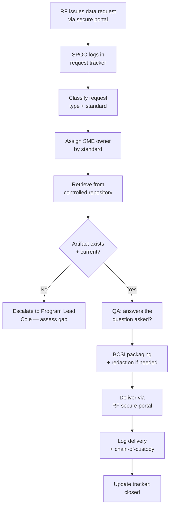

# 07.04 — Data-Request Response Process

| Field | Value |
|---|---|
| Document ID | CIP-07.04 |
| Version | 1.0 |
| Date | 2026-03-02 |
| Classification | BES Cyber System Information (BCSI) // Illustrative Portfolio Sample |
| Owner | Karen Whitfield (NERC Compliance Manager) |
| Author | Advisory Team |
| Status | Approved |

## Purpose

This document defines the process by which GridPoint Energy responds to **ReliabilityFirst (RF) data requests** during the **2027-Q2 Compliance Audit** — the initial RSAW/data request and the supplemental (clarifying) requests that follow during pre-audit review and fieldwork. It establishes a single intake channel, defined turnaround targets, BCSI-safe handling, a controlled evidence repository as the source of retrieval, and a request tracker so that no request is lost and every response is traceable.

The ability to **turn requests around within agreed timeframes** is a direct indicator of a well-managed program and was specifically rehearsed in the pre-audit dry-run ([07.05](07.05-pre-audit-dry-run.md)).

## 1. Principles

| Principle | Application |
|---|---|
| **Single point of contact (SPOC)** | All RF requests route through the Compliance Manager (Whitfield) |
| **Single intake channel** | RF secure portal + logged request tracker; no side channels |
| **Retrieve, never recreate** | Responses drawn from the controlled repository / evidence index |
| **BCSI-safe** | Encrypted delivery, need-to-know, chain-of-custody logging |
| **Answer the question asked** | Provide exactly what is requested — no over- or under-production |
| **Traceable** | Every request → owner → artifact → delivery is logged |

## 2. Request Types and Turnaround Targets

| Request Type | Description | Turnaround Target |
|---|---|---|
| **Initial Data Request** | Pre-populated RSAWs + package request at notification | Per RF engagement letter (~30–45 days) |
| **Pre-Audit Supplemental** | Clarifications on submitted RSAWs/evidence | **2–3 business days** |
| **Fieldwork Same-Day** | Evidence sampled live during interviews/walkthroughs | **Same day** where sourced from repository |
| **Post-Fieldwork Follow-up** | Additional evidence after exit briefing | **Per RF-agreed date** |

Targets are internal commitments set to beat RF deadlines and preserve the "well-managed program" impression; the SPOC negotiates realistic dates when a request is large.

## 3. Response Workflow

## 4. Intake, Assignment, and Ownership

Requests are assigned to the SME who owns the standard, drawing on the same ownership map used for audit logistics ([07.06](07.06-audit-logistics-and-sme-readiness.md)).

| Standard(s) | SME Owner | Typical Evidence Retrieved |
|---|---|---|
| CIP-002 | Whitfield | Categorization, asset/BCS lists |
| CIP-003, CIP-011, CIP-013 | Nair | Policies, BCSI program, supply chain |
| CIP-004 | Lee | Training, PRA, access records |
| CIP-005, CIP-007, CIP-010 | Bell | ESP, patch, baselines |
| CIP-006, CIP-014 | Delgado | PSP, PACS, physical security |
| CIP-008, CIP-009 | Okafor | IR, recovery, backups |
| Asset reconciliation | Ruiz | Substation/field inventory |

## 5. BCSI Handling During Responses

Every response is treated as **BES Cyber System Information** per CIP-011-3:

- **Delivery:** RF secure portal only; encrypted in transit; no raw BCSI over email.
- **Need-to-know:** artifacts released only to named RF audit-team members.
- **Redaction:** non-responsive BCSI (e.g., credentials, unrelated IP addresses) redacted before delivery.
- **Chain-of-custody:** each export logs requester, artifact ID, timestamp, and recipient.
- **Custodians:** Whitfield and Cole; access provisioned per CIP-004-7.

## 6. Evidence Repository and Retrieval

The controlled repository is the authoritative source. The evidence index ([07.02](07.02-compliance-evidence-package-assembly.md), component 19) maps each of the **~260 artifacts** to its repository path and RSAW requirement part, so retrieval is a lookup — not a hunt.

| Repository Attribute | Detail |
|---|---|
| Access model | Role-based, need-to-know per CIP-004-7 |
| Index | ~260 artifacts, RSAW-mapped |
| Versioning | Every artifact versioned with date/period covered |
| Logging | Access, export, and delivery logged |
| Retention | Audit period + RF-defined retention window |

## 7. Request Tracker Fields

The request tracker (maintained at [`trackers/data-request-log.xlsx`](trackers/data-request-log.xlsx)) records:

| Field | Purpose |
|---|---|
| Request ID | Unique RF request identifier |
| Date received / due | Turnaround management |
| Standard / requirement part | Routing |
| SME owner | Accountability |
| Artifact ID(s) | Traceability to evidence index |
| Delivery date / method | Chain-of-custody |
| Status | Open / In progress / Delivered / Closed |

## 8. Readiness Status

| Metric | Value |
|---|---|
| Intake channel | RF secure portal (single) |
| SPOC | Karen Whitfield |
| Supplemental turnaround target | 2–3 business days |
| Repository artifacts indexed | ~260 |
| Process rehearsed in dry-run | ✅ Yes |
| Readiness | ✅ Ready |

## Cross-References

- [07.02-compliance-evidence-package-assembly.md](07.02-compliance-evidence-package-assembly.md) — evidence index and repository
- [07.05-pre-audit-dry-run.md](07.05-pre-audit-dry-run.md) — data-request process rehearsal
- [07.06-audit-logistics-and-sme-readiness.md](07.06-audit-logistics-and-sme-readiness.md) — SME-by-standard ownership
- [../01-program-foundation/01.13-document-and-evidence-management-plan.md](../01-program-foundation/01.13-document-and-evidence-management-plan.md) — evidence management plan

---
[⬅ Previous](07.03-evidence-completeness-checklist.md) · [🏠 Phase README](07.00-README.md) · [Next ➡](07.05-pre-audit-dry-run.md)
