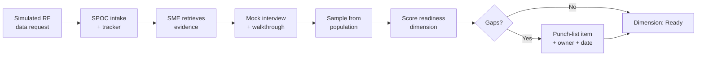

# 07.05 — Pre-Audit Dry-Run & Self-Assessment

| Field | Value |
|---|---|
| Document ID | CIP-07.05 |
| Version | 1.0 |
| Date | 2026-03-02 |
| Classification | BES Cyber System Information (BCSI) // Illustrative Portfolio Sample |
| Owner | Nathan Cole (Program Lead) |
| Author | Advisory Team |
| Status | Approved |

## Purpose

This document records the **pre-audit dry-run** — an internal, end-to-end rehearsal conducted before the **2027-Q2 ReliabilityFirst (RF) Compliance Audit** to confirm GridPoint Energy is audit-ready. The dry-run differs from the Phase 05 internal (mock) audit: Phase 05 **found** the 9 Potential Noncompliance items; this dry-run **confirms** that the remediated program, the 24-component package, and the SME team are ready to withstand RF scrutiny. It verifies four readiness dimensions: **RSAWs complete, evidence current, SMEs prepared, and sampling populations ready**, and rehearses the data-request response process.

**Result: Ready.**

## 1. Dry-Run Objectives

| # | Objective | Success Criterion |
|---|---|---|
| 1 | Confirm all 12 RSAWs complete and finalized | 12 / 12 finalized, no open cells |
| 2 | Confirm evidence current through audit period | ~260 artifacts current; 0 stale |
| 3 | Confirm SMEs can demonstrate controls | Every standard has a prepped owner |
| 4 | Confirm sampling populations ready | Populations defined and retrievable |
| 5 | Rehearse data-request turnaround | Simulated requests met within target |
| 6 | Confirm cross-document consistency | 0 unresolved discrepancies |

## 2. Dry-Run Method

Conducted by the Advisory Team with Program Lead **Nathan Cole** and Compliance Manager **Karen Whitfield**, playing the role of the RF audit team. The dry-run exercised the same stages the real audit will follow (see [07.01](07.01-audit-process-overview-cmep.md)): simulated data requests, mock interviews, live control walkthroughs, and on-demand evidence sampling.

## 3. Readiness Dimension Results

| Dimension | Check | Result |
|---|---|---|
| **RSAWs complete** | All 12 RSAWs finalized, requirement-by-requirement determinations present | ✅ Ready |
| **Evidence current** | ~260 artifacts mapped, current through audit period, 0 stale | ✅ Ready |
| **SMEs prepared** | Each standard has a briefed owner; walkthroughs rehearsed | ✅ Ready |
| **Sampling ready** | Populations (BCS, access records, patches, baselines, logs) defined and retrievable | ✅ Ready |
| **Data-request turnaround** | Simulated supplemental requests met within 2–3 business days | ✅ Ready |
| **Cross-document consistency** | Canonical figures reconcile across all 24 components | ✅ Ready |

## 4. Remediation State Confirmed at Dry-Run

The dry-run confirms the Phase 06 remediation posture holds going into the audit.

| Item | State at Dry-Run |
|---|---|
| Mitigation Plans (MIT-01…09) | 8 Closed / 1 In Progress (MIT-05) |
| Open High-risk items | 0 |
| Overdue Mitigation Plans | 0 |
| Self-Reports filed to RF | 2 (MIT-02, MIT-07) |
| TFEs required | 0 |
| Residual risk | Low |

## 5. Dry-Run Punch List

Minor, non-blocking items identified and assigned; none affects the "Ready" determination.

| Punch # | Item | Owner | Target |
|---|---|---|---|
| DR-01 | Refresh two CIP-007 audit-log-review screenshots to latest period | Bell | Pre-fieldwork |
| DR-02 | Confirm MIT-05 vendor amendment status note for Area-of-Concern context | Nair | Pre-fieldwork |
| DR-03 | Re-verify PACS clock-sync record post-MIT-08 closure | Delgado | Pre-fieldwork |
| DR-04 | Add repository path for two CIP-004 quarterly review sign-offs to index | Lee | Pre-fieldwork |

## 6. SME Readiness Snapshot

| SME | Standards | Dry-Run Interview Result |
|---|---|---|
| Marcus Bell | CIP-005, -007, -010 | ✅ Demonstrated controls confidently |
| Priya Nair | CIP-003, -011, -013 | ✅ Ready; MIT-05 talking point set |
| Frank Delgado | CIP-006, -014 | ✅ Ready; CIP-014 in-progress framing set |
| Sandra Lee | CIP-004 | ✅ Ready |
| James Okafor | CIP-008, -009 | ✅ Ready |
| Elena Ruiz | Asset inventory | ✅ Ready |

## 7. Overall Determination

| Readiness Rating | **READY** |
|---|---|
| RSAWs | 12 / 12 complete |
| Evidence | ~260 artifacts current |
| Consistency discrepancies | 0 |
| Open High-risk items | 0 |
| Punch-list items | 4 (non-blocking, owned, pre-fieldwork) |
| Recommendation | Proceed to RF Compliance Audit fieldwork (2027-06) |

The dry-run confirms GridPoint is **ready** for the RF Compliance Audit. The CIP Senior Manager (Daniel Reyes) is briefed on the "Ready" determination and the four-item punch list.

## Cross-References

- [07.01-audit-process-overview-cmep.md](07.01-audit-process-overview-cmep.md) — audit stages rehearsed
- [07.03-evidence-completeness-checklist.md](07.03-evidence-completeness-checklist.md) — completeness inputs to the dry-run
- [07.04-data-request-response-process.md](07.04-data-request-response-process.md) — data-request rehearsal
- [../05-internal-compliance-assessment/05.16-mock-audit-report-and-readiness-rating.md](../05-internal-compliance-assessment/05.16-mock-audit-report-and-readiness-rating.md) — prior "Substantially Ready" rating

---
[⬅ Previous](07.04-data-request-response-process.md) · [🏠 Phase README](07.00-README.md) · [Next ➡](07.06-audit-logistics-and-sme-readiness.md)
