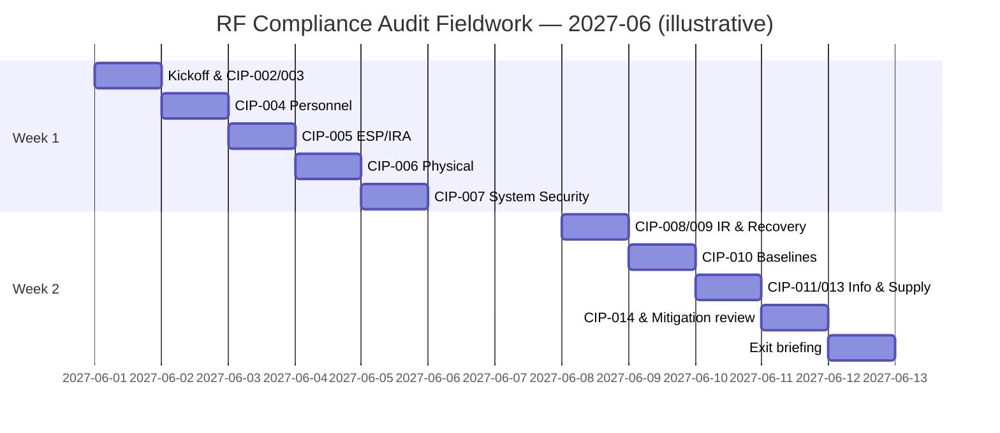

# 07.06 — Audit Logistics & SME Readiness

| Field | Value |
|---|---|
| Document ID | CIP-07.06 |
| Version | 1.0 |
| Date | 2026-03-02 |
| Classification | BES Cyber System Information (BCSI) // Illustrative Portfolio Sample |
| Owner | Nathan Cole (Program Lead) |
| Author | Advisory Team |
| Status | Approved |

## Purpose

This document sets the **logistics** and **Subject Matter Expert (SME) readiness** plan for the **2027-Q2 ReliabilityFirst (RF) Compliance Audit** (fieldwork **2027-06**). It defines the interview schedule, assigns ownership of each CIP standard to a named SME, gives interview do's and don'ts, and sets rules for handling **BES Cyber System Information (BCSI)** during interviews. The goal is that every RF question meets a prepared owner who demonstrates the control, cites the evidence, and stays within scope.

## 1. Logistics Overview

| Element | Detail |
|---|---|
| Fieldwork window | **2027-06** (on-site + remote) |
| On-site location | Primary Control Center & HQ, Millbrook, Ohio |
| Single point of contact (SPOC) | Karen Whitfield (Compliance Manager) |
| Program Lead | Nathan Cole |
| Interview room | Dedicated, access-controlled; BCSI-safe |
| Evidence delivery | RF secure portal + controlled repository retrieval |
| Daily cadence | Morning kickoff · interviews/walkthroughs · end-of-day debrief |

## 2. SME-by-Standard Ownership

Each applicable standard has a **primary** owner (leads the interview) and a **backup** (covers absence and corroborates).

| Standard | Primary SME | Backup SME | Focus of Demonstration |
|---|---|---|---|
| CIP-002-5.1a Categorization | Karen Whitfield | Elena Ruiz | Asset reconciliation, High/Med/Low logic |
| CIP-003-8 Security Mgmt Controls | Daniel Reyes | Priya Nair | Policy suite, CIP Senior Manager approval, Low-impact Attachment 1 |
| CIP-004-7 Personnel & Training | Sandra Lee | Priya Nair | Training, PRA, access authorization/revocation |
| CIP-005-7 ESP & Remote Access | Marcus Bell | Priya Nair | ESP, Intermediate System / MFA, IRA logging |
| CIP-006-6 Physical Security | Frank Delgado | Elena Ruiz | PSP, PACS, visitor logs, monitoring |
| CIP-007-6 System Security Mgmt | Marcus Bell | Priya Nair | Patch cycle, ports/services, malware, log review |
| CIP-008-6 Incident Response | James Okafor | Marcus Bell | IR plan, testing, notification |
| CIP-009-6 Recovery Plans | James Okafor | Marcus Bell | Recovery plans, backup restoration testing |
| CIP-010-4 Config Change & Vuln | Marcus Bell | Elena Ruiz | Baselines, change approvals, vulnerability assessments |
| CIP-011-3 Information Protection | Priya Nair | Marcus Bell | BCSI program, storage, reuse/disposal |
| CIP-013-2 Supply Chain | Priya Nair | Karen Whitfield | Supply chain risk plan, vendor assessments, contracts |
| CIP-014-3 Physical Security | Frank Delgado | Elena Ruiz | Northgate assessment (in-progress + commitment) |

## 3. Interview Schedule (Illustrative)

## 4. Interview Do's and Don'ts

| Do | Don't |
|---|---|
| Answer the question asked — precisely and completely | Volunteer scope beyond the question |
| Demonstrate the control with cited evidence | Speculate or guess; say "I'll confirm and provide" |
| Use canonical terms (BCS, ESP, IRA, EACMS, PACS, PCA) | Use loose or inconsistent terminology |
| Let the SPOC route all evidence delivery | Hand RF raw BCSI directly or by email |
| Reference the Mitigation Plan for known items (MIT-02, MIT-07) | Hide or downplay self-reported items |
| Defer unknowns to the backup or SPOC | Argue or debate the auditor |
| Keep answers factual and calm | Editorialize about other entities or opinions |
| Take a follow-up as an action with an owner/date | Promise evidence that does not exist |

## 5. BCSI in Interviews

- **Screen-share discipline:** display only the artifact under discussion; close unrelated BCSI windows.
- **Delivery through SPOC:** any artifact the auditor wants to keep is delivered via the RF secure portal by Whitfield — never handed over ad hoc.
- **Need-to-know:** only named RF audit-team members view BCSI.
- **Redaction:** redact non-responsive credentials, IPs, or details before delivery.
- **Logging:** every artifact shown or delivered is logged for chain-of-custody.
- **Physical:** printed BCSI (if any) is tracked, collected, and destroyed per CIP-011-3.

## 6. Self-Reported Items — Talking Points

The 2 Self-Reports are a strength, not a liability, when framed correctly.

| Item | Frame |
|---|---|
| **MIT-02** (CIP-005 R2 IRA session logging) | Self-reported to RF; under an **accepted Mitigation Plan**; remediation on schedule |
| **MIT-07** (CIP-010 R1 baseline approvals) | Self-reported; Mitigation Plan **closed** with completion evidence |
| **MIT-05** (CIP-013 vendor clauses) | In-progress; awaiting counterparty signature — expected Area-of-Concern context |
| **CIP-014 Northgate** | In-progress with a documented completion commitment |

## 7. Readiness Status

| Metric | Value |
|---|---|
| Standards with named primary + backup SME | 12 / 12 |
| SMEs briefed and rehearsed (dry-run) | ✅ All |
| Interview schedule set | ✅ Yes |
| BCSI interview rules issued | ✅ Yes |
| Readiness | ✅ Ready |

## Cross-References

- [07.05-pre-audit-dry-run.md](07.05-pre-audit-dry-run.md) — SME readiness snapshot from dry-run
- [07.07-control-walkthrough-narratives.md](07.07-control-walkthrough-narratives.md) — how SMEs demonstrate key controls
- [07.04-data-request-response-process.md](07.04-data-request-response-process.md) — SPOC-routed evidence delivery
- [../01-program-foundation/01.07-governance-structure-and-raci.md](../01-program-foundation/01.07-governance-structure-and-raci.md) — roles and RACI

---
[⬅ Previous](07.05-pre-audit-dry-run.md) · [🏠 Phase README](07.00-README.md) · [Next ➡](07.07-control-walkthrough-narratives.md)
