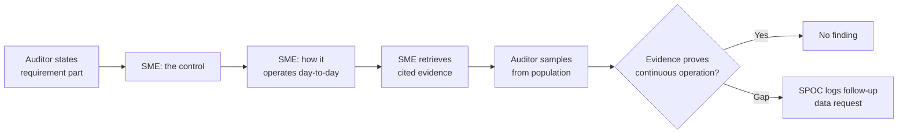

# 07.07 — Control Walkthrough Narratives

| Field | Value |
|---|---|
| Document ID | CIP-07.07 |
| Version | 1.0 |
| Date | 2026-03-02 |
| Classification | BES Cyber System Information (BCSI) // Illustrative Portfolio Sample |
| Owner | Marcus Bell (OT / ICS Security Lead) |
| Author | Advisory Team |
| Status | Approved |

## Purpose

This document provides **control walkthrough narratives** that GridPoint Energy SMEs rehearse and use to demonstrate how key controls operate during the **2027-Q2 ReliabilityFirst (RF) Compliance Audit**. A walkthrough narrative is the structured story an SME tells an auditor: *here is the requirement, here is the control, here is how it runs, and here is the evidence that proves it ran continuously across the audit period.* Narratives focus on the standards RF is most likely to sample deeply: **CIP-005 (ESP / Interactive Remote Access)**, **CIP-007 (patch management)**, and **CIP-010 (configuration baselines)** — the same areas that generated the entity's original High-risk gaps and are now remediated.

## 1. Narrative Structure

Each narrative follows the same four-part arc so SMEs stay consistent and complete:

| Part | SME States | Purpose |
|---|---|---|
| **1. Requirement** | The applicable CIP requirement part | Anchors scope |
| **2. Control** | The implemented control | Shows the control exists |
| **3. Operation** | How the control runs day-to-day, who, how often | Shows it operates |
| **4. Evidence** | The cited artifact(s) proving continuous operation | Closes the loop |

## 2. Walkthrough — CIP-005-7 ESP & Interactive Remote Access (SME: Marcus Bell)

**Requirement focus:** CIP-005 R1 (ESP) and R2 (Interactive Remote Access via an Intermediate System, encryption, and multi-factor authentication).

**Narrative:**
1. **Requirement** — Every Medium-impact BES Cyber System resides within a defined Electronic Security Perimeter; all external routable connectivity passes through an identified Electronic Access Point. All Interactive Remote Access (IRA), including vendor access, transits an **Intermediate System**, is **encrypted**, and requires **multi-factor authentication (MFA)**.
2. **Control** — GridPoint's ESPs enclose the Medium BCS at the 2 control centers and 8 Medium substations. Vendor and employee IRA terminates on a hardened Intermediate System in a management zone; direct access to BCS from outside the ESP is denied by firewall rule.
3. **Operation** — Firewall rulesets are baseline-controlled and change-managed; IRA sessions are brokered through the Intermediate System with MFA enforced at logon; sessions are logged. This closed the original **GAP-01** (missing Intermediate System / MFA at 2 substations). Session logging completeness is the subject of the self-reported **MIT-02**, currently under an accepted Mitigation Plan.
4. **Evidence** — ESP network diagrams, EAP firewall rulesets, Intermediate System / MFA configuration, and IRA session logs (evidence index, CIP-005 set).

**Likely auditor probes:** "Show the rule that denies BCS access from outside the ESP." · "Demonstrate MFA on a vendor IRA session." · "Where are the IRA session logs, and what is the MIT-02 status?"

## 3. Walkthrough — CIP-007-6 Patch Management (SME: Marcus Bell / Priya Nair)

**Requirement focus:** CIP-007 R2 — security patch **evaluation** within 35 calendar days of source availability, and documented action (apply / mitigate / dated plan).

**Narrative:**
1. **Requirement** — For each applicable BES Cyber System and associated EACMS/PACS/PCA, evaluate security patches from identified sources within **35 calendar days**, then apply, create a dated mitigation plan, or document why the patch is not applicable.
2. **Control** — A patch-source register identifies the authoritative source per software family; a monthly evaluation cycle produces a documented determination per patch.
3. **Operation** — Each cycle, the OT/IT team pulls new patches, records the 35-day evaluation, and logs the disposition. This closed the original **GAP-02** (prior self-logged lapse where the evaluation cycle exceeded 35 days on control-center BCS). Audit-log-review documentation gaps found in Phase 05 (**PNC-06 / MIT-07 sibling item**) were remediated.
4. **Evidence** — Patch-source register, dated 35-day evaluation records, disposition logs, and mitigation plans for deferred patches (evidence index, CIP-007 set).

**Likely auditor probes:** "Pick a patch released in the audit period — show the 35-day evaluation." · "Show the disposition for a patch you chose not to apply." · "How did you fix the prior 35-day lapse?"

## 4. Walkthrough — CIP-010-4 Configuration Baselines (SME: Marcus Bell / Elena Ruiz)

**Requirement focus:** CIP-010 R1 — maintain baseline configurations, authorize and document changes that deviate from baseline, and update the baseline within 30 days of a change.

**Narrative:**
1. **Requirement** — Maintain a baseline configuration for each applicable BES Cyber System (OS/firmware, installed software, logical ports, security patches); authorize and document any change that deviates from the baseline; update the baseline within 30 days.
2. **Control** — Every Medium BCS has a documented baseline in the configuration-management system; changes route through a change ticket requiring approval before implementation.
3. **Operation** — A change is proposed, approved, implemented, verified against required cyber-security controls, and the baseline is updated. This closed the original **GAP-03** (incomplete baselines for 10 Medium substation BCS). The self-reported **MIT-07** (two baseline change records missing approvals) is **closed** with completion evidence.
4. **Evidence** — Baseline configuration records for the 10 Medium substation BCS, change tickets with approvals, and verification records (evidence index, CIP-010 set).

**Likely auditor probes:** "Show the baseline for a Medium substation BCS." · "Pick a change — show the pre-implementation approval." · "Demonstrate the baseline was updated within 30 days."

## 5. Walkthrough Summary Table

| Standard | Requirement Focus | Control Demonstrated | Original Gap Closed | Evidence Set |
|---|---|---|---|---|
| **CIP-005-7** | R1 ESP · R2 IRA (Intermediate System, MFA, logging) | ESP + brokered MFA IRA | GAP-01 | ESP diagrams, rulesets, IS/MFA config, IRA logs |
| **CIP-007-6** | R2 35-day patch evaluation | Monthly evaluation cycle + dispositions | GAP-02 | Patch register, 35-day records, disposition logs |
| **CIP-010-4** | R1 baselines + change approvals | Baselines + change-managed approvals | GAP-03 | Baselines, change tickets, verification records |

## 6. Walkthrough Flow (What the Auditor Sees)

## 7. Common Auditor Pitfalls and SME Responses

Walkthroughs fail most often not because the control is absent, but because the SME narrates it poorly. The following pitfalls were surfaced in the dry-run and are pre-briefed.

| Pitfall | Why It Hurts | Prepared SME Response |
|---|---|---|
| Describing intent instead of operation | Auditors test operation, not design | Walk the live control and cite the dated artifact |
| Citing evidence that ends before audit-period close | Suggests a lapse in continuity | Confirm coverage window spans the full audit period |
| Over-producing unrelated BCSI | Expands scope and risk | Show only the sampled artifact; route the rest via SPOC |
| Downplaying a self-reported item | Reads as evasive | State the item, the Self-Report, and the accepted Mitigation Plan |
| Guessing at a number | Any mismatch invites a data request | Use canonical figures or defer: "I'll confirm and provide" |

## 8. Evidence-to-Requirement Traceability

Each walkthrough closes by pointing the auditor to the RSAW requirement part and the mapped artifact, so the narrative and the ~260-artifact evidence index tell one consistent story.

| Walkthrough | RSAW | Key Requirement Part | Mapped Evidence Location |
|---|---|---|---|
| CIP-005 ESP / IRA | CIP-005-7 | R1.1 / R2.1–R2.3 | Evidence index, CIP-005 set |
| CIP-007 patch | CIP-007-6 | R2.2 / R2.3 | Evidence index, CIP-007 set |
| CIP-010 baselines | CIP-010-4 | R1.1 / R1.2 | Evidence index, CIP-010 set |

## 9. Rehearsal Status

| Walkthrough | SME | Rehearsed (Dry-Run) | Status |
|---|---|---|---|
| CIP-005 ESP / IRA | Bell | ✅ | Ready |
| CIP-007 patch | Bell / Nair | ✅ | Ready |
| CIP-010 baselines | Bell / Ruiz | ✅ | Ready |

All three key-standard walkthroughs are rehearsed and ready for RF fieldwork (2027-06); each maps a closed original High-risk gap (GAP-01/02/03) to a demonstrable, evidenced control.

## Cross-References

- [07.06-audit-logistics-and-sme-readiness.md](07.06-audit-logistics-and-sme-readiness.md) — SME ownership and interview rules
- [../02-bes-cyber-system-categorization/02.12-gap-register-and-risk-ranking.md](../02-bes-cyber-system-categorization/02.12-gap-register-and-risk-ranking.md) — original GAP-01/02/03
- [../05-internal-compliance-assessment/05.07-cip-005-rsaw-and-evidence.md](../05-internal-compliance-assessment/05.07-cip-005-rsaw-and-evidence.md) — CIP-005 RSAW evidence
- [../06-gap-remediation-mitigation-plans/06.02-mitigation-plan-register.md](../06-gap-remediation-mitigation-plans/06.02-mitigation-plan-register.md) — MIT-02, MIT-07
- [07.08-sampling-readiness-and-populations.md](07.08-sampling-readiness-and-populations.md) — sampling populations for walkthroughs

---
[⬅ Previous](07.06-audit-logistics-and-sme-readiness.md) · [🏠 Phase README](07.00-README.md) · [Next ➡](07.08-sampling-readiness-and-populations.md)
