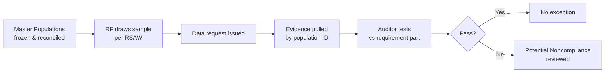

# 07.08 — Sampling Readiness & Populations

| Field | Value |
|---|---|
| Document ID | CIP-AUD-SAMP-2026-708 |
| Version | 1.0 |
| Date | 2026-03-02 |
| Classification | BES Cyber System Information (BCSI) // Illustrative Portfolio Sample |
| Owner | Karen Whitfield, NERC Compliance Manager |
| Author | Advisory Team (OT GRC / NERC CIP Advisory) |
| Status | Approved |

## Purpose

This document establishes GridPoint Energy's **sampling readiness** for the ReliabilityFirst (RF) Compliance Audit. Under the CMEP, an RF audit team does not test every record; it draws **samples** from defined **populations** and inspects the corresponding evidence against the applicable Reliability Standard Audit Worksheet (RSAW) requirement parts. Audit-readiness therefore requires that every sampleable population is **complete, current, reconciled, and immediately producible**, and that the entity can trace any drawn sample item to its supporting evidence within the agreed data-request turnaround. This document defines the master populations, the sampling method the audit team is expected to use, and the internal controls that keep each population defensible.

## 1. Sampling in the CMEP Context

RF auditors apply professional judgment and sampling guidance to select items from a population, then request the evidence that demonstrates the applicable requirement part was met for each selected item across the **audit period**. For GridPoint, populations are frozen as of the data-request date and version-controlled so that the sample the auditor draws maps exactly to the evidence GridPoint produces.

## 2. Master Population Register

The following populations are maintained in the controlled compliance repository, each with a unique **Population ID**, a record count as of the freeze date, the source system of record, and the standards to which the population is sampled.

| Pop ID | Population | Count | System of Record | Primary Standards Sampled |
|---|---|---|---|---|
| POP-BCS | BES Cyber Systems (grouped) | **52** (14 Medium / 38 Low) | Asset & BCS master list (Phase 02) | CIP-002, -005, -007, -010 |
| POP-BCA | BES Cyber Assets | ~420 | CMDB / OT asset inventory | CIP-007, -010 |
| POP-EACMS | Electronic Access Control or Monitoring Systems | 26 | Asset master list | CIP-005, -007 |
| POP-PACS | Physical Access Control Systems | 18 | Asset master list | CIP-006 |
| POP-PCA | Protected Cyber Assets | 60 | Asset master list | CIP-007, -010 |
| POP-PERS | Personnel with authorized electronic/unescorted physical access | **160** | HR / access-management register | CIP-004 |
| POP-PATCH | Patch-evaluation cycles (source-to-BCS, per 35-day period) | 1 per source per BCS per cycle | Patch management tracker | CIP-007 R2 |
| POP-CHG | Configuration change records (baseline changes) | Change-management log entries in audit period | Change management system | CIP-010 R1 |
| POP-IRA | Interactive Remote Access sessions | IRA session logs in audit period | Intermediate System / jump-host logs | CIP-005 R2 |
| POP-PSP | Physical access authorizations & logs (per PSP) | Access events per Medium PSP | PACS event log | CIP-006 R1/R2 |
| POP-TRN | CIP training completions | 1 per person per cycle (subset of POP-PERS) | LMS records | CIP-004 R2 |
| POP-PRA | Personnel Risk Assessments (7-year cycle) | 1 per person (subset of POP-PERS) | HR PRA register | CIP-004 R3 |

> The four populations called out in the engagement scope — **52 BCS, 160 personnel, patch cycles, and change records** — are the highest-frequency audit draws and are reconciled monthly rather than only at freeze.

## 3. The Four Primary Sampling Populations

### 3.1 BES Cyber Systems (POP-BCS = 52)

The 52 grouped BCS (14 Medium + 38 Low, 0 High) are the backbone population. An auditor sampling CIP-007 or CIP-010 typically selects a mix of Medium control-center BCS, Medium substation BCS, and Low BCS, then pivots to the associated BCAs, EACMS, and PCAs. Each BCS row carries: BCS ID, site, impact rating, Attachment 1 criterion, associated systems, and evidence-index pointers. This population is reconciled to the approved CIP-002 categorization (Phase 02) so the count never drifts from 52.

### 3.2 Personnel (POP-PERS = 160)

The 160 individuals holding authorized electronic access and/or unescorted physical access to Medium BCS and associated systems form the CIP-004 sampling frame. From this frame the auditor samples training completions (R2), Personnel Risk Assessments (R3), access authorizations (R4), and revocations (R5). The register is joined to HR joiner/mover/leaver events so that a sampled termination can be traced to its 24-hour revocation evidence.

### 3.3 Patch Cycles (POP-PATCH)

CIP-007 R2 is sampled by **patch-evaluation cycle**: for a selected source-of-patches applied to a selected BCS/BCA, the auditor tests that a security-patch evaluation occurred within 35 calendar days and that the resulting action (apply / mitigate / document) is evidenced. Because a lapsed patch-evaluation cycle was the prior self-logged issue (and drove GAP-02 and MIT-06/related monitoring), this population is scrutinized internally every cycle.

### 3.4 Change Records (POP-CHG)

CIP-010 R1 is sampled by **baseline configuration change record**. For a selected change, the auditor tests authorization, baseline update, and — where required — the security-controls verification (R1 Part 1.4/1.5). This population feeds directly from the change-management system for the audit period; MIT-07 remediated the two records that had missing approvals in the internal assessment.

## 4. How Samples Are Pulled

| Step | Action | Owner |
|---|---|---|
| 1 | RF issues a data request naming the standard, requirement part, and sample selection (often by ID or by a random/interval draw over the population) | RF audit team |
| 2 | Compliance Manager logs the request in the data-request tracker with a due date | Whitfield |
| 3 | The named population is opened at its frozen version; sampled items are located by Population ID + item ID | Program Lead (Cole) |
| 4 | Evidence for each sampled item is pulled from the ~260-artifact evidence index and mapped to the RSAW part | SME + Advisory Team |
| 5 | Evidence is reviewed for completeness and BCSI handling, then released through the controlled repository | Whitfield |
| 6 | Response delivered within the agreed turnaround; item marked responded in the tracker | Program Lead |

Sampling is **reproducible**: because populations are frozen and versioned, GridPoint can re-derive exactly which items sit behind any auditor draw, which prevents the "moving population" problem that commonly generates audit friction.

## 5. Population Integrity Controls

| Control | Purpose |
|---|---|
| Monthly reconciliation of POP-BCS to the CIP-002 categorization | Prevents count drift from the approved 52 BCS |
| Joiner/mover/leaver feed into POP-PERS | Keeps the 160-person frame current for CIP-004 sampling |
| Patch-tracker completeness check each 35-day cycle | Ensures no missing POP-PATCH rows (prior-issue area) |
| Change-management log export vs. baseline repository | Confirms POP-CHG completeness for CIP-010 |
| Version/freeze stamp on every population at data-request time | Guarantees auditor draw ↔ evidence traceability |
| BCSI access controls on all population files | CIP-011 handling of sampling artifacts |

## 6. Dry-Run Confirmation

The pre-audit dry-run (07.05) exercised the full sampling chain: RF-style draws were simulated against POP-BCS, POP-PERS, POP-PATCH, and POP-CHG; evidence was pulled and mapped without gaps; and turnaround times were within the agreed data-request window. The dry-run confirmed **sampling populations ready** — one of the four readiness pillars (RSAWs complete, evidence current, SMEs prepared, sampling populations ready).

## Cross-References

| Reference | Purpose |
|---|---|
| [07.02 — Compliance Evidence Package Assembly](07.02-compliance-evidence-package-assembly.md) | Evidence index the samples resolve into |
| [07.04 — Data-Request Response Process](07.04-data-request-response-process.md) | Turnaround process for sampled items |
| [07.05 — Pre-Audit Dry-Run](07.05-pre-audit-dry-run.md) | Sampling chain rehearsal |
| [02.06 — High/Medium/Low Categorization List](../02-bes-cyber-system-categorization/02.06-high-medium-low-categorization-list.md) | Source of the 52-BCS population |
| [05.15 — Findings Register & Risk Exposure](../05-internal-compliance-assessment/05.15-findings-register-and-risk-exposure.md) | Prior sampling findings (patch/change) |

---

[⬅ Previous](07.07-control-walkthrough-narratives.md) · [🏠 Phase README](07.00-README.md) · [Next ➡](07.09-mock-interview-guides.md)
