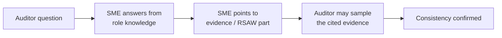

# 07.09 — Mock Interview Guides

| Field | Value |
|---|---|
| Document ID | CIP-AUD-INTV-2026-709 |
| Version | 1.0 |
| Date | 2026-03-02 |
| Classification | BES Cyber System Information (BCSI) // Illustrative Portfolio Sample |
| Owner | Karen Whitfield, NERC Compliance Manager |
| Author | Advisory Team (OT GRC / NERC CIP Advisory) |
| Status | Approved |

## Purpose

RF Compliance Audits combine documentation review, evidence sampling, and **personnel interviews**. Auditors interview Subject Matter Experts (SMEs) to confirm that documented controls are actually understood and operated, and to corroborate the evidence. This document provides **mock interview guides** for the four most heavily interviewed standards — **CIP-005, CIP-007, CIP-010, and CIP-004** — capturing the questions RF is most likely to ask, the prepared, evidence-anchored answers, and the interview do's and don'ts that keep SME responses accurate and defensible. These guides were rehearsed in the pre-audit dry-run (07.05).

## 1. Interview Approach

Each SME owns a standard aligned to their role: **Marcus Bell (OT)** for CIP-005/007/010 technical controls, **Priya Nair (IT)** for supporting system security, **Frank Delgado (Physical)** for CIP-006, **Sandra Lee (HR)** for CIP-004 personnel controls, with **Elena Ruiz (Field)** and **James Okafor (Ops)** corroborating substation and control-center operations. **Karen Whitfield** manages the room; the **Advisory Team** observes.

## 2. Interview Do's and Don'ts

| Do | Don't |
|---|---|
| Answer only the question asked, concisely and factually | Speculate, guess, or volunteer scope beyond the question |
| Point to the specific evidence artifact / RSAW part | Describe controls you cannot evidence |
| Say "I will confirm and provide that" if unsure | Fabricate a date, count, or approval |
| Use exact NERC terms (BCS, ESP, IRA, PSP, EACMS) | Use loose jargon that conflicts with the RSAW |
| Let the named SME answer their own standard | Talk over the SME or answer outside your role |
| Acknowledge the 2 self-reported items plainly, noting accepted Mitigation Plans | Hide, minimize, or over-explain known items |
| Route documentation questions to the Compliance Manager | Commit to remediation dates on the spot |
| Keep BCSI handling in mind when showing evidence | Display BCSI to unauthorized attendees |

## 3. CIP-005 — Electronic Security Perimeter(s) & Remote Access (SME: Bell)

| # | Likely Auditor Question | Prepared Answer |
|---|---|---|
| 1 | How is the ESP defined around your Medium BCS? | Each Medium BCS at the 2 control centers and 8 Medium substations sits inside a defined ESP with all external routable connectivity through identified Electronic Access Points; documented in the CIP-005 RSAW (05.07) and boundary overview (02.08). |
| 2 | Walk me through Interactive Remote Access. | All IRA — including vendor access — traverses an Intermediate System (jump host) in a DMZ; no direct access to BCS. Multi-factor authentication and encryption are enforced; sessions are logged (POP-IRA). |
| 3 | How was the prior gap on vendor IRA at 2 substations resolved? | GAP-01 was remediated in Phase 04: Intermediate System + MFA now enforced at those substations; verified with configuration and access evidence. |
| 4 | Tell me about the IRA logging self-report. | PNC-02 identified incomplete IRA session logging; we self-reported it to RF (MIT-02) with an accepted Mitigation Plan; logging is now complete and internally validated. |
| 5 | How do you detect and control malicious communications? | EACMS enforce and monitor inbound/outbound access at the EAPs; alerts route to monitoring per CIP-005 R1/R2. |

## 4. CIP-007 — System Security Management (SME: Bell / Nair)

| # | Likely Auditor Question | Prepared Answer |
|---|---|---|
| 1 | Describe your patch-management process. | For each source of patches applicable to a BCS/BCA, we evaluate security patches within 35 calendar days, then apply, create a dated mitigation plan, or document non-applicability — evidenced per patch cycle (POP-PATCH), CIP-007 RSAW (05.09). |
| 2 | You had a prior patch-cycle lapse — what changed? | GAP-02 (a self-logged 35-day exceedance on control-center BCS) drove a redesigned tracker with automated cycle alerts and monthly completeness checks; no exceedances since. |
| 3 | How do you manage ports and services? | Only needed logical network accessible ports are enabled; the enabled-ports baseline is documented and reconciled through CIP-010 change control. |
| 4 | How is malicious code prevented? | Deployed anti-malware / application controls per asset capability, with signature/update management evidenced. |
| 5 | Tell me about audit-log review. | Security event logging is enabled on applicable systems; logs are reviewed on the defined cadence. PNC-06 found documentation gaps in review evidence; MIT-06 closed it — reviews are now consistently evidenced (CIP-007 R4). |
| 6 | How are shared/default accounts handled? | Default and shared accounts are inventoried and controlled; interactive access uses individual accounts where technically feasible. |

## 5. CIP-010 — Configuration Change Management & Vulnerability Assessments (SME: Bell)

| # | Likely Auditor Question | Prepared Answer |
|---|---|---|
| 1 | What is in your configuration baseline? | Operating system/firmware, commercially/custom software, logical ports, and security patches — the CIP-010 R1 baseline elements — maintained per BCS in the baseline repository. |
| 2 | Show me a change from authorization to updated baseline. | Any sampled change record (POP-CHG) traces: request → authorization → implementation → baseline update, with R1 Part 1.4/1.5 security-controls verification where required (05.12). |
| 3 | The internal assessment found missing approvals — status? | PNC-07 flagged two baseline change records lacking documented approval; self-reported (MIT-07) with an accepted Mitigation Plan; both remediated and controls reinforced. |
| 4 | How do you detect unauthorized changes? | Baseline monitoring compares deployed configuration against the authorized baseline on the R2 cadence for Medium BCS; deviations are investigated. |
| 5 | Describe your vulnerability assessments. | Active/paper vulnerability assessments are performed on the required cadence and prior to adding new applicable Cyber Assets, with results evidenced (CIP-010 R3). |

## 6. CIP-004 — Personnel & Training (SME: Lee)

| # | Likely Auditor Question | Prepared Answer |
|---|---|---|
| 1 | Who has access, and how is the population maintained? | 160 individuals hold authorized electronic and/or unescorted physical access; the access register (POP-PERS) is kept current via HR joiner/mover/leaver feeds (07.08). |
| 2 | Describe your security-awareness and training. | Quarterly security awareness plus role-based CIP training before access is granted and annually thereafter, evidenced in the LMS (POP-TRN), CIP-004 RSAW (05.06). |
| 3 | Walk through your Personnel Risk Assessment process. | Identity verification and a seven-year criminal-history check before access, refreshed every seven years (POP-PRA), documented per person. |
| 4 | How do you authorize and review access? | Access is authorized on documented need; quarterly access reviews reconcile authorizations. PNC-09 found one unsigned quarterly review; MIT-09 closed it — reviews are now consistently signed. |
| 5 | How fast do you revoke access on termination? | Electronic and unescorted physical access is revoked for terminations within the CIP-004 R5 timeframe (removal by end of the next calendar day for terminations for cause / on the termination action), traceable from the HR event to the revocation record. |
| 6 | How was the prior access-records gap fixed? | GAP-05 (incomplete authorization/revocation records for recent staffing changes) was remediated in Phase 04 with a reconciled access register and control checks. |

## 7. Cross-Standard Questions (All SMEs)

Beyond standard-specific questions, RF commonly probes the governance layer that spans every CIP standard. All SMEs are prepared to route these consistently.

| # | Likely Auditor Question | Prepared Answer |
|---|---|---|
| 1 | Who is your CIP Senior Manager and what is their role? | Daniel Reyes, VP Security & Compliance — the single accountable authority under CIP-003 R1, with documented delegations. |
| 2 | How do you protect BCSI, including this evidence? | Under a CIP-011 information-protection program: BCSI is identified, access-controlled, and handled in a controlled repository; evidence shown in interviews is managed accordingly. |
| 3 | How do you know your controls are actually operating? | Through the internal compliance assessment (Phase 05), Mitigation Plan validation (Phase 06), and the transition to a continuous internal-controls program (Phase 08). |
| 4 | How were low-impact assets addressed? | Low-impact BES Cyber Systems (4 generation plants + 34 substations) are governed by CIP-003 Attachment 1 controls; no formal ESP is required for Low assets. |

## 8. Interview Readiness Confirmation

| Readiness item | Status |
|---|---|
| SMEs assigned per standard and briefed | Complete |
| Mock interviews conducted in dry-run (07.05) | Complete |
| Do's / don'ts distributed to all interviewees | Complete |
| Answers anchored to RSAW parts and evidence IDs | Complete |
| Self-reported items (MIT-02, MIT-07) framed consistently | Complete |
| Cross-standard / governance questions rehearsed | Complete |
| Compliance Manager designated room manager | Complete |

## Cross-References

| Reference | Purpose |
|---|---|
| [07.06 — Audit Logistics & SME Readiness](07.06-audit-logistics-and-sme-readiness.md) | SME assignments and logistics |
| [07.07 — Control Walkthrough Narratives](07.07-control-walkthrough-narratives.md) | Narratives behind the answers |
| [07.08 — Sampling Readiness & Populations](07.08-sampling-readiness-and-populations.md) | Populations cited in answers |
| [05.06 — CIP-004 RSAW & Evidence](../05-internal-compliance-assessment/05.06-cip-004-rsaw-and-evidence.md) | CIP-004 evidence |
| [05.07 — CIP-005 RSAW & Evidence](../05-internal-compliance-assessment/05.07-cip-005-rsaw-and-evidence.md) | CIP-005 evidence |
| [05.09 — CIP-007 RSAW & Evidence](../05-internal-compliance-assessment/05.09-cip-007-rsaw-and-evidence.md) | CIP-007 evidence |
| [05.12 — CIP-010 RSAW & Evidence](../05-internal-compliance-assessment/05.12-cip-010-rsaw-and-evidence.md) | CIP-010 evidence |

---

[⬅ Previous](07.08-sampling-readiness-and-populations.md) · [🏠 Phase README](07.00-README.md) · [Next ➡](07.10-audit-conduct-and-outcome.md)
