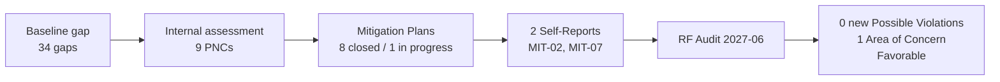

# 07.10 — Audit Conduct & Outcome

| Field | Value |
|---|---|
| Document ID | CIP-AUD-RSLT-2026-710 |
| Version | 1.0 |
| Date | 2026-03-02 |
| Classification | BES Cyber System Information (BCSI) // Illustrative Portfolio Sample |
| Owner | Daniel Reyes, CIP Senior Manager |
| Author | Advisory Team (OT GRC / NERC CIP Advisory) |
| Status | Approved |

## Purpose

This document is the **formal record of the ReliabilityFirst (RF) Compliance Audit** of GridPoint Energy, Inc. (NCR11027) conducted under the NERC Compliance Monitoring and Enforcement Program (CMEP). It records how the audit was conducted, the scope and methods applied, the disposition of the two self-reported items already under accepted Mitigation Plans, and the audit outcome. The result is **favorable**: **0 new Possible Violations**, the two self-reported items acknowledged under accepted Mitigation Plans, and **1 Area of Concern** (a non-violation recommendation). This document is the authoritative outcome summary for the compliance package and is countersigned by the CIP Senior Manager in 07.12.

## 1. Audit Identification

| Attribute | Detail |
|---|---|
| Registered Entity | GridPoint Energy, Inc. |
| NERC Compliance Registry ID | NCR11027 |
| Regional Entity | ReliabilityFirst (RF) |
| Oversight chain | FERC → NERC → ReliabilityFirst |
| Monitoring method | Compliance Audit (CMEP) |
| Registered functions in scope | GO · GOP · TO · TOP · DP |
| Delivery | On-site + remote over the audit period |
| **Audit fieldwork** | **2027-06** |
| **Compliance Audit Report issued** | **2027-07-15** |
| Standards in scope | CIP-002 through CIP-013; CIP-014 noted in-progress (Northgate) |
| Audit cycle | ~3-year cycle for Medium-impact entities |

## 2. Audit Scope

The audit examined GridPoint's compliance with all applicable CIP Reliability Standards and their **118 applicable requirement parts** across the entity's **52 BES Cyber Systems** (14 Medium + 38 Low; 0 High), together with the associated **26 EACMS, 18 PACS, and 60 PCA**, and the personnel and physical controls surrounding them.

| Standard | Title | Scope Note |
|---|---|---|
| CIP-002-5.1a | BES Cyber System Categorization | 52 BCS; Attachment 1 criteria 2.12 / 2.5 |
| CIP-003-8 | Security Management Controls (incl. Low Attachment 1) | Policies; Low-impact controls |
| CIP-004-7 | Personnel & Training | 160-person access population |
| CIP-005-7 | ESP(s) & Remote Access | ESP, EAP, IRA via Intermediate System / MFA |
| CIP-006-6 | Physical Security | Medium PSPs, PACS |
| CIP-007-6 | System Security Management | Patch cycles, ports/services, logging |
| CIP-008-6 | Incident Reporting & Response Planning | IR plan and testing |
| CIP-009-6 | Recovery Plans | Recovery and restoration testing |
| CIP-010-4 | Config Change Mgmt & Vulnerability Assessments | Baselines, change records |
| CIP-011-3 | Information Protection (BCSI) | BCSI handling |
| CIP-013-2 | Supply Chain Risk Management | Vendor risk, contract clauses |
| CIP-014-3 | Physical Security (critical stations) | **Northgate — in-progress; completion committed** |

## 3. Audit Methods Applied

RF conducted the audit using the standard CMEP toolset, drawing on the compliance evidence package assembled in Phase 07 (24 line items, ~260 evidence artifacts mapped to RSAW requirement parts).

| Method | How Applied |
|---|---|
| RSAW documentation review | RF reviewed the 12 RSAWs and the CIP-002 categorization against requirement parts |
| Evidence sampling | Samples drawn from the frozen populations (52 BCS, 160 personnel, patch cycles, change records) per 07.08 |
| Personnel interviews | SME interviews per standard (CIP-005/007/010 Bell; CIP-004 Lee; CIP-006 Delgado; corroboration Nair/Ruiz/Okafor) |
| Technical validation | Inspection of configurations, access controls, and logs for sampled items |
| Data requests | Issued through the rehearsed data-request response process (07.04); turned around within agreed timeframes |

## 4. Conduct of the Audit

The audit opened with an **entrance conference** in **2027-06** at which RF confirmed scope, audit period, logistics, and the data-request protocol. Over the fieldwork period RF issued data requests against the sampling populations; GridPoint responded through the controlled BCSI repository within the agreed turnaround, with each sampled item traceable from the auditor's draw to its supporting evidence. SME interviews proceeded per the prepared guides (07.09), with the Compliance Manager (Whitfield) managing the room and the Program Lead (Cole) coordinating evidence production. At the **exit conference**, RF presented preliminary observations. The formal **Compliance Audit Report was issued on 2027-07-15**.

## 5. Disposition of the Two Self-Reported Items

Prior to the audit, GridPoint had **self-reported two items** to RF, each with a Mitigation Plan, arising from the internal compliance assessment (Phase 05) and remediated in Phase 06:

| Item | Standard | Origin | Mitigation Plan Status | Audit Disposition |
|---|---|---|---|---|
| MIT-02 | CIP-005 R2 — IRA session logging | PNC-02 (Moderate) | Accepted Mitigation Plan; remediated & internally validated | **Acknowledged under accepted Mitigation Plan — no additional enforcement** |
| MIT-07 | CIP-010 R1 — baseline change approvals | PNC-07 (Moderate) | Accepted Mitigation Plan; remediated & internally validated | **Acknowledged under accepted Mitigation Plan — no additional enforcement** |

RF **acknowledged both items as already under accepted Mitigation Plans** and did **not** treat them as new Possible Violations or open additional enforcement. This reflects the favorable treatment of proactive self-reporting under the CMEP. The remaining seven PNCs had been handled as self-logged minimal-risk issues / Compliance Exceptions and required no further action.

## 6. Audit Outcome

> **Overall result: FAVORABLE — no violations; program assessed as compliant and well-managed.**

| Outcome Element | Result |
|---|---|
| **New Possible Violations identified by RF** | **0** |
| Self-reported items (MIT-02, MIT-07) | Acknowledged under accepted Mitigation Plans; no additional enforcement |
| **Areas of Concern (recommendation, non-violation)** | **1** |
| Technical Feasibility Exceptions required | 0 |
| Overall assessment | Compliant and well-managed |
| Compliance package sign-off | CIP Senior Manager **Daniel Reyes** (07.12) |

### 6.1 The Single Area of Concern

An **Area of Concern** under the CMEP is a **recommendation, not a violation** — it identifies a matter that, while compliant today, warrants attention to preserve compliance and reduce risk.

| Ref | Area of Concern | Nature | Response Owner |
|---|---|---|---|
| AOC-01 | **Accelerate completion of the CIP-014 Northgate risk assessment and the MIT-05 vendor contract amendments** | Recommendation (non-violation) | Program Lead (Cole) / CIP Senior Manager (Reyes) |

At the time of fieldwork the **CIP-014 physical-security risk assessment for the Northgate station** was in progress with a documented completion commitment, and **MIT-05** (CIP-013 R2 vendor notification clauses) remained **In Progress**, awaiting counterparty signature on two contract amendments. RF recommended accelerating both to closure. GridPoint's post-audit approach to AOC-01 is set out in 07.11.

## 7. Outcome in Context

The trajectory from a 29% baseline gap (Phase 02) through a "Substantially Ready" internal assessment (Phase 05) and an 89% Mitigation-Plan closure rate (Phase 06) to a clean RF audit demonstrates a functioning compliance lifecycle. Critically, **no High-risk finding ever reached the RF audit**: every Moderate item was either remediated and self-reported (MIT-02, MIT-07) or self-logged, so RF found **0 new Possible Violations**.

## 8. Significance for the Program

| Dimension | Significance |
|---|---|
| Enforcement exposure | No new Possible Violations → no new penalty exposure from this audit |
| Self-reporting posture | Proactive self-reports accepted without additional enforcement — validates the internal-controls approach |
| Residual risk | Confirmed **Low**; the sole open recommendation (AOC-01) is bounded and owned |
| Regulatory standing | RF assessment of "compliant and well-managed" strengthens GridPoint's standing with RF/NERC |
| Program maturity | Justifies transition from remediation to an ongoing internal controls program (Phase 08) |

## 9. Formal Record & Retention

The Compliance Audit Report (issued 2027-07-15), the RSAWs, sampled evidence, the two accepted Mitigation Plans, and this outcome summary are retained in the controlled BCSI repository under the document and evidence management plan. Retention supports the next ~3-year audit cycle and any RF follow-up on AOC-01.

## 10. Statement of Outcome

GridPoint Energy underwent the ReliabilityFirst Compliance Audit with fieldwork in **2027-06** and a Compliance Audit Report issued **2027-07-15**. RF identified **0 new Possible Violations**, acknowledged the two self-reported items (**MIT-02** and **MIT-07**) as already under **accepted Mitigation Plans** with no additional enforcement, and issued **1 Area of Concern** recommending acceleration of the **CIP-014 Northgate** risk assessment and the **MIT-05** vendor contract amendments. The overall result is **favorable — the CIP compliance program is assessed as compliant and well-managed.** This outcome is accepted and signed off by CIP Senior Manager **Daniel Reyes** (07.12).

## Cross-References

| Reference | Purpose |
|---|---|
| [07.01 — Audit Process Overview (CMEP)](07.01-audit-process-overview-cmep.md) | CMEP audit process |
| [07.02 — Compliance Evidence Package Assembly](07.02-compliance-evidence-package-assembly.md) | Package presented to RF |
| [07.08 — Sampling Readiness & Populations](07.08-sampling-readiness-and-populations.md) | Populations RF sampled |
| [07.11 — Post-Audit Remediation Approach](07.11-post-audit-remediation-approach.md) | Response to AOC-01 |
| [07.12 — Compliance Package Sign-Off](07.12-compliance-package-sign-off.md) | CIP Senior Manager sign-off |
| [06.04 — Self-Report Preparation](../06-gap-remediation-mitigation-plans/06.04-self-report-preparation.md) | MIT-02 / MIT-07 self-reports |
| [06.08 — Remediation Status Reporting](../06-gap-remediation-mitigation-plans/06.08-remediation-status-reporting.md) | Mitigation Plan status incl. MIT-05 |

---

[⬅ Previous](07.09-mock-interview-guides.md) · [🏠 Phase README](07.00-README.md) · [Next ➡](07.11-post-audit-remediation-approach.md)
