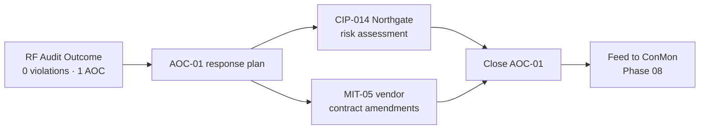

# 07.11 — Post-Audit Remediation Approach

| Field | Value |
|---|---|
| Document ID | CIP-AUD-PREM-2026-711 |
| Version | 1.0 |
| Date | 2026-03-02 |
| Classification | BES Cyber System Information (BCSI) // Illustrative Portfolio Sample |
| Owner | Nathan Cole, Program Lead |
| Author | Advisory Team (OT GRC / NERC CIP Advisory) |
| Status | Approved |

## Purpose

The ReliabilityFirst (RF) Compliance Audit produced **0 new Possible Violations** and **1 Area of Concern** (AOC-01). Because AOC-01 is a **recommendation, not a violation**, no Mitigation Plan is required for it under the CMEP; nonetheless GridPoint treats the recommendation with the same rigor as a formal finding. This document sets out the **post-audit remediation approach**: closing AOC-01 (accelerate the **CIP-014 Northgate** risk assessment and the **MIT-05** vendor contract amendments), continuing closure of the remaining open Mitigation Plan, and feeding all of it into the ongoing Continuous Monitoring (ConMon) and internal controls program (Phase 08).

## 1. Scope of Post-Audit Work

| Work Item | Type | Enforcement Status |
|---|---|---|
| AOC-01 — CIP-014 Northgate risk assessment | Area of Concern (recommendation) | Non-violation; no Mitigation Plan required |
| AOC-01 — MIT-05 vendor contract amendments | Area of Concern + open Mitigation Plan | MIT-05 already an accepted plan; In Progress |
| Continued Mitigation-Plan closure | Ongoing remediation | 8 of 9 closed; MIT-05 open |
| Feed to ConMon | Transition activity | Phase 08 |

## 2. Area of Concern Response Plan

### 2.1 AOC-01(a) — CIP-014 Northgate Risk Assessment

CIP-014-3 requires an identification of critical Transmission stations through a risk assessment, verified by an unaffiliated third-party reviewer, followed by a physical-security evaluation and plan. At audit fieldwork, the **Northgate** station assessment was in progress with a documented completion commitment.

| Step | Action | Owner | Evidence |
|---|---|---|---|
| 1 | Finalize the CIP-014 R1 risk assessment for Northgate | Frank Delgado (Physical) | Completed risk assessment |
| 2 | Obtain unaffiliated third-party verification (R2) via an independent licensed engineering firm | Delgado / Reyes | Third-party verification letter |
| 3 | Complete the physical-security evaluation and plan (R4/R5) | Delgado | Approved security plan |
| 4 | CIP Senior Manager review and acceptance | Daniel Reyes | Signed acceptance |

### 2.2 AOC-01(b) — MIT-05 Vendor Contract Amendments

**MIT-05** (Low, CIP-013 R2) addresses missing vendor notification clauses in two contracts; it was **In Progress** at Phase-06 baseline, awaiting counterparty signature.

| Step | Action | Owner | Evidence |
|---|---|---|---|
| 1 | Finalize amended clauses with both vendors | Priya Nair (IT) | Executed amendments |
| 2 | Confirm notification/coordination-of-response terms meet CIP-013 R2 | Nair / Whitfield | Clause-to-requirement map |
| 3 | Internally validate and certify closure | Karen Whitfield / Daniel Reyes | Completion certification |
| 4 | Report MIT-05 closed to RF (Mitigation Plan completion) | Nathan Cole | RF submission record |

## 3. Continued Mitigation-Plan Closure

Eight of the nine Mitigation Plans (MIT-01, -02, -03, -04, -06, -07, -08, -09) were closed and internally validated at Phase-06 baseline; **MIT-05** is the sole open plan and is the primary continuing-closure item, tracked to certified completion and reported to RF.

| Metric | Value |
|---|---|
| Mitigation Plans total | 9 |
| Closed & validated | 8 |
| Open (MIT-05) | 1 |
| Overdue | 0 |
| Open High-risk items | 0 |
| Self-Reports filed to RF | 2 (MIT-02, MIT-07) — accepted, acknowledged at audit |

## 4. Feeding Into Continuous Monitoring (ConMon)

Post-audit items do not close into a vacuum — they become inputs to the ongoing internal controls program stood up in Phase 08. This ensures the conditions behind AOC-01 stay under active surveillance and do not recur.

| Post-Audit Item | ConMon Handoff |
|---|---|
| CIP-014 Northgate | Added to the physical-security control monitoring set; recurring review of critical-station assessments |
| MIT-05 vendor clauses | Rolled into CIP-013 supply-chain control monitoring; contract-clause checks at renewal |
| Patch cycle (prior-issue area) | Continuous CIP-007 R2 cycle monitoring with alerting |
| Change approvals (MIT-07 area) | Continuous CIP-010 R1 change-record completeness checks |
| Access reviews (MIT-09 area) | Recurring CIP-004 access-review reconciliation |

## 5. Tracking, Governance & Cadence

| Element | Approach |
|---|---|
| Tracker | AOC-01 and MIT-05 tracked in the remediation/action tracker with milestones and target dates |
| Reporting | Status reported to the CIP Senior Manager on the standing compliance cadence |
| Validation | Independent internal validation by the Compliance Manager before closure |
| Certification | CIP Senior Manager Daniel Reyes certifies completion |
| RF interface | MIT-05 completion reported to RF; AOC-01 closure available for any RF follow-up |
| Residual risk | Remains **Low**; drops further as AOC-01 items close |

## 6. Success Criteria

| Criterion | Target |
|---|---|
| CIP-014 Northgate assessment finalized & third-party verified | Complete, CIP Senior Manager accepted |
| MIT-05 amendments executed and validated | Complete, reported to RF |
| AOC-01 formally closed | Documented closure retained in BCSI repository |
| All findings/recommendations under ConMon surveillance | Handed off to Phase 08 |
| Residual risk | Confirmed Low, no open High items |

## Cross-References

| Reference | Purpose |
|---|---|
| [07.10 — Audit Conduct & Outcome](07.10-audit-conduct-and-outcome.md) | Source of AOC-01 |
| [06.02 — Mitigation Plan Register](../06-gap-remediation-mitigation-plans/06.02-mitigation-plan-register.md) | MIT-01…09 register |
| [06.08 — Remediation Status Reporting](../06-gap-remediation-mitigation-plans/06.08-remediation-status-reporting.md) | MIT-05 status |
| [06.09 — Residual Risk & Risk Acceptance](../06-gap-remediation-mitigation-plans/06.09-residual-risk-and-risk-acceptance.md) | Residual-risk basis |
| [07.13 — Phase Summary & Transition](07.13-phase-summary-and-transition.md) | Transition to Phase 08 ConMon |

---

[⬅ Previous](07.10-audit-conduct-and-outcome.md) · [🏠 Phase README](07.00-README.md) · [Next ➡](07.12-compliance-package-sign-off.md)
