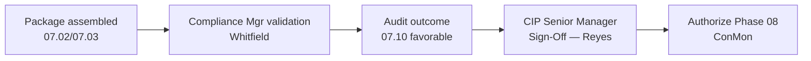

# 07.12 — Compliance Package Sign-Off

| Field | Value |
|---|---|
| Document ID | CIP-AUD-SIGN-2026-712 |
| Version | 1.0 |
| Date | 2026-03-02 |
| Classification | BES Cyber System Information (BCSI) // Illustrative Portfolio Sample |
| Owner | Daniel Reyes, CIP Senior Manager |
| Author | Advisory Team (OT GRC / NERC CIP Advisory) |
| Status | Approved |

## Purpose

This document records the **formal sign-off** of GridPoint Energy's Phase 07 compliance evidence package and the **ReliabilityFirst (RF) Compliance Audit outcome** by the **CIP Senior Manager, Daniel Reyes** — the single accountable authority designated under CIP-003 R1. Sign-off attests that the compliance package is complete and controlled, that the audit outcome (0 new Possible Violations; 1 Area of Concern; favorable) is accepted, and that the post-audit approach and transition to the ongoing internal controls program are authorized.

## 1. Sign-Off Scope

| Item Attested | Reference |
|---|---|
| Compliance evidence package (24 line items, ~260 artifacts) | 07.02 / 07.03 |
| 12 RSAWs + CIP-002 categorization | Phase 05 / Phase 02 |
| 9 Mitigation Plans and 2 Self-Reports (MIT-02, MIT-07) | Phase 06 |
| Sampling populations and readiness | 07.08 |
| RF Compliance Audit outcome | 07.10 |
| Post-audit remediation approach (AOC-01, MIT-05) | 07.11 |

## 2. Attestation of the Compliance Package

I attest that the Phase 07 compliance evidence package assembled for the ReliabilityFirst Compliance Audit is **complete, accurate, current, and maintained under access controls as BES Cyber System Information (BCSI)**. The package comprises 24 line items and approximately 260 evidence artifacts mapped to the 118 applicable CIP requirement parts across GridPoint's 52 BES Cyber Systems and associated EACMS, PACS, and PCA. The RSAWs, categorization, policy suite, CIP-004 program evidence, Mitigation Plans, Self-Reports, and supporting registers were reviewed and found fit for regulatory submission.

## 3. Attestation of the Audit Outcome

I acknowledge and accept the outcome of the ReliabilityFirst Compliance Audit:

| Outcome Element | Result |
|---|---|
| Audit fieldwork | 2027-06 |
| Compliance Audit Report issued | 2027-07-15 |
| **New Possible Violations** | **0** |
| Self-reported items (MIT-02, MIT-07) | Acknowledged under accepted Mitigation Plans; no additional enforcement |
| **Areas of Concern** | **1** (AOC-01: accelerate CIP-014 Northgate + MIT-05) |
| Overall assessment | **Favorable — compliant and well-managed** |

## 4. Authorization of the Post-Audit Approach

I authorize the post-audit remediation approach (07.11): finalize and third-party-verify the **CIP-014 Northgate** risk assessment, complete and validate the **MIT-05** vendor contract amendments, certify closure of the remaining open Mitigation Plan, and hand all residual items to the ongoing Continuous Monitoring and internal controls program (Phase 08). Residual risk is accepted as **Low**, with **0** open High-risk items.

## 5. Statement of Responsibility

As CIP Senior Manager, I hold single accountability for GridPoint Energy's CIP compliance program under CIP-003 R1. I confirm that the controls represented in this package are implemented and operating, that the evidence is authentic, and that any known open items (AOC-01, MIT-05) are disclosed and under active management. This sign-off does not delegate that accountability; delegations, where used, are recorded per the CIP-003 R1 delegation framework.

## 6. Signature Block

| Role | Name | Attestation | Signature | Date |
|---|---|---|---|---|
| **CIP Senior Manager** (VP Security & Compliance) | **Daniel Reyes** | Package complete; audit outcome accepted; post-audit approach authorized | ______________________ | 2027-07-15 |
| NERC Compliance Manager | Karen Whitfield | Evidence and RSAWs validated; audit interface managed | ______________________ | 2027-07-15 |
| Program Lead | Nathan Cole | Package assembled; data requests fulfilled | ______________________ | 2027-07-15 |
| OT / ICS Security Lead | Marcus Bell | Technical controls and evidence confirmed | ______________________ | 2027-07-15 |
| Advisory Team | Advisory Team (OT GRC / NERC CIP Advisory) | Independent assurance of package and outcome | ______________________ | 2027-07-15 |

## 7. Package Contents Attested

The sign-off covers the full compliance package assembled in Phase 07, each component of which is retained under BCSI access controls.

| Component | Count / Detail |
|---|---|
| Reliability Standard Audit Worksheets (RSAWs) | 12 (CIP-002 through CIP-013) |
| CIP-002 categorization | 52 BCS (14 Medium / 38 Low) |
| Integrated asset & BCS lists | ~420 BCA; 26 EACMS / 18 PACS / 60 PCA |
| Policy suite | CIP-003 R1 cyber security policies |
| CIP-004 program evidence | 160-person access population |
| Evidence artifacts index | ~260 artifacts mapped to requirement parts |
| Mitigation Plans | 9 (MIT-01…09) |
| Self-Reports | 2 (MIT-02, MIT-07) |
| Supporting registers | Gap register, findings register, remediation trackers |

## 8. Conditions & Disclosures

This sign-off is made with full disclosure of the known open items, none of which constitute a violation:

- **AOC-01** — the CIP-014 Northgate risk assessment and MIT-05 vendor contract amendments are in progress under an authorized plan (07.11).
- **MIT-05** — the sole open Mitigation Plan, on schedule, awaiting counterparty signature.
- No open High-risk items; residual risk accepted as **Low**.

## 9. Effect of Sign-Off

Upon this sign-off, the Phase 07 compliance package and audit outcome are **baselined and retained** in the controlled BCSI repository under the document and evidence management plan, preserved for the next ~3-year audit cycle and any RF follow-up on AOC-01. The program is authorized to close Phase 07 and transition to Phase 08 (07.13).

## Cross-References

| Reference | Purpose |
|---|---|
| [07.02 — Compliance Evidence Package Assembly](07.02-compliance-evidence-package-assembly.md) | Package attested |
| [07.10 — Audit Conduct & Outcome](07.10-audit-conduct-and-outcome.md) | Outcome accepted |
| [07.11 — Post-Audit Remediation Approach](07.11-post-audit-remediation-approach.md) | Approach authorized |
| [01.06 — CIP Senior Manager Designation & Delegations](../01-program-foundation/01.06-cip-senior-manager-designation-and-delegations.md) | CIP-003 R1 authority |
| [07.13 — Phase Summary & Transition](07.13-phase-summary-and-transition.md) | Phase close-out |

---

[⬅ Previous](07.11-post-audit-remediation-approach.md) · [🏠 Phase README](07.00-README.md) · [Next ➡](07.13-phase-summary-and-transition.md)
