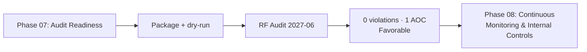

# 07.13 — Phase 07 Summary & Transition

| Field | Value |
|---|---|
| Document ID | CIP-AUD-PHSUM-2026-713 |
| Version | 1.0 |
| Date | 2026-03-02 |
| Classification | BES Cyber System Information (BCSI) // Illustrative Portfolio Sample |
| Owner | Karen Whitfield, NERC Compliance Manager |
| Author | Advisory Team (OT GRC / NERC CIP Advisory) |
| Status | Approved |

## Purpose

This document closes **Phase 07 — Regional Entity Audit Readiness & Compliance Package** for GridPoint Energy. It confirms that the compliance package was assembled, the ReliabilityFirst (RF) Compliance Audit was passed with **0 new Possible Violations** and **1 Area of Concern**, residual risk is **Low**, and the program is ready to transition to **Phase 08 — Continuous Monitoring & Internal Controls**.

## 1. What Phase 07 Delivered

| Outcome | Result |
|---|---|
| Compliance evidence package assembled | 24 line items · ~260 evidence artifacts · classified BCSI |
| Sampling populations ready | 52 BCS · 160 personnel · patch cycles · change records (07.08) |
| SMEs prepared | Mock interview guides for CIP-005/007/010/004 (07.09) |
| Pre-audit dry-run | Readiness confirmed on all four pillars (07.05) |
| **RF Compliance Audit conducted** | **Fieldwork 2027-06; report 2027-07-15** |
| **Audit outcome** | **0 new Possible Violations; 1 Area of Concern; favorable** |
| Self-reported items | MIT-02, MIT-07 acknowledged under accepted Mitigation Plans |
| Package sign-off | CIP Senior Manager **Daniel Reyes** (07.12) |
| Residual risk | **Low** — 0 open High items |

## 2. Audit Result Confirmed

The ReliabilityFirst Compliance Audit assessed GridPoint's CIP program as **compliant and well-managed**. RF identified **0 new Possible Violations**, acknowledged the two self-reported items (MIT-02 IRA logging, MIT-07 baseline approvals) as already under accepted Mitigation Plans with no additional enforcement, and issued a single **Area of Concern (AOC-01)** recommending acceleration of the **CIP-014 Northgate** risk assessment and the **MIT-05** vendor contract amendments — a recommendation, not a violation.

## 3. Open Items Carried Into Phase 08

| Item | Status | Handoff |
|---|---|---|
| AOC-01 — CIP-014 Northgate | In progress; completion committed | Physical-security control monitoring |
| AOC-01 / MIT-05 — vendor clauses | Open Mitigation Plan; awaiting signature | CIP-013 supply-chain monitoring |
| Prior-issue areas (patch, change, access) | Closed; under surveillance | Continuous CIP-007/010/004 monitoring |

## 4. Readiness to Enter Phase 08

| Readiness check | Status |
|---|---|
| Compliance package baselined and retained (BCSI) | Complete |
| Audit outcome accepted and signed off | Complete |
| Post-audit approach authorized (07.11) | Complete |
| Residual risk confirmed Low; 0 open High | Complete |
| Open items assigned to ConMon control sets | Complete |

## 5. Program Trajectory Confirmed

Phase 07 is the culmination of the compliance lifecycle that began with CIP-002 categorization. The end-to-end trajectory is now evidenced:

| Milestone | Phase | Result |
|---|---|---|
| BES Cyber Systems categorized | 02 | 52 BCS; 118 applicable parts |
| Baseline gap assessment | 02 | 84 met / 34 gaps |
| Internal compliance assessment | 05 | 9 PNCs; "Substantially Ready" |
| Gap remediation & Mitigation Plans | 06 | 8 of 9 closed; 2 Self-Reports; residual risk Low |
| Audit readiness & RF audit | 07 | **0 violations; 1 AOC; favorable** |

No High-risk finding ever reached the RF audit; every item was remediated, self-reported, or self-logged before fieldwork, producing a clean, defensible audit result.

## 6. Handoff to Phase 08

Phase 08 stands up the **ongoing internal controls program**: continuous monitoring of CIP controls, periodic self-assessment and self-certification, evidence freshness management, and closure of AOC-01 and MIT-05 under recurring surveillance. It inherits the baselined compliance package, the favorable audit result, and the Low residual-risk posture from Phase 07 without modification.

## 7. Residual Risk Statement

With the favorable audit result recorded and only a bounded, owned Area of Concern outstanding, GridPoint's CIP compliance residual risk is confirmed **Low**:

| Risk Dimension | Position at Phase 07 Close |
|---|---|
| Open High-risk items | 0 |
| Open Possible Violations | 0 |
| Open Mitigation Plans | 1 (MIT-05, on schedule) |
| Open Areas of Concern | 1 (AOC-01, non-violation) |
| New penalty exposure from the audit | None |
| Overall residual risk | **Low** |

## 8. Sign-Off

| Role | Name | Acceptance |
|---|---|---|
| CIP Senior Manager | Daniel Reyes | Audit outcome and package accepted (07.12) |
| NERC Compliance Manager | Karen Whitfield | Phase deliverables validated |
| Program Lead | Nathan Cole | Package assembled; audit supported |
| Advisory Team | Advisory Team | Phase 07 deliverables complete |

## Cross-References

| Reference | Purpose |
|---|---|
| [07.10 — Audit Conduct & Outcome](07.10-audit-conduct-and-outcome.md) | Formal audit result |
| [07.11 — Post-Audit Remediation Approach](07.11-post-audit-remediation-approach.md) | AOC-01 / MIT-05 approach |
| [07.12 — Compliance Package Sign-Off](07.12-compliance-package-sign-off.md) | CIP Senior Manager sign-off |
| [06.10 — Phase 06 Summary & Transition](../06-gap-remediation-mitigation-plans/06.10-phase-summary-and-transition.md) | Prior phase handoff |

---

[⬅ Previous](07.12-compliance-package-sign-off.md) · [🏠 Phase README](07.00-README.md) · [Next ➡](../08-continuous-monitoring-internal-controls/08.00-README.md)
