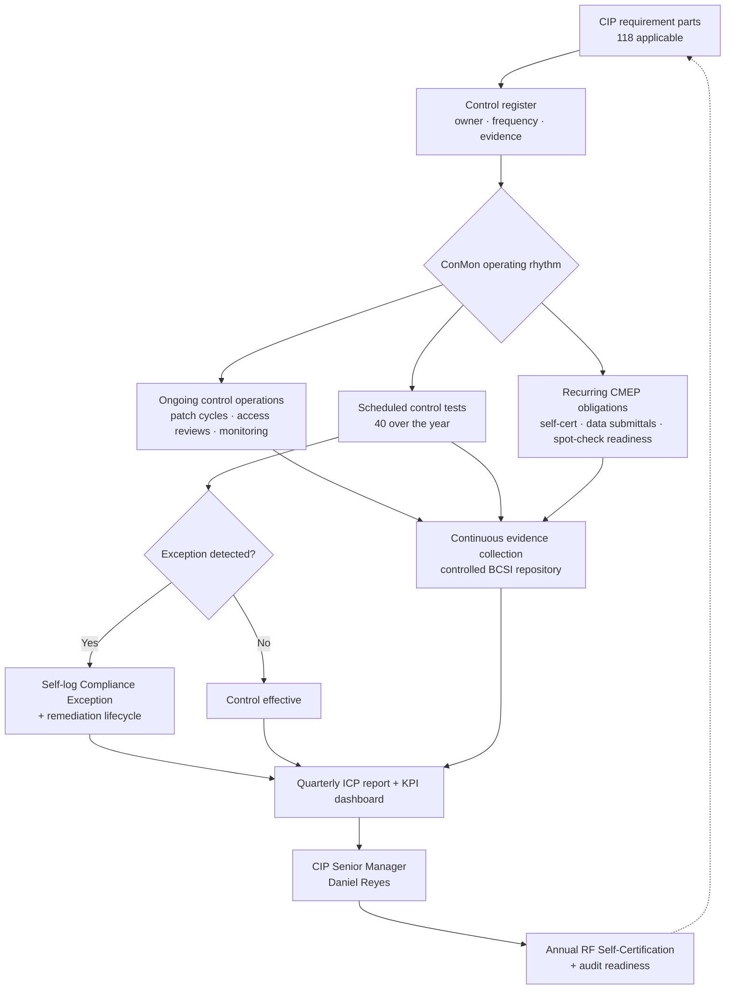

# 08.01 — CIP Internal Controls Program (ICP): Design

| Field | Value |
|---|---|
| Document ID | CIP-ICP-DSGN-2026-801 |
| Version | 1.0 |
| Date | 2026-03-02 |
| Classification | BES Cyber System Information (BCSI) // Illustrative Portfolio Sample |
| Owner | Karen Whitfield, NERC Compliance Manager (ICP Owner) |
| Author | Advisory Team (OT GRC / NERC CIP Advisory) |
| Status | Approved |

## Purpose

This document is the **design charter for GridPoint Energy's CIP Internal Controls Program (ICP)** — the standing program that **sustains NERC CIP compliance between ReliabilityFirst (RF) Compliance Audits**. Following the favorable RF audit (fieldwork 2027-06; Compliance Audit Report issued 2027-07-15; **0 new Possible Violations**, 1 Area of Concern), GridPoint transitioned from an implementation-and-remediation posture to **continuous compliance monitoring (ConMon)**. The ICP defines the objectives, the control-testing model, the roles, and the operating rhythm that keep the **52 BES Cyber Systems (14 Medium + 38 Low; 0 High)** and their associated **26 EACMS, 18 PACS, and 60 PCA** compliant and audit-ready at all times, while detecting and self-correcting issues early — before they can mature into Possible Violations. This is the **keystone** document for Phase 08; every other document in this phase operates a component the ICP defines here.

## 1. Why an Internal Controls Program

Under the NERC Compliance Monitoring and Enforcement Program (CMEP), a Medium-impact entity is audited by RF on a **~3-year cycle**. Compliance is a continuous obligation, not a point-in-time event. An entity that only "gets ready" for the audit accumulates undetected drift across the ~34 months between fieldwork windows. GridPoint's own history — a prior lapsed **CIP-007 R2** patch-evaluation cycle — demonstrates how a single unmanaged control can silently fall out of compliance.

The ICP exists to eliminate that gap. It converts each CIP requirement part into a **monitored control with an owner, a frequency, an evidence stream, and a test**, so that:

- Recurring CMEP obligations (self-certifications, periodic data submittals, spot-check readiness) are met **on time, every time** — overdue obligations: **0**.
- Control drift is **detected internally** through routine testing rather than by an RF auditor.
- Issues are **self-logged and remediated** under GridPoint's control — 3 Compliance Exceptions were self-logged and remediated during the reporting window, keeping Possible Violations at **0**.
- Evidence is **continuously current** — the program is audit-ready at all times, not reconstructed under deadline pressure.

## 2. ICP Objectives

| # | Objective | How the ICP Delivers It | Primary Measure |
|---|---|---|---|
| O1 | Sustain compliance between audits | Every applicable requirement part mapped to a monitored control with owner + frequency | 118 requirement parts under monitoring |
| O2 | Detect issues early | Scheduled internal control tests; exception-based monitoring; KRI/KPI dashboard | 40 control tests over the year |
| O3 | Self-correct before enforcement | Self-logged Compliance Exception + remediation lifecycle | 3 Compliance Exceptions logged & remediated; 0 Possible Violations |
| O4 | Keep evidence audit-ready | Continuous evidence collection to the controlled BCSI repository | Evidence currency: continuous |
| O5 | Meet all recurring CMEP deadlines | ConMon calendar with owners and lead-time alerts | 0 overdue obligations |
| O6 | Close residual audit items | Track the single Area of Concern to closure | AOC-01 closed (CIP-014 Northgate + MIT-05) |
| O7 | Inform leadership & the CIP Senior Manager | Quarterly ICP report + annual attestation | Reported 2027-Q3 → 2028-Q2 |

## 3. The Three Lines of Defense

The ICP is organized on the standard **three-lines-of-defense** model, adapted to an OT-GRC / NERC CIP context.

| Line | Who | Role in the ICP |
|---|---|---|
| **1st line — Control operators** | Bell (OT), Nair (IT), Delgado (Physical), Lee (HR), Ruiz (Field), Okafor (Ops) | Own and operate the CIP controls day-to-day; generate primary evidence; run first-level checks |
| **2nd line — Compliance oversight** | Karen Whitfield (Compliance Manager / ICP Owner) | Designs the control-testing plan; runs independent control tests; maintains the ConMon calendar; logs & tracks Compliance Exceptions; reports to the CIP Senior Manager |
| **3rd line — Independent assurance** | Internal audit / independent reviewers; RF Compliance Audit | Periodic independent validation of ICP effectiveness; the RF ~3-year audit is the external assurance backstop |

Accountability terminates with the **CIP Senior Manager, Daniel Reyes** — the single accountable authority required by **CIP-003 R1** — who receives ICP reporting and signs the annual RF Self-Certification.

## 4. The Control-Testing Model

The ICP treats each CIP requirement part as a **control** and applies a repeatable test methodology. Controls are risk-ranked (Medium-impact BCS controls tested more frequently than Low), assigned a test frequency, and evidenced.

| Step | Activity | Output |
|---|---|---|
| 1. Inventory | Map applicable requirement parts to named controls with owners | Control register (118 parts) |
| 2. Risk-rank | Weight by impact rating (Medium > Low) and prior-issue history | Test-frequency assignment |
| 3. Schedule | Place each test on the ConMon calendar (quarterly / annual / 15-month) | Annual test plan (40 tests) |
| 4. Test | Sample evidence; verify the control operated as designed | Test worksheet + result |
| 5. Conclude | Rate **Effective / Effective-with-exception / Ineffective** | Test conclusion |
| 6. Remediate | For exceptions, open a self-logged Compliance Exception + remediation | Remediation record |
| 7. Report | Roll results into the quarterly ICP report and KPI dashboard | ICP report to CIP SM |

### 4.1 Reporting-window results

| Metric | Figure |
|---|---|
| Internal control tests conducted | **40** |
| Controls assessed **effective** | All (2 minor exceptions self-corrected) |
| Self-logged Compliance Exceptions | **3** — all minimal-risk, remediated |
| Possible Violations | **0** |
| Reportable Cyber Security Incidents (CIP-008) | **0** |
| Low-severity security events handled internally | **4** |
| Overdue compliance obligations | **0** |
| Reporting window | **2027-Q3 → 2028-Q2** |
| Compliance status as of 2028-Q2 | **Good standing** |

## 5. The ICP Operating Model

The loop is deliberately closed: every operation and test feeds evidence and results upward to the CIP Senior Manager, who in turn attests to RF and sets the priorities that flow back into the control register.

## 6. Roles & Responsibilities

| Role | Person | ICP Responsibility |
|---|---|---|
| CIP Senior Manager | **Daniel Reyes** | Accountable authority (CIP-003 R1); receives ICP reporting; signs annual Self-Certification |
| ICP Owner / Compliance Manager | **Karen Whitfield** | Runs the ICP; owns the control-testing plan, ConMon calendar, exception log, and reporting |
| OT / ICS Security Lead | **Marcus Bell** | Controls for CIP-005, CIP-007, CIP-010 on OT/BES Cyber Systems; incident response technical lead |
| IT Security Manager | **Priya Nair** | Patch sourcing, security event monitoring (SIEM), CIP-007 IT-side controls |
| Physical Security Manager | **Frank Delgado** | CIP-006 physical access controls and monitoring (10 PSPs) |
| HR / PRA Coordinator | **Sandra Lee** | CIP-004 personnel risk assessments, training, access-privilege reviews |
| Substation & Field Engineering Lead | **Elena Ruiz** | Field-side CIP-010 baselines/changes; substation control evidence |
| Control Center Operations Manager | **James Okafor** | CIP-009 recovery operations; control-center operational evidence |

## 7. How the ICP Detects Issues Early

The ICP layers **preventive**, **detective**, and **corrective** controls so that drift surfaces internally.

| Control Type | Examples | Detects / Prevents |
|---|---|---|
| Preventive | Change authorization (CIP-010 R1), access provisioning workflow (CIP-004), 35-day patch evaluation (CIP-007 R2) | Stops non-compliant change before it happens |
| Detective | SIEM security-event monitoring (CIP-007 R4), configuration monitoring (CIP-010 R2), quarterly access reviews (CIP-004), 40 scheduled control tests | Surfaces drift and unauthorized change after the fact but before an audit |
| Corrective | Self-logged Compliance Exception + remediation, Mitigation Plan lifecycle, recovery/restoration testing (CIP-009) | Restores compliance and reduces recurrence |

The three self-logged Compliance Exceptions during the window are the model working as designed: internal detection → self-log → remediation → **0 Possible Violations**.

## 8. Reporting Cadence

| Report | Frequency | Audience | Content |
|---|---|---|---|
| ICP control-test summary | Quarterly | CIP Senior Manager | Test results, exceptions, remediation status |
| KPI / KRI dashboard | Quarterly | Compliance & leadership | 40 tests, 3 exceptions, 0 PVs, 0 overdue |
| Annual ICP effectiveness attestation | Annual | CIP Senior Manager → RF | Program effectiveness; supports Self-Certification |
| Area-of-Concern closure report | On closure | CIP Senior Manager / RF | AOC-01 (CIP-014 Northgate + MIT-05) closed |

## 9. Closing the Audit's Area of Concern

The ICP absorbed and closed the single Area of Concern (AOC-01) from the RF audit:

| Item | Action | Status |
|---|---|---|
| CIP-014 Northgate risk assessment | Completed with independent third-party verification; physical security plan updated | **Completed 2027-Q4 — closed** |
| MIT-05 vendor contract amendments (CIP-013 R2) | Counterparty amendments executed | **Completed 2027-03-31 — closed** |
| **Area of Concern overall** | — | **Closed** |

## 10. Program Assurance Statement

GridPoint's CIP Internal Controls Program provides **reasonable assurance** that the entity's applicable NERC CIP obligations are met continuously between RF audits. Over the first post-audit year (2027-Q3 → 2028-Q2), the ICP executed **40 internal control tests**, sustained **12 monthly patch cycles at 100% within window**, completed **4 of 4 quarterly access reviews**, and self-logged and remediated **3 minimal-risk Compliance Exceptions** with **0 Possible Violations** and **0 reportable incidents** — leaving GridPoint in **good standing** and audit-ready at all times.

## Cross-References

| Reference | Purpose |
|---|---|
| [08.02 — Compliance Monitoring Calendar](08.02-compliance-monitoring-calendar.md) | The recurring CMEP obligations the ICP schedules |
| [08.11 — Continuous Evidence Collection & Testing](08.11-continuous-evidence-collection-and-testing.md) | Evidence & test operations detail |
| [08.12 — Compliance Metrics & KPIs](08.12-compliance-metrics-and-kpis.md) | KPI dashboard the ICP reports |
| [08.13 — Self-Report & Mitigation Lifecycle](08.13-self-report-and-mitigation-lifecycle.md) | Compliance Exception / self-report handling |
| [01.06 — CIP Senior Manager Designation & Delegations](../01-program-foundation/01.06-cip-senior-manager-designation-and-delegations.md) | CIP-003 R1 accountable authority |
| [01.12 — Compliance Obligations Calendar](../01-program-foundation/01.12-compliance-obligations-calendar.md) | Foundational obligations calendar |
| [07.10 — Audit Conduct & Outcome](../07-audit-readiness-compliance-package/07.10-audit-conduct-and-outcome.md) | RF audit result the ICP sustains |

---

[⬅ Previous](08.00-README.md) · [🏠 Phase README](08.00-README.md) · [Next ➡](08.02-compliance-monitoring-calendar.md)
