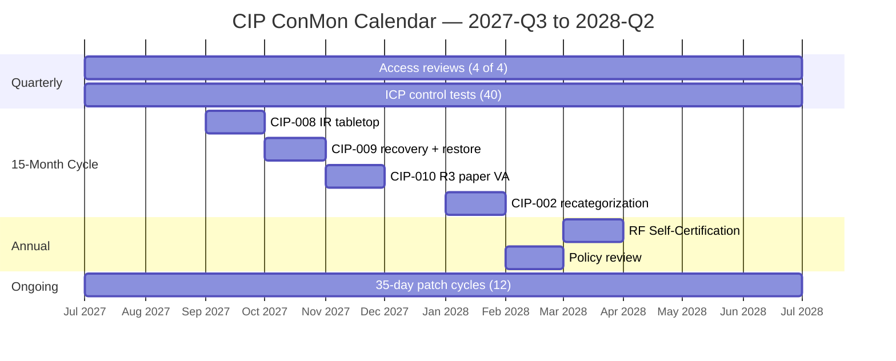

# 08.02 — Compliance Monitoring Calendar (CMEP Obligations in Operation)

| Field | Value |
|---|---|
| Document ID | CIP-ICP-CAL-2026-802 |
| Version | 1.0 |
| Date | 2026-03-02 |
| Classification | BES Cyber System Information (BCSI) // Illustrative Portfolio Sample |
| Owner | Karen Whitfield, NERC Compliance Manager (ICP Owner) |
| Author | Advisory Team (OT GRC / NERC CIP Advisory) |
| Status | Approved |

## Purpose

This document is the **operating compliance-monitoring calendar** for GridPoint Energy's CIP Internal Controls Program (ICP). It records the **recurring CMEP obligations** — RF Self-Certifications, periodic data submittals, spot-check readiness, and the quarterly / annual / 15-month / 7-year control cycles — as they were **operated during the first post-audit year (reporting window 2027-Q3 → 2028-Q2)**, each with an owner and a status. Every obligation in the window was met on time: **overdue compliance obligations: 0.** The calendar is the scheduling backbone the ICP (08.01) uses to guarantee no obligation is missed between RF audits.

## 1. Obligation Cycle Types

Under the CMEP, GridPoint's recurring obligations fall into distinct cycle types. The ICP tracks each with lead-time alerts so that owners act before, not on, the due date.

| Cycle | Typical Obligations | Owner Layer |
|---|---|---|
| **Quarterly** | CIP-004 R4 access-privilege reviews; ICP control-test summary; KPI dashboard | 1st + 2nd line |
| **Annual** | RF Self-Certification; annual policy review (CIP-003 R1); CIP-008/009 alignment | CIP SM + Compliance |
| **15-month** | CIP-008 IR plan test; CIP-009 recovery test; CIP-010 R3 paper VA; CIP-002 recategorization review | Control owners |
| **7-year** | Personnel Risk Assessment (PRA) renewal cycle (CIP-004 R3) | HR / PRA coordinator |
| **Event-driven / periodic** | Periodic Data Submittals to RF; spot-check responses; self-reports | Compliance Manager |

## 2. The Operating Calendar — Reporting Window 2027-Q3 → 2028-Q2

| Obligation | CIP Ref | Cycle | Owner | Due / Window | Status |
|---|---|---|---|---|---|
| Q3 access-privilege review | CIP-004 R4 | Quarterly | Sandra Lee | 2027-Q3 | ✅ Complete |
| Q4 access-privilege review | CIP-004 R4 | Quarterly | Sandra Lee | 2027-Q4 | ✅ Complete |
| Q1 access-privilege review | CIP-004 R4 | Quarterly | Sandra Lee | 2028-Q1 | ✅ Complete |
| Q2 access-privilege review | CIP-004 R4 | Quarterly | Sandra Lee | 2028-Q2 | ✅ Complete (4 of 4) |
| Monthly 35-day patch cycles | CIP-007 R2 | Monthly | Priya Nair / Marcus Bell | Each month | ✅ 12 of 12, 100% in window |
| Security-event monitoring review | CIP-007 R4 | Quarterly | Priya Nair | Each quarter | ✅ Complete; 4 low-severity events handled |
| Configuration/baseline monitoring | CIP-010 R2 | Ongoing | Marcus Bell | Continuous | ✅ Operating |
| ICP control-test summary | ICP | Quarterly | Karen Whitfield | Each quarter | ✅ 40 tests total |
| KPI / KRI dashboard | ICP | Quarterly | Karen Whitfield | Each quarter | ✅ Reported |
| CIP-008 IR plan test (tabletop) | CIP-008 R2 | 15-month | Marcus Bell | Within 15 months | ✅ 1 tabletop; lessons learned captured |
| CIP-009 recovery plan test | CIP-009 R2 | 15-month | James Okafor | Within 15 months | ✅ Passed |
| CIP-009 backup restoration test | CIP-009 R1 | 15-month | James Okafor | Within 15 months | ✅ Passed |
| CIP-010 R3 paper vulnerability assessment | CIP-010 R3 | 15-month | Marcus Bell | Within 15 months | ✅ Completed |
| CIP-002 recategorization review | CIP-002 R1/R2 | 15-month | Karen Whitfield | Within 15 months | ✅ Completed; no change (52 BCS) |
| CIP-013 vendor risk reviews | CIP-013 R1 | Annual/periodic | Karen Whitfield | Reporting year | ✅ Completed for key vendors |
| PRA renewals | CIP-004 R3 | 7-year | Sandra Lee | Rolling | ✅ Current: 142 personnel + 18 vendors |
| **RF Self-Certification** | CMEP | Annual | Daniel Reyes / Whitfield | Annual submission | ✅ 1 submitted on time |
| Periodic Data Submittals to RF | CMEP | Periodic | Karen Whitfield | Per RF schedule | ✅ On time |
| Spot-check readiness | CMEP | Continuous | Karen Whitfield | Always ready | ✅ Audit-ready at all times |
| Annual policy review | CIP-003 R1 | Annual | Daniel Reyes | Annual | ✅ Complete |

## 3. Annual Rhythm (Illustrative Timeline)

## 4. Spot-Check & Data-Request Readiness

Under the CMEP, RF may issue a **Spot Check** or **Periodic Data Submittal** request at any time. The ICP keeps GridPoint **audit-ready at all times** so these are routine, not disruptive:

| Readiness Element | State |
|---|---|
| Evidence currency | Continuous — controlled BCSI repository kept current |
| Sampling populations | Maintained live (52 BCS; 142 personnel + 18 vendors) |
| Data-request response process | Rehearsed (per Phase 07); turnaround within agreed timeframes |
| RSAW alignment | RSAWs kept in sync with operating evidence |

## 5. Lead-Time Alerting & Escalation

To guarantee **0 overdue obligations**, each calendar entry carries a lead-time alert and a defined escalation path so an owner acts before the due date, not on it.

| Lead-Time Stage | Trigger | Action |
|---|---|---|
| T-60 days | Obligation enters the alert window | Owner notified; evidence gathering begins |
| T-30 days | Obligation approaching | Owner confirms readiness to Compliance Manager |
| T-14 days | Final readiness check | Compliance Manager (Whitfield) verifies evidence complete |
| T-0 | Due date | Obligation met; evidence filed to BCSI repository |
| Overdue (would-be) | Missed T-0 | Escalate immediately to CIP Senior Manager (Reyes) — **did not occur** |

## 6. Ownership Matrix by Cycle

| Cycle | Accountable | Consulted / Support |
|---|---|---|
| Quarterly access reviews | Sandra Lee | Karen Whitfield, control owners |
| Monthly patch cycles | Priya Nair / Marcus Bell | IT/OT teams |
| 15-month tests & assessments | Bell / Okafor | Whitfield (evidence), Reyes (oversight) |
| Annual Self-Certification | Daniel Reyes | Karen Whitfield (preparation) |
| 7-year PRA renewals | Sandra Lee | HR, hiring managers |
| Periodic Data Submittals / spot checks | Karen Whitfield | All control owners |

## 7. Obligation Health Summary

| Measure | Result |
|---|---|
| Obligations due in window | All met |
| **Overdue obligations** | **0** |
| RF Self-Certifications submitted late | 0 |
| Periodic Data Submittals late | 0 |
| Escalations to CIP Senior Manager for missed obligations | 0 |
| Compliance status (2028-Q2) | **Good standing** |

## Cross-References

| Reference | Purpose |
|---|---|
| [08.01 — Internal Controls Program Design](08.01-internal-controls-program-design.md) | ICP that owns this calendar |
| [08.08 — Access Reviews & PRA Renewals (CIP-004)](08.08-access-reviews-and-pra-renewals-cip-004.md) | Quarterly reviews & 7-year PRA cycle |
| [08.09 — CIP-002 15-Month Review](08.09-cip-002-15-month-review.md) | 15-month recategorization obligation |
| [01.12 — Compliance Obligations Calendar](../01-program-foundation/01.12-compliance-obligations-calendar.md) | Foundational obligations calendar |
| [01.03 — Regulatory Context (NERC/FERC/RF/CMEP)](../01-program-foundation/01.03-regulatory-context-nerc-ferc-rf-cmep.md) | CMEP monitoring methods |

---

[⬅ Previous](08.01-internal-controls-program-design.md) · [🏠 Phase README](08.00-README.md) · [Next ➡](08.03-incident-response-testing-cip-008.md)
