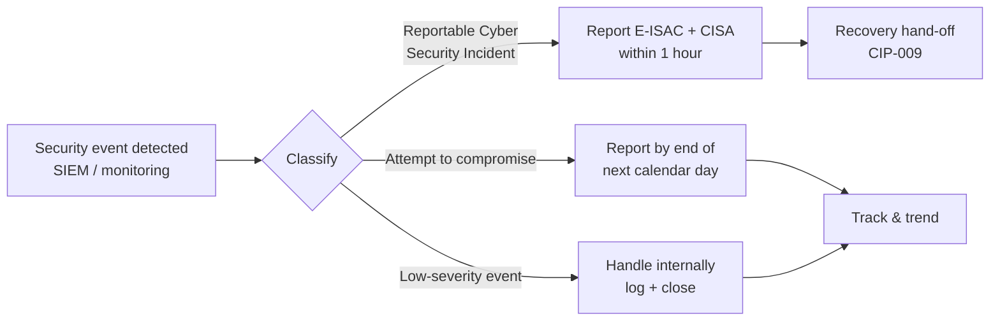

# 08.03 — Incident Response Testing (CIP-008) in Operation

| Field | Value |
|---|---|
| Document ID | CIP-ICP-008-2026-803 |
| Version | 1.0 |
| Date | 2026-03-02 |
| Classification | BES Cyber System Information (BCSI) // Illustrative Portfolio Sample |
| Owner | Marcus Bell, OT / ICS Security Lead |
| Author | Advisory Team (OT GRC / NERC CIP Advisory) |
| Status | Approved |

## Purpose

This document records the **ongoing operation of GridPoint Energy's CIP-008 Cyber Security Incident Response program** during the ICP reporting window (**2027-Q3 → 2028-Q2**). It documents the **tabletop exercise conducted** and its lessons learned, GridPoint's **E-ISAC and CISA reporting readiness**, and the incident record for the window: **0 Reportable Cyber Security Incidents** and **4 low-severity security events handled internally**. CIP-008-6 requires a documented incident response plan, testing at least once every **15 months**, and reporting of Reportable Cyber Security Incidents and attempts to compromise. The ICP operates all three continuously.

## 1. CIP-008 Obligations & How the ICP Meets Them

| CIP-008-6 Requirement | Obligation | ICP Operation |
|---|---|---|
| R1 | Documented incident response plan (roles, classification, response, reporting) | Plan maintained; reporting thresholds current |
| R2 | Test the plan at least once every 15 months (exercise or actual incident); use lessons learned; update plan | **1 tabletop conducted**; lessons learned captured; plan updated |
| R3 | Update plan and notify responders on changes | Plan revision issued post-exercise; responders re-briefed |
| Reporting | Reportable Cyber Security Incidents to **E-ISAC and CISA within 1 hour**; attempts to compromise by end of next calendar day | Reporting playbook validated in the exercise |

## 2. The Tabletop Exercise Conducted

One tabletop exercise was conducted within the 15-month cycle, satisfying CIP-008 R2.

| Attribute | Detail |
|---|---|
| Exercise type | Tabletop (discussion-based) |
| Scenario | Simulated intrusion attempt at an Electronic Access Point (EAP) with suspected lateral movement toward a Medium-impact BES Cyber System |
| Cycle | Within the 15-month CIP-008 R2 window |
| Participants | Marcus Bell (OT lead / IR commander), Priya Nair (IT/SIEM), James Okafor (Control Center Ops), Karen Whitfield (Compliance), Frank Delgado (Physical) |
| Objectives tested | Detection → classification → containment → notification decision → E-ISAC/CISA reporting timing → recovery hand-off to CIP-009 |
| Result | Plan exercised end-to-end; reporting decision path validated within the 1-hour threshold |

### 2.1 Lessons Learned

| # | Lesson Learned | Action Taken |
|---|---|---|
| L1 | Reportable-vs-attempt classification needed a faster decision aid | Added a one-page classification decision tree to the IR plan |
| L2 | E-ISAC / CISA contact roster required a fresher review cadence | Roster verification added to the quarterly ICP checklist |
| L3 | Hand-off from IR (CIP-008) to recovery (CIP-009) could be crisper | Defined explicit trigger and hand-off checklist between the two plans |

## 3. E-ISAC / CISA Reporting Readiness

GridPoint maintains readiness to report a **Reportable Cyber Security Incident to both E-ISAC and CISA within 1 hour** of determination, and to report **attempts to compromise by the end of the next calendar day**, as required under CIP-008-6 (as amended per the reporting mandate).

| Readiness Element | State |
|---|---|
| Reporting thresholds documented | ✅ In the IR plan; classification decision tree added |
| E-ISAC reporting channel | ✅ Verified; roster current |
| CISA reporting channel | ✅ Verified; roster current |
| 1-hour clock ownership | ✅ IR commander (Bell) with Compliance (Whitfield) backup |
| Attempt-to-compromise path | ✅ End-of-next-calendar-day path documented |

## 4. Incident Record — Reporting Window

| Incident Metric | Figure |
|---|---|
| **Reportable Cyber Security Incidents** | **0** |
| Attempts to compromise requiring next-day report | 0 |
| **Low-severity security events handled internally** | **4** |
| E-ISAC / CISA reports filed | 0 (none reportable) |
| IR plan tests conducted (15-month cycle) | 1 (tabletop) |

The **4 low-severity events** were routine security events (e.g., benign anomalous log entries and unsuccessful external scanning) that did not meet the Reportable threshold; each was triaged, logged, and closed internally with no BES impact.

## 5. Incident Classification Thresholds

The classification decision tree added post-exercise (lesson L1) codifies the CIP-008 thresholds so responders apply them consistently under time pressure.

| Classification | Definition (CIP-008 context) | Reporting Obligation |
|---|---|---|
| **Reportable Cyber Security Incident** | Compromise, or disruption, of a BES Cyber System / EACMS performing its function | **E-ISAC + CISA within 1 hour** |
| **Attempt to compromise** | An attempt that, if successful, would compromise applicable systems | Report by **end of next calendar day** |
| **Low-severity security event** | Event with no BES impact; no compromise or attempt meeting threshold | Handle & log internally |

## 6. The Four Low-Severity Events (Disposition)

| Event | Nature (illustrative) | Disposition |
|---|---|---|
| EV-1 | Anomalous authentication log entry — benign, verified | Logged; closed |
| EV-2 | Unsuccessful external port scanning at the perimeter | Logged; blocked; closed |
| EV-3 | Endpoint malware-prevention alert — quarantined, no spread | Logged; closed |
| EV-4 | Misconfigured monitoring rule generating false alerts | Rule corrected; closed |

None met the Reportable or attempt-to-compromise thresholds; none had BES impact.

## 7. Program Effectiveness Statement

Over the reporting window, GridPoint's CIP-008 program operated as designed: **1 tabletop** satisfied the 15-month testing obligation, lessons learned were captured and folded into the plan, E-ISAC/CISA reporting readiness was validated, and the incident record shows **0 Reportable Cyber Security Incidents** with **4 low-severity events** handled internally. The program remains audit-ready.

## Cross-References

| Reference | Purpose |
|---|---|
| [08.01 — Internal Controls Program Design](08.01-internal-controls-program-design.md) | ICP governing incident-response testing |
| [08.04 — Recovery Testing (CIP-009)](08.04-recovery-testing-cip-009.md) | Recovery hand-off from IR |
| [04.15 — Incident Response Plan (CIP-008)](../04-technical-physical-control-implementation/04.15-incident-response-plan-cip-008.md) | The IR plan being tested |
| [08.11 — Continuous Evidence Collection & Testing](08.11-continuous-evidence-collection-and-testing.md) | Evidence of exercise and events |

---

[⬅ Previous](08.02-compliance-monitoring-calendar.md) · [🏠 Phase README](08.00-README.md) · [Next ➡](08.04-recovery-testing-cip-009.md)
