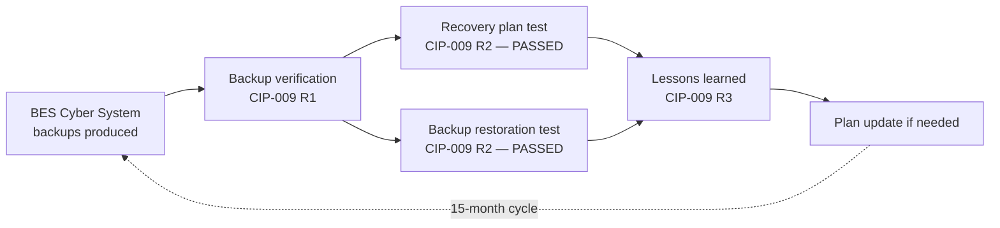

# 08.04 — Recovery Testing (CIP-009) in Operation

| Field | Value |
|---|---|
| Document ID | CIP-ICP-009-2026-804 |
| Version | 1.0 |
| Date | 2026-03-02 |
| Classification | BES Cyber System Information (BCSI) // Illustrative Portfolio Sample |
| Owner | James Okafor, Control Center Operations Manager |
| Author | Advisory Team (OT GRC / NERC CIP Advisory) |
| Status | Approved |

## Purpose

This document records the **ongoing operation of GridPoint Energy's CIP-009 Recovery Plan program** during the ICP reporting window (**2027-Q3 → 2028-Q2**). CIP-009-6 requires recovery plans for BES Cyber Systems, backup and restoration processes, and testing of both the **recovery plan** and **backup media / restoration** at least once every **15 months**. During the window GridPoint completed **1 recovery plan test (passed)** and a **backup restoration test (passed)**, both within the 15-month cycle. Recovery capability is anchored at the **Backup Control Center (Easton)** and supports continuity of the TOP/GOP functions.

## 1. CIP-009 Obligations & How the ICP Meets Them

| CIP-009-6 Requirement | Obligation | ICP Operation |
|---|---|---|
| R1 | Recovery plan(s): conditions for activation, roles, backup & storage, verification of backups | Plans maintained; backups produced and verified |
| R2 | Test recovery plan at least once every 15 months; test a representative sample of backup media / restoration | **Recovery plan test passed; backup restoration test passed** |
| R3 | Update recovery plan on lessons learned and on changes; notify responders | Lessons learned reviewed; plan current |

## 2. Recovery Plan Test

| Attribute | Detail |
|---|---|
| Test type | Recovery plan test (operational exercise of activation and recovery roles) |
| Cycle | Within the 15-month CIP-009 R2 window |
| Scope | Medium-impact BES Cyber Systems; recovery from the Backup Control Center (Easton) |
| Participants | James Okafor (Ops lead), Marcus Bell (OT), Priya Nair (IT), Karen Whitfield (Compliance) |
| Objectives | Activation criteria, role execution, recovery sequencing, verification of recovered function |
| **Result** | **Passed** |

## 3. Backup Restoration Test

| Attribute | Detail |
|---|---|
| Test type | Backup media / restoration test |
| Cycle | Within the 15-month CIP-009 R2 window |
| Scope | Representative sample of backup media for Medium-impact BES Cyber Systems |
| Method | Restore from backup to a verification environment; confirm integrity and usability |
| **Result** | **Passed** — backups restorable and usable |

## 4. Recovery Testing Cycle

## 5. Reporting-Window Results

| Metric | Figure / Status |
|---|---|
| Recovery plan tests completed | 1 — **Passed** |
| Backup restoration tests completed | 1 — **Passed** |
| 15-month cycle | ✅ Satisfied |
| Recovery site | Backup Control Center (Easton) |
| Lessons learned requiring plan change | Minor; plan kept current |
| Impact to BES operations from testing | None |

## 5a. Recovery Test Objectives & Outcomes

| Objective | What Was Verified | Outcome |
|---|---|---|
| Activation criteria | Conditions that trigger recovery-plan activation are clear and applied | ✅ Met |
| Role execution | Named recovery roles executed their steps without ambiguity | ✅ Met |
| Recovery sequencing | Systems recovered in the correct dependency order | ✅ Met |
| Backup integrity | Sampled backup media restored cleanly and completely | ✅ Met |
| Function verification | Recovered BES Cyber System function confirmed operational | ✅ Met |
| RTO/RPO expectations | Recovery achieved within planned time/data objectives | ✅ Met |

## 5b. Backup Media Handling & Storage

| Aspect | Operation |
|---|---|
| Backup production | Backups produced for Medium-impact BES Cyber Systems per schedule |
| Backup verification | Integrity verified per CIP-009 R1.4 (information for recovery is protected) |
| Storage | Backups retained at the Easton backup control center, physically protected |
| Sampling for test | Representative sample selected for the restoration test |
| Result | All sampled media restorable and usable |

## 6. Interlock with Incident Response (CIP-008)

Recovery testing is coordinated with the CIP-008 program: the incident-response tabletop (08.03) explicitly exercised the **hand-off from incident response to recovery**, and lesson L3 from that exercise sharpened the trigger and hand-off checklist between the CIP-008 and CIP-009 plans. This ensures that, in a real event, a contained incident transitions cleanly into a tested recovery.

## 7. Program Effectiveness Statement

GridPoint's CIP-009 program satisfied its 15-month obligations during the window: a **recovery plan test passed** and a **backup restoration test passed**, both evidenced in the controlled BCSI repository. Recovery capability from the Easton backup control center is demonstrated and audit-ready.

## Cross-References

| Reference | Purpose |
|---|---|
| [08.01 — Internal Controls Program Design](08.01-internal-controls-program-design.md) | ICP governing recovery testing |
| [08.03 — Incident Response Testing (CIP-008)](08.03-incident-response-testing-cip-008.md) | IR-to-recovery hand-off |
| [04.16 — Recovery Plan (CIP-009)](../04-technical-physical-control-implementation/04.16-recovery-plan-cip-009.md) | The recovery plan being tested |
| [08.11 — Continuous Evidence Collection & Testing](08.11-continuous-evidence-collection-and-testing.md) | Test evidence |

---

[⬅ Previous](08.03-incident-response-testing-cip-008.md) · [🏠 Phase README](08.00-README.md) · [Next ➡](08.05-patch-cycle-operations-cip-007.md)
