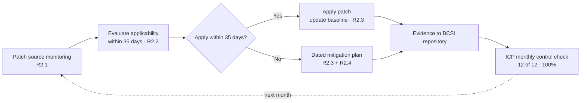

# 08.05 — Patch Cycle Operations (CIP-007) in Operation

| Field | Value |
|---|---|
| Document ID | CIP-ICP-007-2026-805 |
| Version | 1.0 |
| Date | 2026-03-02 |
| Classification | BES Cyber System Information (BCSI) // Illustrative Portfolio Sample |
| Owner | Priya Nair, IT Security Manager |
| Author | Advisory Team (OT GRC / NERC CIP Advisory) |
| Status | Approved |

## Purpose

This document records the **ongoing operation of GridPoint Energy's CIP-007 R2 patch-management program and CIP-007 R4 security-event monitoring** during the ICP reporting window (**2027-Q3 → 2028-Q2**). CIP-007-6 R2 requires a documented patch-management process with a **35-day evaluation cycle** and mitigation plans where a patch is not applied within the window. Over the year GridPoint executed **12 monthly 35-day patch cycles at 100% within window**. This is the control whose prior lapse motivated the mature internal-controls program (see FACTS drivers) — it is now the most closely monitored control in the ICP.

## 1. CIP-007 R2 Obligations & How the ICP Meets Them

| CIP-007-6 R2 Part | Obligation | ICP Operation |
|---|---|---|
| R2.1 | Identify patch sources for applicable Cyber Assets | Sources catalogued and maintained per BCS baseline |
| R2.2 | Evaluate security patches for applicability **within 35 calendar days** of source availability | Monthly evaluation cycle; 12 of 12 within window |
| R2.3 | Within 35 days of the evaluation completion, **apply** the patch, **create a dated mitigation plan**, or **revise an existing one** | Applied where feasible; mitigation plans created where not |
| R2.4 | Implement the mitigation plan | Mitigation actions tracked to completion |

## 2. Twelve Monthly Patch Cycles — Reporting Window

Each monthly cycle evaluated newly available security patches for applicability against the **14 Medium-impact BES Cyber System baselines** (and associated EACMS/PACS/PCA) within the 35-day window, then applied or mitigated.

| Cycle | Month | Evaluated within 35 days | Applied / Mitigated | Within Window |
|---|---|---|---|---|
| 1 | 2027-07 | ✅ | Applied; 1 mitigation plan | ✅ 100% |
| 2 | 2027-08 | ✅ | Applied | ✅ 100% |
| 3 | 2027-09 | ✅ | Applied | ✅ 100% |
| 4 | 2027-10 | ✅ | Applied; 1 mitigation plan | ✅ 100% |
| 5 | 2027-11 | ✅ | Applied | ✅ 100% |
| 6 | 2027-12 | ✅ | Applied | ✅ 100% |
| 7 | 2028-01 | ✅ | Applied | ✅ 100% |
| 8 | 2028-02 | ✅ | Applied; 1 mitigation plan | ✅ 100% |
| 9 | 2028-03 | ✅ | Applied | ✅ 100% |
| 10 | 2028-04 | ✅ | Applied | ✅ 100% |
| 11 | 2028-05 | ✅ | Applied | ✅ 100% |
| 12 | 2028-06 | ✅ | Applied | ✅ 100% |
| **Total** | **12 cycles** | **12 of 12** | **All within 35 days** | **✅ 100%** |

## 3. Mitigation Plans Where Needed

Where a security patch could not be applied within the 35-day window (e.g., vendor validation pending or operational maintenance window constraints on OT assets), a **dated CIP-007 R2.3 mitigation plan** was created and tracked to completion — never leaving the asset outside a controlled, documented state.

| Aspect | Operation |
|---|---|
| Trigger | Patch applicable but not applied within 35 days |
| Action | Dated mitigation plan created, compensating controls documented |
| Tracking | Mitigation actions tracked on the ICP to completion |
| Outcome | All in-window; no cycle slipped; 0 Possible Violations |

## 4. Patch Cycle Operating Flow

## 5. CIP-007 R4 Security-Event Monitoring

Alongside patching, the ICP operates CIP-007 R4 security-event monitoring continuously via the SIEM.

| CIP-007-6 R4 Part | Obligation | ICP Operation |
|---|---|---|
| R4.1 | Log events for identification of, and after-the-fact investigation of, Cyber Security Incidents | SIEM ingests logs from applicable BCS/EACMS |
| R4.2 | Generate alerts for security events | Alerting tuned; reviewed each quarter |
| R4.3 | Retain event logs (≥90 days per applicable requirement) | Retention maintained |
| R4.4 | Review a summarization/sampling of logs at least every 15 calendar days | Periodic review operating |

During the window, security-event monitoring surfaced the **4 low-severity events** handled internally (see 08.03) with **0 Reportable Cyber Security Incidents**.

## 6. Reporting-Window Results

| Metric | Figure |
|---|---|
| **35-day patch cycles executed** | **12 monthly cycles** |
| **Cycles within window** | **100%** |
| Mitigation plans created (R2.3) where needed | Tracked to completion |
| Patch evaluations missed | 0 |
| CIP-007 R4 log review cadence | Maintained (≤15-day sampling) |
| Low-severity events surfaced | 4 (handled internally) |
| Possible Violations | 0 |

## 7. Program Effectiveness Statement

GridPoint's CIP-007 R2 patch program — the control whose earlier lapse drove the internal-controls investment — operated at **100% within the 35-day window across all 12 monthly cycles**, with mitigation plans where application was deferred and continuous R4 security-event monitoring. The control is demonstrably reliable and audit-ready.

## Cross-References

| Reference | Purpose |
|---|---|
| [08.01 — Internal Controls Program Design](08.01-internal-controls-program-design.md) | ICP governing patch operations |
| [08.06 — Config Monitoring & Vulnerability Assessments (CIP-010)](08.06-config-monitoring-and-vuln-assessments-cip-010.md) | Baseline updates from patching |
| [04.07 — Patch Management (CIP-007 R2)](../04-technical-physical-control-implementation/04.07-patch-management-cip-007-r2.md) | The implemented patch process |
| [04.09 — Security Event Monitoring (CIP-007 R4)](../04-technical-physical-control-implementation/04.09-security-event-monitoring-cip-007-r4.md) | R4 monitoring design |

---

[⬅ Previous](08.04-recovery-testing-cip-009.md) · [🏠 Phase README](08.00-README.md) · [Next ➡](08.06-config-monitoring-and-vuln-assessments-cip-010.md)
