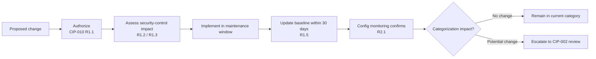

# 08.06 — Configuration Monitoring & Vulnerability Assessments (CIP-010) in Operation

| Field | Value |
|---|---|
| Document ID | CIP-ICP-010-2026-806 |
| Version | 1.0 |
| Date | 2026-03-02 |
| Classification | BES Cyber System Information (BCSI) // Illustrative Portfolio Sample |
| Owner | Marcus Bell, OT / ICS Security Lead |
| Author | Advisory Team (OT GRC / NERC CIP Advisory) |
| Status | Approved |

## Purpose

This document records the **ongoing operation of GridPoint Energy's CIP-010 configuration change management and vulnerability assessment program** during the ICP reporting window (**2027-Q3 → 2028-Q2**). CIP-010-4 requires baseline configurations (R1), configuration monitoring (R2), and vulnerability assessments (R3). During the window GridPoint operated **baseline/configuration monitoring** across the **14 Medium-impact BES Cyber System baselines**, completed the **15-month paper vulnerability assessment**, and maintained **change-record discipline** — including a significant change (a substation relay-platform upgrade) managed under R1 change control with no recategorization required.

## 1. CIP-010 Obligations & How the ICP Meets Them

| CIP-010-4 Requirement | Obligation | ICP Operation |
|---|---|---|
| R1 | Develop & maintain baseline configurations; authorize & document changes; update baselines | 14 baselines maintained; changes authorized before implementation |
| R2 | Monitor for unauthorized changes to the baseline (≥ every 35 days for applicable Medium BCS) | Configuration monitoring operating; deviations investigated |
| R3 | Vulnerability assessments — **paper VA at least every 15 months** (active VA every 36 months applies to High only — N/A) | **Paper VA completed** within the 15-month cycle |
| R4 | Transient Cyber Asset & Removable Media controls | TCA/RM controls operating |

## 2. Baseline / Configuration Monitoring (R1 & R2)

| Aspect | Operation |
|---|---|
| Baselines maintained | 14 (one per Medium-impact BES Cyber System) |
| Change authorization | Every change authorized and documented before implementation (R1) |
| Baseline update on change | Baseline updated within 30 days of a completed change (R1.5) |
| Unauthorized-change monitoring | Configuration monitoring ≤35-day interval (R2.1); deviations investigated |
| Deviations found | Investigated; none constituted an unauthorized change of concern |

## 3. The 15-Month Paper Vulnerability Assessment (R3)

GridPoint completed its **paper (documentation-based) vulnerability assessment** within the required 15-month cycle. Because all in-scope BES Cyber Systems are **Medium-impact (0 High)**, the **active** vulnerability assessment (36-month cycle) does **not** apply.

| Attribute | Detail |
|---|---|
| Assessment type | Paper / documentation-based vulnerability assessment |
| Cycle | Within the 15-month CIP-010 R3 window |
| Scope | 14 Medium-impact BES Cyber Systems + associated EACMS/PACS/PCA |
| Method | Review of ports/services, patch status, configuration against secure baselines, and known-vulnerability posture |
| **Result** | **Completed**; findings triaged, no unmanaged high-risk exposure |
| Active VA (36-month) | N/A — applies to High-impact only |

## 4. Change-Record Discipline & the Significant Change

A **significant change — a substation relay-platform upgrade** — was managed under CIP-010 R1 change control during the window. The change was authorized, its security-control impact assessed, the baseline updated, and configuration monitoring confirmed the result. The change was assessed against categorization and **remained within its impact category — no recategorization required** (see 08.10 and 08.09).

## 5. Reporting-Window Results

| Metric | Figure / Status |
|---|---|
| Baselines maintained | 14 |
| Configuration monitoring | Operating (≤35-day interval) |
| Unauthorized changes of concern | 0 |
| **Paper vulnerability assessment (15-month)** | **Completed** |
| Active VA (36-month, High-only) | N/A |
| Significant change managed under R1 | 1 (relay-platform upgrade) — no recategorization |
| Change-record discipline | Maintained; all changes authorized & documented |

## 5a. Baseline Elements Under Monitoring (CIP-010 R1.1)

Each of the 14 baselines captures the required configuration elements, monitored for unauthorized drift.

| Baseline Element (R1.1) | Monitored For |
|---|---|
| Operating system / firmware | Version drift; unauthorized upgrade/downgrade |
| Commercial & custom software installed | Unauthorized software additions/removals |
| Logical network accessible ports | Newly opened or unauthorized ports/services |
| Security patches applied | Alignment with CIP-007 R2 patch state |
| Security-control configuration | Deviation from the authorized secure baseline |

## 5b. Transient Cyber Asset & Removable Media (R4)

| Control (CIP-010 R4) | Operation |
|---|---|
| Transient Cyber Asset (TCA) management | Authorized, scanned, and tracked before connection to BES Cyber Systems |
| Removable Media | Scanned for malicious code prior to use (aligns with CIP-007 R3) |
| Ongoing status | Operating; no TCA/RM incidents in the window |

## 6. Program Effectiveness Statement

GridPoint's CIP-010 program operated continuously: baselines and configuration monitoring held across all 14 Medium-impact BES Cyber Systems, the **15-month paper vulnerability assessment was completed**, and change-record discipline — including a properly managed significant relay-platform upgrade — kept configurations authorized, documented, and audit-ready.

## Cross-References

| Reference | Purpose |
|---|---|
| [08.01 — Internal Controls Program Design](08.01-internal-controls-program-design.md) | ICP governing config & VA operations |
| [08.05 — Patch Cycle Operations (CIP-007)](08.05-patch-cycle-operations-cip-007.md) | Patching feeds baseline updates |
| [08.09 — CIP-002 15-Month Review](08.09-cip-002-15-month-review.md) | Categorization confirmation |
| [08.10 — Change Management for BES Cyber Systems](08.10-change-management-for-bes-cyber-systems.md) | The significant change lifecycle |
| [04.11 — Configuration Baselines (CIP-010 R1)](../04-technical-physical-control-implementation/04.11-configuration-baselines-cip-010-r1.md) | Baseline design |
| [04.13 — Vulnerability Assessments (CIP-010 R3)](../04-technical-physical-control-implementation/04.13-vulnerability-assessments-cip-010-r3.md) | VA methodology |

---

[⬅ Previous](08.05-patch-cycle-operations-cip-007.md) · [🏠 Phase README](08.00-README.md) · [Next ➡](08.07-supply-chain-ongoing-management-cip-013.md)
