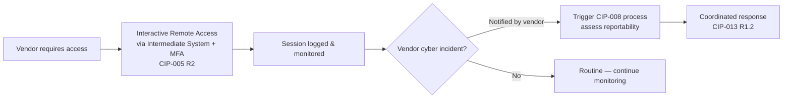

# 08.07 — Supply-Chain Ongoing Management (CIP-013) in Operation

| Field | Value |
|---|---|
| Document ID | CIP-ICP-013-2026-807 |
| Version | 1.0 |
| Date | 2026-03-02 |
| Classification | BES Cyber System Information (BCSI) // Illustrative Portfolio Sample |
| Owner | Karen Whitfield, NERC Compliance Manager (ICP Owner) |
| Author | Advisory Team (OT GRC / NERC CIP Advisory) |
| Status | Approved |

## Purpose

This document records the **ongoing operation of GridPoint Energy's CIP-013 Supply Chain Risk Management (SCRM) program** during the ICP reporting window (**2027-Q3 → 2028-Q2**). CIP-013-2 requires a documented supply-chain cyber-security risk management plan (R1), its implementation (R2), and periodic review by the CIP Senior Manager (R3). During the window GridPoint completed **vendor risk reviews for its key vendors** and operated **ongoing monitoring of vendor remote access and vendor incident-notification obligations**. The program also closed the CIP-013 element of the audit's Area of Concern — **MIT-05 vendor contract amendments completed 2027-03-31**.

## 1. CIP-013 Obligations & How the ICP Meets Them

| CIP-013-2 Requirement | Obligation | ICP Operation |
|---|---|---|
| R1 | Documented SCRM plan: vendor risk in procurement and in operations | SCRM plan maintained; risk criteria current |
| R1.1 | Process to identify & assess vendor-related cyber risks | Vendor risk reviews performed for key vendors |
| R1.2 | Procurement controls: vendor notification of incidents, coordinated response, remote-access controls, software integrity/authenticity | Contract clauses in place; MIT-05 amendments completed |
| R2 | Implement the SCRM plan | Operated across the vendor population |
| R3 | CIP Senior Manager review & approval of the plan at least every 15 months | Reviewed under Daniel Reyes |

## 2. Vendor Risk Reviews — Key Vendors

Vendor risk reviews were **completed for GridPoint's key vendors** — those supplying or supporting the 14 Medium-impact BES Cyber Systems and associated EACMS/PACS. Reviews covered cyber-risk posture, incident-notification commitments, remote-access arrangements, and software integrity/authenticity practices.

| Vendor Category (illustrative) | Review Focus | Status |
|---|---|---|
| OT/ICS control-system vendor | Remote access, incident notification, software integrity | ✅ Reviewed |
| ESP firewall / EACMS vendor | Patch/advisory notification, remote support controls | ✅ Reviewed |
| Backup / DR platform vendor | Restoration support, access controls | ✅ Reviewed |
| Substation relay-platform vendor | Change support, integrity of updates (relay-platform upgrade) | ✅ Reviewed |
| Physical access control (PACS) vendor | Remote support, incident notification | ✅ Reviewed |

## 3. Vendor Remote Access & Incident-Notification Monitoring

| Monitoring Element | Operation |
|---|---|
| Vendor remote access | All vendor access via the Intermediate System (jump host) with MFA and encryption; sessions logged (CIP-005 R2) |
| Vendor incident notification | Contractual obligation to notify GridPoint of vendor-side incidents; feeds the CIP-008 process |
| Coordinated response | Response coordination clauses in place per CIP-013 R1.2 |
| Software integrity/authenticity | Verification of updates (e.g., the relay-platform upgrade) |
| Vendor incidents reported in window | 0 |

## 4. Area-of-Concern Closure (MIT-05)

The audit's single Area of Concern (AOC-01) included the **MIT-05 vendor contract amendments** (CIP-013 R2 vendor notification clauses). These were **completed 2027-03-31**, closing the CIP-013 portion of the Area of Concern.

| Item | CIP Ref | Action | Status |
|---|---|---|---|
| MIT-05 vendor contract amendments | CIP-013 R1.2 / R2 | Vendor notification & coordinated-response clauses executed with counterparties | **Completed 2027-03-31 — closed** |

## 5. Reporting-Window Results

| Metric | Figure / Status |
|---|---|
| Vendor risk reviews completed (key vendors) | ✅ Complete |
| Vendor population under PRA tracking | 18 vendors (current) |
| Vendor remote access controls | Operating (Intermediate System + MFA, logged) |
| Vendor incident notifications received | 0 |
| CIP-013 R3 CIP SM review | Completed under Daniel Reyes |
| MIT-05 contract amendments | Completed 2027-03-31 |
| Possible Violations | 0 |

## 5a. Vendor Risk Review Criteria (CIP-013 R1.1)

Each key-vendor review scored the vendor against the SCRM plan's risk criteria.

| Risk Criterion (R1.2 alignment) | What Is Assessed |
|---|---|
| Incident notification | Vendor commitment & mechanism to notify GridPoint of vendor-side incidents |
| Coordinated incident response | Vendor cooperation obligations during a GridPoint incident |
| Vendor remote access controls | Enforced via Intermediate System + MFA; session logging |
| Software integrity & authenticity | Verification of the source and integrity of software/patches |
| Vendor security posture | Vendor's own cyber-security practices and disclosures |

## 5b. SCRM Governance & CIP Senior Manager Review (R3)

| Governance Element | Operation |
|---|---|
| SCRM plan ownership | Compliance Manager (Whitfield), under CIP Senior Manager (Reyes) |
| R3 review cadence | CIP Senior Manager review & approval at least every 15 months |
| Review performed | Completed under Daniel Reyes within the window |
| Plan updates | Risk criteria refreshed; MIT-05 amendments incorporated |
| Procurement integration | New procurements routed through the SCRM risk process |

## 6. Program Effectiveness Statement

GridPoint's CIP-013 SCRM program operated continuously during the window: **key-vendor risk reviews completed**, vendor remote access controlled and logged via the Intermediate System, vendor incident-notification obligations monitored, and the **MIT-05 contract amendments closed (2027-03-31)** to retire the CIP-013 element of the audit's Area of Concern. The program is audit-ready.

## Cross-References

| Reference | Purpose |
|---|---|
| [08.01 — Internal Controls Program Design](08.01-internal-controls-program-design.md) | ICP governing SCRM operations |
| [08.03 — Incident Response Testing (CIP-008)](08.03-incident-response-testing-cip-008.md) | Vendor incident-notification feed |
| [08.10 — Change Management for BES Cyber Systems](08.10-change-management-for-bes-cyber-systems.md) | Relay-platform upgrade (vendor software) |
| [04.18 — Supply Chain Risk Management (CIP-013)](../04-technical-physical-control-implementation/04.18-supply-chain-risk-management-cip-013.md) | The SCRM plan being operated |
| [07.10 — Audit Conduct & Outcome](../07-audit-readiness-compliance-package/07.10-audit-conduct-and-outcome.md) | Area of Concern (AOC-01 / MIT-05) |

---

[⬅ Previous](08.06-config-monitoring-and-vuln-assessments-cip-010.md) · [🏠 Phase README](08.00-README.md) · [Next ➡](08.08-access-reviews-and-pra-renewals-cip-004.md)
