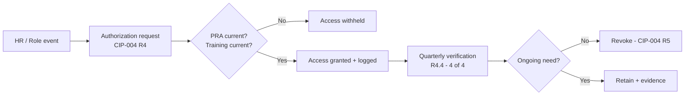

# 08.08 — Access Reviews & PRA Renewals (CIP-004)

| Field | Value |
|---|---|
| Document ID | CIP-CM-ACCESS-2026-808 |
| Version | 1.0 |
| Date | 2026-03-02 |
| Classification | BES Cyber System Information (BCSI) // Illustrative Portfolio Sample |
| Owner | Karen Whitfield, NERC Compliance Manager (ICP Owner) |
| Author | Advisory Team (OT GRC / NERC CIP Advisory) |
| Status | Approved |

## Purpose

This document evidences the **ongoing operation of CIP-004-7 personnel and training controls** during the first post-audit ConMon window (**2027-Q3 through 2028-Q2**) for GridPoint Energy. It confirms that **all 4 of 4 quarterly access-privilege reviews** were completed, that **Personnel Risk Assessments (PRAs) remain current for all 160 covered individuals** on the mandated 7-year renewal cadence, and that **CIP security awareness and role-based training currency** was maintained. These controls sustain the CIP-004 obligations audited by ReliabilityFirst in 2027-06 and feed the Internal Controls Program (ICP) metrics in **08.12**.

## 1. CIP-004 Scope Under Continuous Monitoring

CIP-004-7 governs who may be granted authorized electronic and unescorted physical access to BES Cyber Systems and their associated EACMS, PACS, and PCA, and requires that such access be justified, reviewed, verified, and revoked on defined cadences. GridPoint applies the full CIP-004 requirement set to its **14 Medium-impact BES Cyber Systems** (2 Control Centers + 10 BCS across 8 Medium substations) and applies CIP-004 R1 security awareness across the low-impact footprint via CIP-003 Attachment 1.

| CIP-004-7 Requirement | Obligation | ConMon Treatment |
|---|---|---|
| R1 | Security awareness program (quarterly reinforcement) | Continuous; delivered each quarter |
| R2 | Role-based cyber security training before access | Currency tracked; pre-access gate enforced |
| R3 | Personnel Risk Assessment (PRA) — 7-year renewal | Renewal tracker; no lapses |
| R4 | Access management — authorization & quarterly verification | 4 of 4 quarterly reviews complete |
| R5 | Access revocation — termination & reassignment timing | Triggered on HR events; no misses |

## 2. Quarterly Access-Privilege Reviews — 4 of 4 Complete

CIP-004-7 R4 Part 4.4 requires verification, at least once each calendar quarter, that individuals with authorized electronic and unescorted physical access have an ongoing need. GridPoint completed **all four quarterly reviews** on schedule during the reporting window. Each review reconciled the authorized-access list against active roster, role, and PRA/training status, with the CIP Senior Manager's delegate approving the results.

| Quarter | Review Period | Accounts / Rights Reviewed | Discrepancies | Disposition | Status |
|---|---|---|---|---|---|
| 2027-Q3 | Jul–Sep 2027 | Electronic + unescorted physical (Medium BCS/EACMS/PACS) | 1 stale contractor account | Revoked same day; logged | Complete |
| 2027-Q4 | Oct–Dec 2027 | Electronic + unescorted physical | 0 | No action | Complete |
| 2028-Q1 | Jan–Mar 2028 | Electronic + unescorted physical | 1 role change → rights adjusted | Right-sized; re-authorized | Complete |
| 2028-Q2 | Apr–Jun 2028 | Electronic + unescorted physical | 0 | No action | Complete |

**Result: 4 of 4 quarterly access-privilege reviews complete; 0 overdue; all discrepancies remediated within cycle.**

## 3. Personnel Risk Assessment (PRA) Renewals — 7-Year Cycle

CIP-004-7 R3 requires a PRA (identity verification plus a seven-year criminal history records check) before granting access, and **renewal at least once every seven years**. GridPoint maintains a rolling PRA renewal tracker owned by HR PRA coordinator **Sandra Lee**, driven off each individual's PRA anchor date so renewals are actioned before the 7-year boundary rather than at it.

| PRA Population | Count | Renewal Cadence | Status in Window |
|---|---|---|---|
| Employees with authorized access | 142 | ≤ 7 years | Current — no lapses |
| Vendor / contractor personnel with access | 18 | ≤ 7 years | Current — no lapses |
| **Total covered individuals** | **160** | **≤ 7 years** | **All current** |
| PRAs renewed during the window | 11 | Renewed ahead of anchor date | Complete |
| PRAs newly completed (onboarding) | 6 | Before first access | Complete |
| PRAs overdue / lapsed | 0 | — | None |

**Result: PRAs current for all 160 covered individuals (142 personnel + 18 vendors); 0 lapses; renewals actioned ahead of the 7-year boundary.**

## 4. Training & Security Awareness Currency

CIP-004-7 R1 (security awareness) and R2 (role-based cyber security training) are operated continuously. Role-based training is a **pre-access gate** — no electronic or unescorted physical access to Medium BCS is provisioned until R2 training is recorded — and is refreshed at least every 15 calendar months per Part 2.3.

| Element | Standard Basis | Cadence | Window Result |
|---|---|---|---|
| Security awareness reinforcement | CIP-004 R1 | Each calendar quarter | 4 of 4 delivered |
| Role-based cyber security training | CIP-004 R2 | Before access; ≤ 15 months | 100% current |
| Training completion for new grants | CIP-004 R2.1 | Before access | No access-before-training exceptions |
| Low-impact awareness (CIP-003 A1 §1) | CIP-003-8 | Reinforced | Delivered |

## 5. Access Revocation Timeliness (R5)

CIP-004-7 R5 requires timely removal of access on termination and reassignment — for terminations, revoking the ability for unescorted physical access and Interactive Remote Access by the end of the next calendar day following the effective date. All HR-driven separations and reassignments during the window were processed within the required timeframes, with revocation evidence retained.

| Event Type | Events in Window | On-Time Revocation | Misses |
|---|---|---|---|
| Terminations (end of next calendar day) | 4 | 4 | 0 |
| Reassignments / need-to-know changes | 7 | 7 | 0 |
| BCSI repository access removals | 3 | 3 | 0 |

## 6. Evidence Retained (Audit-Ready)

| Evidence Artifact | Owner | Retention |
|---|---|---|
| Quarterly access-review reconciliations (×4) | Karen Whitfield | ConMon repository (BCSI) |
| Authorized-access lists (electronic + physical) | Priya Nair / Frank Delgado | Versioned |
| PRA renewal tracker + completion records | Sandra Lee | HR-controlled (BCSI) |
| Training completion records (R1/R2) | Sandra Lee | LMS export |
| Revocation tickets with timestamps | Priya Nair | Ticketing system |

## 7. Control Effectiveness Statement

The CIP-004 control set operated **effectively** across the reporting window. The two discrepancies surfaced by the quarterly reviews (one stale contractor account, one role-change right adjustment) were caught **by the control itself** and remediated within cycle — evidence the detective control is functioning as designed rather than a compliance failure. No PRA lapses, no access-before-training exceptions, and no late revocations occurred. These results roll up into the ICP metrics in **08.12** and the self-log lifecycle in **08.13**.

## Cross-References

| Reference | Purpose |
|---|---|
| [08.07 — Supply-Chain Ongoing Management (CIP-013)](08.07-supply-chain-ongoing-management-cip-013.md) | Prior ConMon control set (vendor access) |
| [08.11 — Continuous Evidence Collection & Testing](08.11-continuous-evidence-collection-and-testing.md) | Control-test evidence for CIP-004 |
| [08.12 — Compliance Metrics & KPIs](08.12-compliance-metrics-and-kpis.md) | Access-review KPI roll-up (4/4) |
| [01.12 — Compliance Obligations Calendar](../01-program-foundation/01.12-compliance-obligations-calendar.md) | Cadence source for quarterly/annual obligations |
| [07.10 — Audit Conduct & Outcome](../07-audit-readiness-compliance-package/07.10-audit-conduct-and-outcome.md) | CIP-004 sampling at the RF audit |

---

[⬅ Previous](08.07-supply-chain-ongoing-management-cip-013.md) · [🏠 Phase README](08.00-README.md) · [Next ➡](08.09-cip-002-15-month-review.md)
