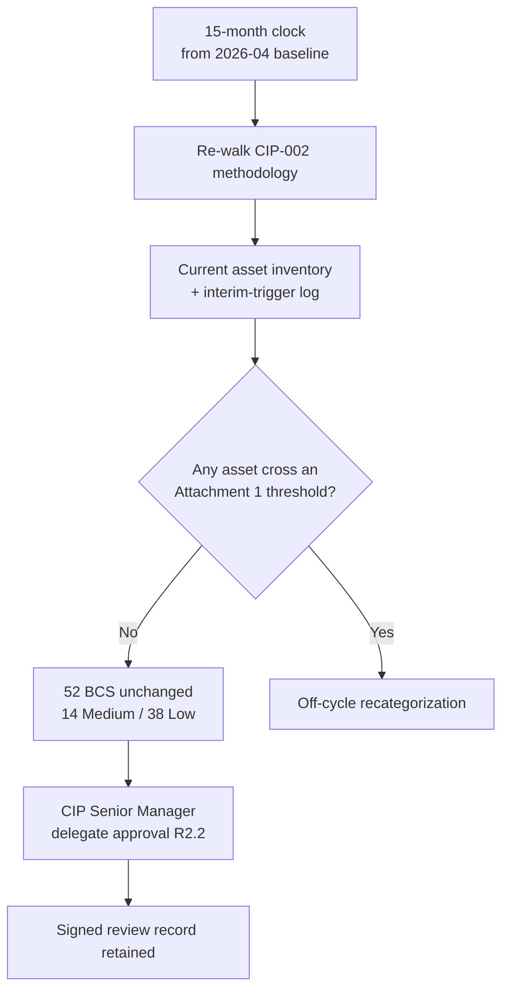

# 08.09 — CIP-002 15-Month Recategorization Review

| Field | Value |
|---|---|
| Document ID | CIP-CM-002REV-2026-809 |
| Version | 1.0 |
| Date | 2026-03-02 |
| Classification | BES Cyber System Information (BCSI) // Illustrative Portfolio Sample |
| Owner | Karen Whitfield, NERC Compliance Manager (ICP Owner) |
| Author | Advisory Team (OT GRC / NERC CIP Advisory) |
| Status | Approved |

## Purpose

This document evidences GridPoint Energy's **CIP-002-5.1a R2 periodic review** obligation — the requirement that the CIP Senior Manager, or delegate, **review and approve the BES Cyber System identifications and impact categorizations at least once every 15 calendar months**. It confirms the review was **completed on schedule during the ConMon window**, that the outcome was **no categorization change** (the **52 BES Cyber Systems** remain 14 Medium + 38 Low, with Sunfield Solar already captured as Low), and that **interim-review triggers** are actively monitored so any material asset change forces an off-cycle reassessment.

## 1. The CIP-002 R2 Periodic-Review Obligation

CIP-002-5.1a R2 has two parts:

| Part | Obligation |
|---|---|
| R2.1 | Review the identifications required by R1 (BES Cyber Systems and their High/Medium/Low categorization) at least once each **15 calendar months**. |
| R2.2 | Have the **CIP Senior Manager or delegate approve** the identifications and categorizations at least once each **15 calendar months**. |

Unlike most CIP cadences (calendar quarter, 15 months of training, 35-day patch), CIP-002 R2 is a **rolling 15-month** obligation measured from the prior approval date. GridPoint anchors the review to the CIP-002 categorization baselined in **2026-04** and schedules subsequent reviews well inside the 15-month boundary.

## 2. Review Conducted — On Schedule, No Change

The periodic review was performed during the reporting window and formally approved by the CIP Senior Manager's delegate. It re-walked the CIP-002 methodology (asset inventory → BCA identification → BCS grouping → Attachment 1 impact criteria → associated EACMS/PACS/PCA) against the current asset baseline and confirmed **no change to the categorization**.

| Review Attribute | Result |
|---|---|
| Review basis | CIP-002-5.1a R2.1 / R2.2 (≤ 15 calendar months) |
| Prior approval anchor | 2026-04 categorization baseline |
| Review completed | On schedule, within the 15-month boundary |
| Approver | CIP Senior Manager delegate (Daniel Reyes' delegation) |
| BES Cyber Systems reviewed | **52 (14 Medium + 38 Low)** |
| Categorization outcome | **No change** |
| Associated systems reconfirmed | EACMS 26 · PACS 18 · PCA 60 |
| Documentation | Signed review record retained (BCSI) |

## 3. Categorization Confirmed Unchanged

The review reconfirmed the exact CIP-002 results carried forward from Phase 02, with no asset crossing an Attachment 1 threshold in either direction.

| Impact | BES Cyber Systems | Composition | Attachment 1 Basis | Change |
|---|---|---|---|---|
| **Medium** | 14 | 4 at 2 Control Centers + 10 across 8 Medium (345 kV) substations | Criteria 2.12 / 2.11 / 2.13 (Control Centers); 2.5 (transmission stations) | None |
| **Low** | 38 | 4 generation plants + 34 Low substations | BES assets w/ BCS not meeting High/Medium (CIP-003 Attachment 1) | None |
| **High** | 0 | — | No asset meets High criteria (1.x) | None |
| **Total** | **52** | — | — | **No change** |

### Sunfield Solar Explicitly Confirmed

The **Sunfield Solar** site (220 MW, newly commissioned) was the most recent asset-baseline change and the reason interim triggers were watched closely. The review confirmed Sunfield **remains correctly categorized as Low impact** — it was already identified and captured in the CIP-002 baseline, does not meet any Medium generation criterion (it is well under the single-plant thresholds, and its BES Cyber Systems do not perform Control Center functions), and therefore is subject to **CIP-003-8 Attachment 1** controls only. No recategorization resulted from Sunfield.

## 4. Interim-Review Triggers Monitored

CIP-002 categorization is not only a 15-month event; a **material change to the BES asset baseline** can require an interim reassessment before the next scheduled review. GridPoint monitors a defined trigger list so recategorization is evaluated when the underlying facts change, not merely when the clock expires.

| Interim Trigger | Monitored By | Status in Window |
|---|---|---|
| New generation / substation commissioned | Elena Ruiz / Marcus Bell | None new past baseline; Sunfield already captured |
| Facility rating or voltage change (200–499 kV threshold) | Robert Tan / Elena Ruiz | No threshold crossings |
| Change in Control Center functional obligations | James Okafor | No change to TOP/GOP scope |
| New / retired BES Cyber System or BCA grouping | Marcus Bell | Relay-platform upgrade assessed (see 08.10) — stayed within categorization |
| Interconnection / topology change (3+ station connectivity) | Robert Tan | No change |
| Retirement or decommissioning | Elena Ruiz | None affecting categorization |

The one significant change during the window — the **substation relay-platform upgrade** — was assessed under CIP-010 R1 change management (**08.10**) and confirmed to remain **within the existing Medium categorization**, requiring no CIP-002 recategorization.

## 5. Evidence Retained (Audit-Ready)

| Evidence Artifact | Owner | Retention |
|---|---|---|
| Signed CIP-002 R2 periodic-review record (approval) | Karen Whitfield | ConMon repository (BCSI) |
| Current BES asset & BCS inventory reconciliation | Marcus Bell | Versioned |
| Interim-trigger monitoring log | Karen Whitfield | Continuous |
| Attachment 1 criteria re-application worksheet | Advisory Team | Retained |

## 6. Relationship to the Broader Categorization Baseline

Because CIP-002 sits at the root of the applicability chain, a stable categorization keeps the downstream scope stable. The unchanged 52-BCS result confirms that the **118 applicable CIP requirement parts** established in Phase 02 remain the correct compliance universe, that no Medium control obligation was inadvertently dropped or added, and that the associated **EACMS (26), PACS (18), and PCA (60)** populations used for sampling and evidence remain valid for the next cycle.

| Downstream Dependency | Effect of "No Change" |
|---|---|
| Applicable requirement parts (118) | Unchanged; scope stable |
| Medium control set (CIP-005/006/007/010 etc.) | Applies to same 14 Medium BCS |
| Low control set (CIP-003 Attachment 1) | Applies to same 38 Low BCS |
| Sampling populations for testing/audit | Valid without re-derivation |

## 7. Control Effectiveness Statement

The CIP-002 R2 review operated **effectively and on schedule**. The 15-month obligation was met with margin, the CIP Senior Manager delegate approved the identifications and categorizations, and the interim-trigger process correctly evaluated the one material change (relay-platform upgrade) without a false negative or a missed reassessment. The categorization foundation on which all 118 applicable requirement parts rest remains **stable and defensible** heading into the next cycle.

## Cross-References

| Reference | Purpose |
|---|---|
| [08.08 — Access Reviews & PRA Renewals (CIP-004)](08.08-access-reviews-and-pra-renewals-cip-004.md) | Prior ConMon control set |
| [08.10 — Change Management for BES Cyber Systems](08.10-change-management-for-bes-cyber-systems.md) | Relay-platform change; interim trigger assessment |
| [02.09 — CIP-002 Categorization Document](../02-bes-cyber-system-categorization/02.09-cip-002-categorization-document.md) | Baseline categorization being reviewed |
| [02.14 — CIP-002 15-Month Review Schedule](../02-bes-cyber-system-categorization/02.14-cip-002-15-month-review-schedule.md) | Original review cadence definition |
| [01.12 — Compliance Obligations Calendar](../01-program-foundation/01.12-compliance-obligations-calendar.md) | 15-month obligation tracking |

---

[⬅ Previous](08.08-access-reviews-and-pra-renewals-cip-004.md) · [🏠 Phase README](08.00-README.md) · [Next ➡](08.10-change-management-for-bes-cyber-systems.md)
