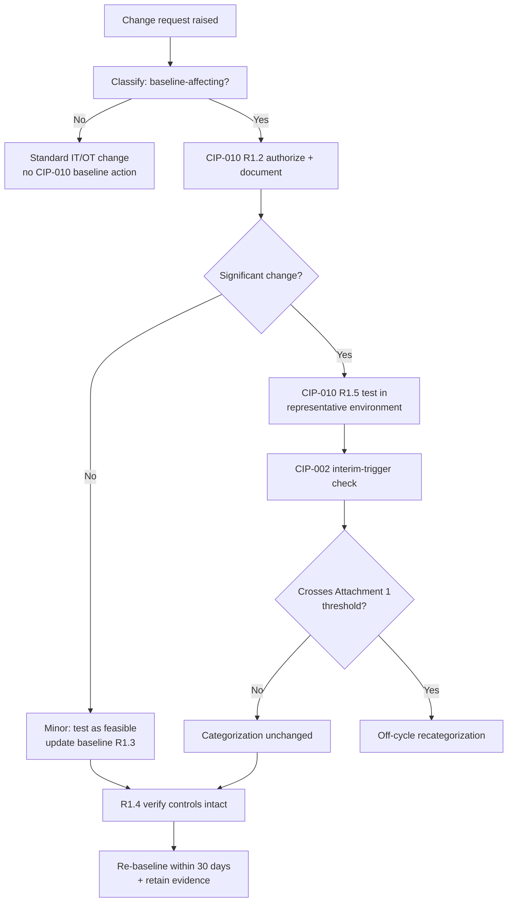

# 08.10 — Change Management for BES Cyber Systems (CIP-010 R1)

| Field | Value |
|---|---|
| Document ID | CIP-CM-CHG-2026-810 |
| Version | 1.0 |
| Date | 2026-03-02 |
| Classification | BES Cyber System Information (BCSI) // Illustrative Portfolio Sample |
| Owner | Karen Whitfield, NERC Compliance Manager (ICP Owner) |
| Author | Advisory Team (OT GRC / NERC CIP Advisory) |
| Status | Approved |

## Purpose

This document evidences GridPoint Energy's **ongoing configuration change management for new and modified BES Cyber Systems** under **CIP-010-4 R1** during the ConMon window (**2027-Q3 through 2028-Q2**). It describes how baseline-affecting changes are authorized, tested, and re-baselined, and documents the one **significant change of the period — a substation relay-platform upgrade** — which was assessed, executed under change control, **remained within its existing Medium categorization**, and required **no CIP-002 recategorization**.

## 1. CIP-010 R1 Change-Management Obligation

CIP-010-4 R1 requires a documented configuration baseline for applicable Cyber Assets and a change-management process that authorizes and documents any change deviating from that baseline. The baseline includes operating system/firmware, commercially/custom software installed, logical network accessible ports, and security patches applied.

| CIP-010-4 R1 Part | Obligation | ConMon Application |
|---|---|---|
| R1.1 | Maintain configuration baselines for Medium BCS (and associated EACMS/PACS/PCA) | Baselines maintained; versioned |
| R1.2 | Authorize and document deviations from baseline | Change tickets; approval gate |
| R1.3 | Update baseline within 30 calendar days of a change | Re-baseline on completion |
| R1.4 | Verify required security controls are not adversely affected | Post-change control verification |
| R1.5 | For High/Medium: test changes in a representative environment where technically feasible | Applied to significant relay-platform change |

## 2. Change-Control Workflow

Every proposed change to a Medium BES Cyber System (or associated EACMS/PACS/PCA) is routed through a single change-control workflow with a CIP compliance checkpoint. The workflow explicitly asks whether a change is **significant** (materially altering the platform, function, connectivity, or footprint) — because significant changes trigger both the CIP-010 R1.5 testing obligation and a CIP-002 interim-categorization check.

## 3. Change Activity in the Window

| Change Class | Count | CIP-010 Treatment | Categorization Impact |
|---|---|---|---|
| Significant changes (Medium BCS) | 1 | R1.2 authorized · R1.5 tested · R1.4 verified · re-baselined | None (relay-platform upgrade) |
| Minor baseline-affecting changes | Multiple (routine) | Authorized, verified, re-baselined ≤ 30 days | None |
| Security patches (baseline element) | 12 monthly cycles | Managed under CIP-007 R2 / CIP-010 R1.1 | None |
| Emergency changes | 0 | — | — |
| Unauthorized changes detected | 0 | Config monitoring (CIP-010 R2) clean | None |

## 4. Significant Change of the Period — Substation Relay-Platform Upgrade

The single significant change during the reporting window was a **protective relay-platform upgrade at a Medium-impact 345 kV substation**, replacing legacy relay hardware/firmware with a current-generation platform. Because it altered the configuration baseline of a Medium BES Cyber System, it was managed end-to-end under CIP-010 R1 and cross-checked against CIP-002.

| Step | Action | Standard Basis | Result |
|---|---|---|---|
| 1. Authorize | Change request approved with CIP compliance sign-off | CIP-010 R1.2 | Authorized and documented |
| 2. Test | Upgrade validated in a representative test environment prior to production cutover | CIP-010 R1.5 | Passed; no adverse findings |
| 3. Security-control verification | Confirmed ports/services, patch level, logging, ESP access controls unaffected | CIP-010 R1.4 | Controls intact |
| 4. Categorization check | Assessed against CIP-002 Attachment 1 interim triggers | CIP-002 R1/R2 | **Remained Medium — no recategorization** |
| 5. Re-baseline | Configuration baseline updated within 30 calendar days | CIP-010 R1.3 | Baseline current |
| 6. Evidence | Change record, test results, and re-baseline retained | CIP-011 (BCSI) | Audit-ready |

### Why No Recategorization Resulted

The upgrade changed **how** the relaying function is delivered, not **what** the asset is: the substation remains a 345 kV Medium-impact transmission station under **Attachment 1 Criterion 2.5**, its Control Center functional relationships are unchanged, and no new BES Cyber System crossed a High or Medium boundary. The interim-trigger evaluation (see **08.09**) therefore confirmed the **52-BCS categorization (14 Medium + 38 Low) is unchanged**. Associated EACMS/PACS/PCA counts were likewise unaffected.

## 5. Configuration Monitoring Linkage (CIP-010 R2)

Change management (R1) is paired with **configuration monitoring (CIP-010 R2)** — periodic detection of deviations from the authorized baseline for Medium BCS. During the window, monitoring returned **0 unauthorized changes**, confirming that all baseline-affecting changes flowed through the R1 workflow rather than around it. Details of R2 monitoring and the CIP-010 R3 vulnerability assessment are carried in **08.06**.

## 6. Evidence Retained (Audit-Ready)

| Evidence Artifact | Owner | Retention |
|---|---|---|
| Change tickets with authorization + CIP sign-off | Marcus Bell | ConMon repository (BCSI) |
| Relay-platform test results (R1.5) | Elena Ruiz | Retained |
| Security-control verification records (R1.4) | Marcus Bell / Priya Nair | Retained |
| Updated configuration baselines (R1.3) | Marcus Bell | Versioned |
| CIP-002 interim-trigger assessment | Karen Whitfield | Cross-linked to 08.09 |

## 7. Significant vs. Non-Significant Change — Decision Criteria

To keep change classification consistent and defensible, the ICP applies a fixed set of criteria to decide whether a baseline-affecting change is **significant** (triggering R1.5 testing and a CIP-002 interim check) or **minor**. The relay-platform upgrade met the significance test on the first two criteria (platform replacement, firmware/OS change) and was handled accordingly.

| Criterion | Significant if… | Relay Upgrade |
|---|---|---|
| Platform / hardware replacement | Core BCS hardware replaced | Yes |
| Operating system / firmware change | Major version or vendor change | Yes |
| Function change | New or altered BES function | No |
| Connectivity / footprint | New routable connectivity or ESP change | No |
| Categorization sensitivity | Could affect Attachment 1 rating | Assessed — no |

## 8. Control Effectiveness Statement

CIP-010 R1 change management operated **effectively**. Every baseline-affecting change — including the one significant relay-platform upgrade — was authorized, tested where technically feasible, verified against security controls, categorization-checked, and re-baselined within the 30-day window, with **0 unauthorized changes** detected by configuration monitoring. The significant change was correctly assessed to **remain within its Medium categorization**, demonstrating that the change-control and CIP-002 interim-trigger processes are integrated and working as designed.

## Cross-References

| Reference | Purpose |
|---|---|
| [08.09 — CIP-002 15-Month Recategorization Review](08.09-cip-002-15-month-review.md) | Interim-trigger assessment; categorization unchanged |
| [08.06 — Config Monitoring & Vulnerability Assessments (CIP-010)](08.06-config-monitoring-and-vuln-assessments-cip-010.md) | R2 monitoring and R3 vuln assessment |
| [08.11 — Continuous Evidence Collection & Testing](08.11-continuous-evidence-collection-and-testing.md) | Control testing of change management |
| [02.05 — Impact Rating (Attachment 1 Criteria)](../02-bes-cyber-system-categorization/02.05-impact-rating-attachment-1-criteria.md) | Criterion 2.5 basis for Medium substation |

---

[⬅ Previous](08.09-cip-002-15-month-review.md) · [🏠 Phase README](08.00-README.md) · [Next ➡](08.11-continuous-evidence-collection-and-testing.md)
