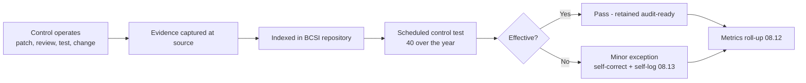

# 08.11 — Continuous Evidence Collection & Control Testing

| Field | Value |
|---|---|
| Document ID | CIP-CM-EVID-2026-811 |
| Version | 1.0 |
| Date | 2026-03-02 |
| Classification | BES Cyber System Information (BCSI) // Illustrative Portfolio Sample |
| Owner | Karen Whitfield, NERC Compliance Manager (ICP Owner) |
| Author | Advisory Team (OT GRC / NERC CIP Advisory) |
| Status | Approved |

## Purpose

This document describes GridPoint Energy's **continuous evidence-collection and internal control-testing regime** operated by the Internal Controls Program (ICP) during the ConMon window (**2027-Q3 through 2028-Q2**). It confirms that **40 internal control tests** were performed across the applicable CIP standards, that controls were assessed **effective** with only **2 minor exceptions — both self-corrected**, and that CIP evidence is kept **continuously audit-ready** so a spot check, self-certification, or the next ReliabilityFirst audit can be supported without a scramble.

## 1. Why Continuous, Not Point-in-Time

The RF Compliance Audit (2027-06) closed favorably, but CIP compliance is a **continuing obligation**. The ICP replaces the historical "collect evidence when audited" posture with **rolling evidence capture at the moment a control operates** and a **planned schedule of control tests**. This produces two outcomes: evidence is fresh and complete at all times, and control weaknesses are detected internally — as self-logged Compliance Exceptions (see **08.13**) — rather than as Possible Violations at audit.

## 2. Control-Testing Program — 40 Tests Over the Year

The ICP executed **40 internal control tests** across the reporting window, distributed by CIP standard in proportion to control criticality and audit sampling emphasis. Each test verified that a control was **designed appropriately** and **operating effectively** by re-performing or inspecting a sample of the control's outputs against the CIP requirement.

| CIP Standard | Control Area Tested | Tests | Result |
|---|---|---|---|
| CIP-004-7 | Access authorization, quarterly reviews, PRA, training | 6 | Effective |
| CIP-005-7 | ESP boundary, Interactive Remote Access (Intermediate System / MFA) | 5 | Effective |
| CIP-006-6 | Physical Security Perimeter access & monitoring | 4 | Effective |
| CIP-007-6 | Ports/services, patch cycle, malicious-code prevention, logging | 6 | Effective (1 minor exception) |
| CIP-008-6 | Incident response plan & reporting readiness | 3 | Effective |
| CIP-009-6 | Recovery plans & backup restoration | 3 | Effective |
| CIP-010-4 | Configuration baselines, change control, config monitoring | 5 | Effective (1 minor exception) |
| CIP-011-3 | BCSI handling & information protection | 3 | Effective |
| CIP-013-2 | Supply-chain vendor risk & procurement controls | 3 | Effective |
| CIP-003-8 | Low-impact controls (Attachment 1) | 2 | Effective |
| **Total** | — | **40** | **Effective; 2 minor exceptions self-corrected** |

## 3. The Two Minor Exceptions — Self-Corrected

Two of the 40 tests surfaced **minor control exceptions**. Both were **detected by the ICP's own testing**, corrected promptly, and processed through the self-log lifecycle in **08.13**. Neither rose to a Possible Violation; both were assessed **minimal risk** with no reliability or security impact.

| Exception | Standard | What the Test Found | Correction | Risk |
|---|---|---|---|---|
| EX-CM-01 | CIP-007-6 R2 | One patch-evaluation record filed slightly late in its documentation step (evaluation itself within the 35-day cycle) | Record completed; reminder control tightened | Minimal |
| EX-CM-02 | CIP-010-4 R1 | One configuration baseline re-baselined near the end of the 30-day window with an incomplete field | Baseline field completed; checklist updated | Minimal |

## 4. Continuous Evidence Collection

Evidence is captured **where and when the control runs**, indexed to the applicable CIP requirement part, and stored in the controlled BCSI repository. This keeps the evidence index — the ~260-artifact population assembled for the 2027 audit — **live and growing** rather than static.

| Evidence Stream | Source Control | Capture Cadence | Freshness |
|---|---|---|---|
| Patch evaluation & application records | CIP-007 R2 | Monthly (12 cycles) | Continuous |
| Quarterly access-review reconciliations | CIP-004 R4 | Quarterly (4 of 4) | Continuous |
| PRA & training records | CIP-004 R2/R3 | On event / renewal | Current |
| Change tickets & re-baselines | CIP-010 R1 | On change | Current |
| Configuration-monitoring results | CIP-010 R2 | Periodic | Current |
| IRA / ESP access logs | CIP-005 R1/R2 | Continuous | Current |
| PSP access & monitoring logs | CIP-006 R1 | Continuous | Current |
| Recovery & IR test artifacts | CIP-009 / CIP-008 | Per test | Current |
| Vendor risk assessments | CIP-013 R1/R2 | Per procurement/review | Current |
| Self-certification & data submittals | CMEP | Annual / periodic | On time |

## 5. Audit-Ready Posture

| Readiness Dimension | Status at Window Close |
|---|---|
| Evidence index complete & indexed to requirement parts | Yes |
| Sampling populations current (52 BCS · 160 personnel · 12 patch cycles) | Yes |
| Overdue evidence or obligations | 0 |
| RSAW-mapped artifacts refreshed | Yes |
| Spot-check / self-certification response capability | Rehearsed; ready |
| Data-request turnaround process | Active (from 07.04) |

## 6. Roles

| Role | Name | Responsibility |
|---|---|---|
| ICP Owner / Compliance Manager | Karen Whitfield | Test schedule, evidence integrity, roll-up |
| CIP Senior Manager | Daniel Reyes | Accountable authority; exception acceptance |
| OT / ICS Security Lead | Marcus Bell | CIP-005/007/010 control testing |
| IT Security Manager | Priya Nair | Logging, access, patch evidence |
| Physical Security Manager | Frank Delgado | CIP-006 testing |
| HR / PRA Coordinator | Sandra Lee | CIP-004 personnel evidence |
| Field Engineering Lead | Elena Ruiz | Substation change/config evidence |

## 7. Control Effectiveness Statement

The continuous evidence-collection and testing regime operated **effectively**. Across **40 control tests**, controls were assessed effective; the **2 minor exceptions were caught by internal testing and self-corrected**, producing **0 Possible Violations**. Evidence remained continuously audit-ready, sustaining the favorable posture established at the 2027 RF audit. Results feed the KPI dashboard in **08.12** and the self-log lifecycle in **08.13**.

## Cross-References

| Reference | Purpose |
|---|---|
| [08.10 — Change Management for BES Cyber Systems](08.10-change-management-for-bes-cyber-systems.md) | Change-control evidence tested here |
| [08.12 — Compliance Metrics & KPIs](08.12-compliance-metrics-and-kpis.md) | 40-test roll-up into KPIs |
| [08.13 — Self-Report & Mitigation Lifecycle](08.13-self-report-and-mitigation-lifecycle.md) | Disposition of the 2 exceptions / 3 self-logs |
| [07.03 — Evidence Completeness Checklist](../07-audit-readiness-compliance-package/07.03-evidence-completeness-checklist.md) | Baseline evidence population (~260) |
| [01.13 — Document & Evidence Management Plan](../01-program-foundation/01.13-document-and-evidence-management-plan.md) | Evidence retention & BCSI controls |

---

[⬅ Previous](08.10-change-management-for-bes-cyber-systems.md) · [🏠 Phase README](08.00-README.md) · [Next ➡](08.12-compliance-metrics-and-kpis.md)
