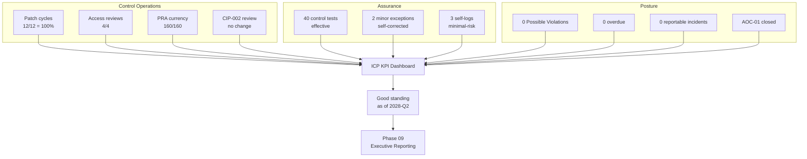

# 08.12 — Compliance Metrics & KPIs

| Field | Value |
|---|---|
| Document ID | CIP-CM-KPI-2026-812 |
| Version | 1.0 |
| Date | 2026-03-02 |
| Classification | BES Cyber System Information (BCSI) // Illustrative Portfolio Sample |
| Owner | Karen Whitfield, NERC Compliance Manager (ICP Owner) |
| Author | Advisory Team (OT GRC / NERC CIP Advisory) |
| Status | Approved |

## Purpose

This document presents the **Internal Controls Program (ICP) metrics and Key Performance Indicators (KPIs)** for GridPoint Energy's first post-audit ConMon year (**2027-Q3 through 2028-Q2**). It consolidates the operational results from the individual ConMon control sets (08.03–08.11) into a single management dashboard that demonstrates the CIP program is **operating effectively and remains in good standing**: **100% patch-cycle conformance**, **4 of 4 quarterly access reviews**, **0 overdue obligations**, **0 Possible Violations**, **0 reportable Cyber Security Incidents**, and **40 internal control tests** with controls assessed effective. These metrics are the source data for the executive reporting in **Phase 09**.

## 1. Why Metrics Matter to a CIP Program

A mature Internal Controls Program is **evidenced by measurement**. ReliabilityFirst and NERC increasingly credit entities that demonstrate a functioning ICP — one that detects and self-corrects issues before they become violations. GridPoint's KPI framework converts control operation into quantified, trended indicators so that the CIP Senior Manager, executive leadership, and (on request) the Regional Entity can see program health at a glance and so that adverse trends trigger action, not surprise.

The KPIs are organized in four families:

| KPI Family | What It Measures | Primary Source |
|---|---|---|
| Control operation | Are recurring CIP controls running on cadence? | 08.05–08.09 |
| Compliance posture | Are there violations, overdue items, or open findings? | 08.13 |
| Detection & assurance | Is the ICP finding and fixing issues internally? | 08.11 |
| Risk & incidents | Are there security or reliability events? | 08.03 |

## 2. Executive KPI Dashboard

| # | KPI | Target | Actual (2027-Q3 – 2028-Q2) | Status |
|---|---|---|---|---|
| 1 | 35-day patch-cycle conformance | 100% | **100% (12 of 12 monthly cycles)** | On target |
| 2 | Quarterly CIP-004 access-privilege reviews | 4 of 4 | **4 of 4 complete** | On target |
| 3 | Overdue compliance obligations | 0 | **0** | On target |
| 4 | Possible Violations | 0 | **0** | On target |
| 5 | Reportable Cyber Security Incidents (CIP-008) | 0 | **0** | On target |
| 6 | Internal control tests performed | ≥ 40 | **40** | On target |
| 7 | Control-test effectiveness | Effective | **Effective (2 minor exceptions self-corrected)** | On target |
| 8 | PRA currency (160 covered individuals) | 100% | **100% (142 personnel + 18 vendors)** | On target |
| 9 | Self-logged Compliance Exceptions | Minimal-risk; remediated | **3 — all minimal-risk, remediated** | On target |
| 10 | CIP-002 15-month recategorization review | On schedule | **Completed; no change (52 BCS)** | On target |
| 11 | CIP-009 recovery-plan test | ≥ 1 pass | **1 completed; passed** | On target |
| 12 | CIP-008 incident-response test | ≥ 1 | **1 tabletop; lessons captured** | On target |
| 13 | CIP-010 R3 paper vulnerability assessment | Within 15 months | **Completed within cycle** | On target |
| 14 | RF Self-Certification & periodic data submittals | On time | **Submitted on time** | On target |
| 15 | Access revocations within CIP-004 R5 timing | 100% | **100% (0 late)** | On target |
| 16 | Unauthorized configuration changes (CIP-010 R2) | 0 | **0** | On target |
| 17 | Area of Concern (AOC-01) closure | Closed | **Closed (2027-Q4)** | Closed |
| 18 | Low-severity security events handled internally | Tracked | **4 — resolved internally** | Tracked |

## 3. Metric Detail by KPI Family

### 3.1 Control Operation

| Metric | Result | Basis |
|---|---|---|
| Patch cycles within 35-day window | 12 of 12 (100%) | CIP-007-6 R2 |
| Quarterly access reviews | 4 of 4 | CIP-004-7 R4.4 |
| PRA currency | 160 of 160 current | CIP-004-7 R3 (7-year) |
| Training currency | 100% | CIP-004-7 R2 (≤15 months) |
| Recovery test | 1 passed | CIP-009-6 R2 |
| IR test | 1 tabletop | CIP-008-6 R2 |
| CIP-002 periodic review | Completed; no change | CIP-002-5.1a R2 (≤15 months) |
| Vulnerability assessment (paper) | Completed | CIP-010-4 R3 (≤15 months) |

### 3.2 Compliance Posture

| Metric | Result | Basis |
|---|---|---|
| Possible Violations | 0 | CMEP |
| Overdue obligations | 0 | Compliance calendar (01.12) |
| Open Mitigation Plans (from audit) | 0 (MIT-05 closed 2027-03-31) | CMEP |
| Open Areas of Concern | 0 (AOC-01 closed 2027-Q4) | RF audit follow-up |
| Self-Certification | Submitted on time | CMEP annual |
| Compliance standing | **Good standing** | As of 2028-Q2 |

### 3.3 Detection & Assurance

| Metric | Result | Basis |
|---|---|---|
| Internal control tests | 40 | ICP test plan |
| Controls assessed effective | Yes | 08.11 |
| Minor exceptions from testing | 2 (self-corrected) | 08.11 |
| Self-logged Compliance Exceptions | 3 (minimal-risk, remediated) | 08.13 |
| Issues escalated to Possible Violation | 0 | 08.13 |

### 3.4 Risk & Incidents

| Metric | Result | Basis |
|---|---|---|
| Reportable Cyber Security Incidents | 0 | CIP-008-6 |
| Low-severity events handled internally | 4 | ICP event log |
| Unauthorized configuration changes | 0 | CIP-010-4 R2 |
| New penalty exposure | None | CMEP |

## 4. KPI Roll-Up Flow

## 5. Trend & Threshold Logic

Each KPI carries a **green/amber/red threshold** so the dashboard drives action rather than merely recording history. For the reporting window, **all KPIs are green**.

| KPI | Green | Amber | Red | Window Reading |
|---|---|---|---|---|
| Patch conformance | 100% | 95–99% | <95% | Green (100%) |
| Access reviews | 4/4 | 3/4 | ≤2/4 | Green (4/4) |
| Overdue obligations | 0 | 1–2 | ≥3 | Green (0) |
| Possible Violations | 0 | — | ≥1 | Green (0) |
| Reportable incidents | 0 | — | ≥1 | Green (0) |
| Control tests | ≥40 | 30–39 | <30 | Green (40) |
| Self-logs (risk) | Minimal | Moderate | Serious | Green (minimal) |

## 6. What the Metrics Demonstrate

Taken together, the KPIs evidence a CIP program that is **operating as designed and self-correcting**. The absence of violations is not the result of no issues arising — **3 minimal-risk items were self-logged and 2 control exceptions self-corrected** — but of a functioning ICP that finds and fixes issues internally, on cadence, with complete evidence. This is precisely the posture that distinguishes a mature internal controls program from a checkbox one, and it is the story carried into executive reporting.

## 7. Data Sources & Ownership

| KPI Source Document | Feeds | Owner |
|---|---|---|
| 08.05 Patch operations | Patch conformance | Priya Nair |
| 08.08 Access & PRA | Access reviews, PRA, training, revocations | Sandra Lee / Karen Whitfield |
| 08.09 CIP-002 review | Categorization stability | Karen Whitfield |
| 08.10 Change management | Unauthorized changes | Marcus Bell |
| 08.11 Evidence & testing | Control tests, exceptions | Karen Whitfield |
| 08.13 Self-report lifecycle | Self-logs, PVs, AOC closure | Karen Whitfield |
| 08.03 / 08.04 IR & recovery | Incident/recovery tests | Marcus Bell |

## Cross-References

| Reference | Purpose |
|---|---|
| [08.11 — Continuous Evidence Collection & Testing](08.11-continuous-evidence-collection-and-testing.md) | Source of the 40-test metric |
| [08.13 — Self-Report & Mitigation Lifecycle](08.13-self-report-and-mitigation-lifecycle.md) | Source of self-log & PV metrics |
| [08.14 — Phase Summary & Transition](08.14-phase-summary-and-transition.md) | Metrics roll into phase close |
| [07.10 — Audit Conduct & Outcome](../07-audit-readiness-compliance-package/07.10-audit-conduct-and-outcome.md) | 0-violation audit baseline |
| [01.12 — Compliance Obligations Calendar](../01-program-foundation/01.12-compliance-obligations-calendar.md) | Obligation cadence for overdue metric |

---

[⬅ Previous](08.11-continuous-evidence-collection-and-testing.md) · [🏠 Phase README](08.00-README.md) · [Next ➡](08.13-self-report-and-mitigation-lifecycle.md)
