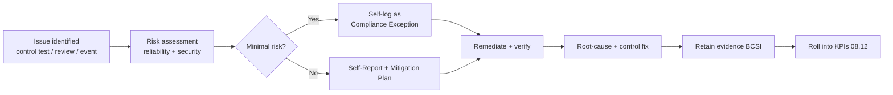
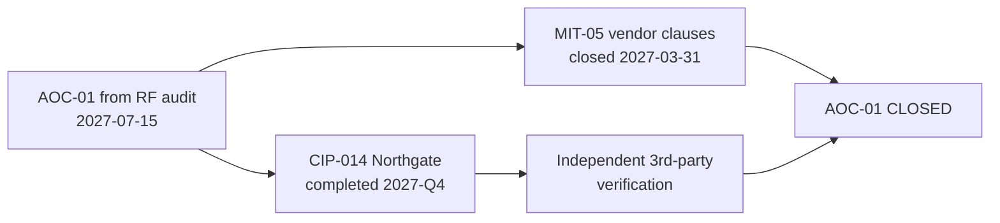

# 08.13 — Self-Report & Mitigation Lifecycle

| Field | Value |
|---|---|
| Document ID | CIP-CM-SELFLOG-2026-813 |
| Version | 1.0 |
| Date | 2026-03-02 |
| Classification | BES Cyber System Information (BCSI) // Illustrative Portfolio Sample |
| Owner | Karen Whitfield, NERC Compliance Manager (ICP Owner) |
| Author | Advisory Team (OT GRC / NERC CIP Advisory) |
| Status | Approved |

## Purpose

This document describes GridPoint Energy's **ongoing self-report / self-log and mitigation lifecycle** operated within the Internal Controls Program during the ConMon window (**2027-Q3 through 2028-Q2**). It evidences that **3 minimal-risk items were self-logged and remediated** during continuous monitoring with **0 escalating to a Possible Violation**, and that the audit's single **Area of Concern (AOC-01 — CIP-014 Northgate risk assessment and the MIT-05 vendor contract amendments)** is now **closed**. It demonstrates that GridPoint uses the CMEP's self-logging and Compliance Exception mechanisms as intended: to surface, correct, and document low-risk issues internally.

## 1. The CMEP Self-Report / Self-Log Framework

Under NERC's Compliance Monitoring and Enforcement Program (CMEP), a Registered Entity that identifies a possible noncompliance may address it through **Self-Report** or, for minimal-risk issues, through **self-logging as a Compliance Exception** — a streamlined disposition that records the issue and its remediation without formal enforcement, provided the entity maintains a qualifying internal controls program. GridPoint's ICP is the qualifying program.

| Mechanism | When Used | Enforcement Outcome |
|---|---|---|
| Self-Log (Compliance Exception) | Minimal-risk possible noncompliance, promptly remediated | Recorded; no penalty |
| Self-Report | Moderate/serious risk, or where enforcement discretion applies | Mitigation Plan; discretion |
| Mitigation Plan | Any accepted issue requiring structured remediation | Tracked to completion |
| Possible Violation | Issue meeting violation criteria | Formal enforcement |

## 2. Self-Log Lifecycle

## 3. Self-Logged Items During ConMon — 3, All Minimal-Risk, Remediated

Three items were self-logged as Compliance Exceptions during the reporting window. Each was assessed **minimal risk** (no adverse reliability or security impact, bounded scope, short duration), remediated promptly, and had its underlying control tightened to prevent recurrence. **None escalated to a Possible Violation.**

| ID | Standard | Description | Risk | Remediation | Status |
|---|---|---|---|---|---|
| SL-01 | CIP-007-6 R2 | One monthly patch-evaluation record documented late in its filing step; the evaluation itself occurred within the 35-day cycle | Minimal | Record completed; automated reminder added to patch workflow | Closed |
| SL-02 | CIP-010-4 R1 | One configuration baseline re-baselined near the end of the 30-day window with an incomplete data field | Minimal | Field completed; re-baseline checklist updated | Closed |
| SL-03 | CIP-004-7 R4 | One contractor account remained on the authorized list briefly after need ended, caught at quarterly review | Minimal | Access revoked same day; offboarding-trigger control strengthened | Closed |

The first two of these map to the **2 minor control-test exceptions** identified in **08.11** (EX-CM-01, EX-CM-02); SL-03 was surfaced by the **2027-Q3 quarterly access review** (08.08). All three are reflected in the KPI dashboard (08.12).

## 4. Possible Violations & Mitigation Plans

| Category | Count in Window | Notes |
|---|---|---|
| Possible Violations identified | **0** | No self-log escalated; ICP contained all items |
| New Mitigation Plans opened | 0 | No issue required structured multi-step remediation |
| Mitigation Plans carried from audit | 0 open | MIT-05 closed 2027-03-31 (see §5) |
| Self-Reports filed | 0 | All items qualified for self-log disposition |

## 5. Area of Concern (AOC-01) — Closed

The RF Compliance Audit (2027-07-15 report) issued a single **Area of Concern — a recommendation, not a violation** — with two components. Both are now **complete**, and AOC-01 is **closed**.

| AOC-01 Component | Action | Completion | Verification |
|---|---|---|---|
| CIP-014-3 Northgate risk assessment | Physical-security risk assessment completed and physical security plan updated | **2027-Q4** | **Independent third-party verification** by a licensed engineering firm |
| MIT-05 vendor contract amendments | CIP-013 supply-chain contract clauses amended and executed | **2027-03-31** | Executed agreements retained (BCSI) |
| **AOC-01 overall** | Both components complete | **Closed** | Confirmed by CIP Senior Manager |

## 6. Root-Cause & Continuous Improvement

Each self-logged item drove a **control improvement**, so the lifecycle strengthens the program rather than merely recording issues:

| Item | Root Cause | Control Improvement |
|---|---|---|
| SL-01 | Manual filing step lacked a deadline prompt | Automated reminder in patch workflow |
| SL-02 | Baseline checklist allowed submission with an open field | Mandatory-field validation added |
| SL-03 | Offboarding trigger relied on manual notification | Strengthened HR-to-access offboarding trigger |

## 7. Evidence Retained (Audit-Ready)

| Evidence Artifact | Owner | Retention |
|---|---|---|
| Compliance Exception self-log entries (×3) | Karen Whitfield | ConMon repository (BCSI) |
| Risk assessments per item | Karen Whitfield | Retained |
| Remediation & verification records | Control owners | Retained |
| CIP-014 Northgate assessment + third-party verification | Frank Delgado | BCSI (controlled) |
| MIT-05 executed vendor agreements | Priya Nair | BCSI (controlled) |

## 8. Control Effectiveness Statement

The self-report / self-log lifecycle operated **effectively**. The ICP surfaced **3 minimal-risk items**, disposed of each as a Compliance Exception with prompt remediation and a durable control fix, and produced **0 Possible Violations**. The audit's single Area of Concern is **closed**, with the CIP-014 Northgate component independently verified. GridPoint's compliance posture is confirmed as **good standing** heading into executive reporting.

## Cross-References

| Reference | Purpose |
|---|---|
| [08.11 — Continuous Evidence Collection & Testing](08.11-continuous-evidence-collection-and-testing.md) | Source of 2 control-test exceptions (SL-01/SL-02) |
| [08.08 — Access Reviews & PRA Renewals (CIP-004)](08.08-access-reviews-and-pra-renewals-cip-004.md) | Quarterly review that surfaced SL-03 |
| [08.12 — Compliance Metrics & KPIs](08.12-compliance-metrics-and-kpis.md) | Self-log & PV metrics roll-up |
| [07.10 — Audit Conduct & Outcome](../07-audit-readiness-compliance-package/07.10-audit-conduct-and-outcome.md) | Origin of AOC-01 |
| [06.10 — Phase 06 Summary & Transition](../06-gap-remediation-mitigation-plans/06.10-phase-summary-and-transition.md) | MIT-05 Mitigation Plan lineage |

---

[⬅ Previous](08.12-compliance-metrics-and-kpis.md) · [🏠 Phase README](08.00-README.md) · [Next ➡](08.14-phase-summary-and-transition.md)
