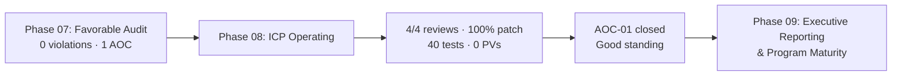

# 08.14 — Phase 08 Summary & Transition

| Field | Value |
|---|---|
| Document ID | CIP-CM-PHSUM-2026-814 |
| Version | 1.0 |
| Date | 2026-03-02 |
| Classification | BES Cyber System Information (BCSI) // Illustrative Portfolio Sample |
| Owner | Karen Whitfield, NERC Compliance Manager (ICP Owner) |
| Author | Advisory Team (OT GRC / NERC CIP Advisory) |
| Status | Approved |

## Purpose

This document closes **Phase 08 — Ongoing Compliance Monitoring & Internal Controls Program** for GridPoint Energy. It confirms that the **Internal Controls Program (ICP) is operating**, that all recurring CIP obligations for the first post-audit year (**2027-Q3 through 2028-Q2**) were met, that the audit's single **Area of Concern is closed**, that GridPoint is in **good standing** with ReliabilityFirst, and that the program is ready to transition to **Phase 09 — Executive Reporting & Program Maturity**.

## 1. What Phase 08 Delivered

| Outcome | Result |
|---|---|
| ICP stood up and operating | Since audit close (2027-07); continuous |
| 35-day patch cycles | 12 of 12 monthly cycles, 100% within window |
| Quarterly CIP-004 access reviews | 4 of 4 complete |
| PRA currency | 160 covered individuals (142 personnel + 18 vendors) current |
| CIP-002 15-month recategorization review | Completed on schedule; no change (52 BCS; Sunfield captured) |
| CIP-010 R1 change management | 1 significant change (relay-platform upgrade); stayed within categorization |
| Internal control tests | 40; controls effective (2 minor exceptions self-corrected) |
| Self-logged Compliance Exceptions | 3 minimal-risk; all remediated |
| Possible Violations | **0** |
| Reportable Cyber Security Incidents (CIP-008) | 0 |
| Overdue compliance obligations | 0 |
| **Area of Concern (AOC-01)** | **Closed** (CIP-014 Northgate 2027-Q4 + MIT-05 2027-03-31) |
| Compliance standing | **Good standing** as of 2028-Q2 |

## 2. All Ongoing Obligations Met

| CMEP / CIP Obligation | Cadence | Result |
|---|---|---|
| CIP-007-6 R2 patch cycle | 35 days | 100% (12/12) |
| CIP-004-7 R4 access reviews | Quarterly | 4 of 4 |
| CIP-004-7 R3 PRA renewals | 7 years | All 160 current |
| CIP-002-5.1a R2 review | ≤ 15 months | Completed; no change |
| CIP-010-4 R3 vulnerability assessment | ≤ 15 months | Completed |
| CIP-009-6 recovery test | Periodic | 1 passed |
| CIP-008-6 IR test | Periodic | 1 tabletop |
| CIP-013-2 vendor reviews | Ongoing | Completed (key vendors) |
| RF Self-Certification & data submittals | Annual / periodic | On time |

## 3. Area of Concern Closed

The single Area of Concern from the RF Compliance Audit is fully resolved. The **CIP-014-3 Northgate risk assessment was completed in 2027-Q4 with independent third-party verification** and the physical security plan updated; the **MIT-05 vendor contract amendments closed 2027-03-31**. AOC-01 is **closed** with no residual obligation.

## 4. Residual Risk Statement

| Risk Dimension | Position at Phase 08 Close |
|---|---|
| Open High-risk items | 0 |
| Open Possible Violations | 0 |
| Open Mitigation Plans | 0 |
| Open Areas of Concern | 0 (AOC-01 closed) |
| Overdue obligations | 0 |
| Overall residual risk | **Low** |

## 5. Readiness to Enter Phase 09

| Readiness Check | Status |
|---|---|
| ICP operating with evidenced control results | Complete |
| KPI dashboard populated and green (08.12) | Complete |
| Self-log lifecycle demonstrated (08.13) | Complete |
| Area of Concern closed | Complete |
| Evidence continuously audit-ready | Complete |
| Good-standing status confirmed | Complete |

## 6. Program Trajectory Confirmed

Phase 08 demonstrates that GridPoint's CIP program has matured from build-out to **sustained, evidenced operation**. The end-to-end trajectory now reads as a continuous lifecycle rather than a one-time project:

| Milestone | Phase | Result |
|---|---|---|
| BES Cyber Systems categorized | 02 | 52 BCS; 118 applicable parts |
| Controls implemented & documented | 03–04 | Medium + Low control sets operating |
| Internal assessment & remediation | 05–06 | Gaps closed; residual risk Low |
| RF Compliance Audit | 07 | 0 violations; 1 AOC; favorable |
| **Continuous monitoring & internal controls** | **08** | **ICP operating; 0 PVs; AOC closed; good standing** |

## 7. Handoff to Phase 09

Phase 09 — **Executive Reporting & Program Maturity** — consumes the Phase 08 KPIs and control results to produce board- and executive-level reporting, benchmark program maturity, and set the forward improvement agenda ahead of the next RF audit cycle. It inherits the operating ICP, the good-standing posture, the closed Area of Concern, and the Low residual-risk position without modification.

## 8. Sign-Off

| Role | Name | Acceptance |
|---|---|---|
| CIP Senior Manager | Daniel Reyes | ICP results and AOC closure accepted |
| NERC Compliance Manager | Karen Whitfield | Phase 08 deliverables validated |
| OT / ICS Security Lead | Marcus Bell | Control operations confirmed |
| Advisory Team | Advisory Team | Phase 08 deliverables complete |

## Cross-References

| Reference | Purpose |
|---|---|
| [08.12 — Compliance Metrics & KPIs](08.12-compliance-metrics-and-kpis.md) | KPI evidence for the phase close |
| [08.13 — Self-Report & Mitigation Lifecycle](08.13-self-report-and-mitigation-lifecycle.md) | AOC-01 closure and self-logs |
| [07.13 — Phase 07 Summary & Transition](../07-audit-readiness-compliance-package/07.13-phase-summary-and-transition.md) | Prior phase handoff |
| [01.12 — Compliance Obligations Calendar](../01-program-foundation/01.12-compliance-obligations-calendar.md) | Recurring obligation cadence |

---

[⬅ Previous](08.13-self-report-and-mitigation-lifecycle.md) · [🏠 Phase README](08.00-README.md) · [Next ➡](../09-executive-reporting-program-maturity/09.00-README.md)
