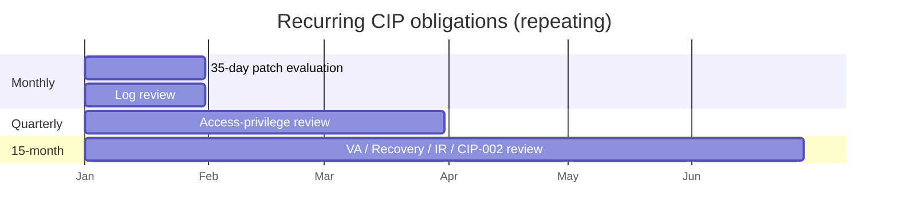

# Diagram — Compliance Calendar Cadence

| Field | Value |
|---|---|
| Version | 1.0 |
| Date | 2026-03-02 |
| Classification | BES Cyber System Information (BCSI) // Illustrative Portfolio Sample |
| Company | GridPoint Energy, Inc. (NCR11027) |
| Regional Entity | ReliabilityFirst (RF) |
| Phase | 08 — Ongoing Compliance Monitoring & Internal Controls |
| Author | Advisory Team |
| Status | Approved |

## Cross-References
`08.02-compliance-monitoring-calendar.md`.
