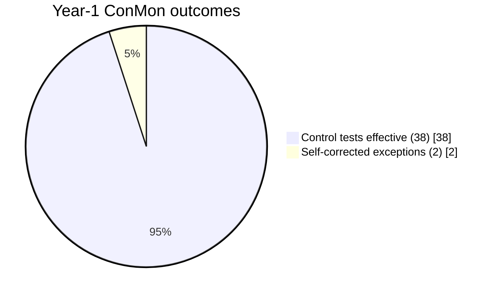

# Diagram — Compliance Health Trend

| Field | Value |
|---|---|
| Version | 1.0 |
| Date | 2026-03-02 |
| Classification | BES Cyber System Information (BCSI) // Illustrative Portfolio Sample |
| Company | GridPoint Energy, Inc. (NCR11027) |
| Regional Entity | ReliabilityFirst (RF) |
| Phase | 08 — Ongoing Compliance Monitoring & Internal Controls |
| Author | Advisory Team |
| Status | Approved |

Patch conformance **100%** · access reviews **4/4** · Possible Violations **0** · reportable incidents **0** · **good standing**.

## Cross-References
`08.12-compliance-metrics-and-kpis.md`.
