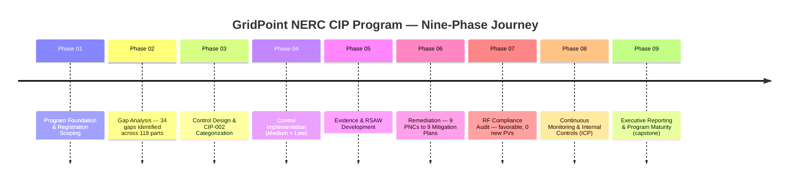
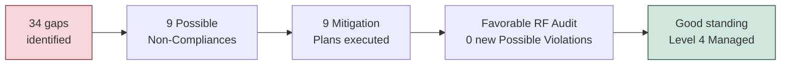

# 09.01 — Executive Summary & Program Overview

| Field | Value |
|---|---|
| Document ID | CIP-EXEC-SUMM-2026-901 |
| Version | 1.0 |
| Date | 2026-03-02 |
| Classification | BES Cyber System Information (BCSI) // Illustrative Portfolio Sample |
| Owner | Karen Whitfield, NERC Compliance Manager (ICP Owner) |
| Author | Advisory Team (OT GRC / NERC CIP Advisory) |
| Status | Approved |

## Purpose

This document is the **executive summary and single-narrative overview of GridPoint Energy's complete NERC CIP compliance program** — the capstone read for executive leadership and the Board of Directors. It compresses a nine-phase engagement into one authoritative account: what GridPoint is, what was in scope, the journey from a reactive, ad-hoc starting posture to a **Managed (Level 4)** internal-controls program, the **favorable ReliabilityFirst (RF) Compliance Audit** outcome, and the resulting state of **good standing**. It is written for readers who will not open the underlying evidence but who are accountable for the enterprise — so every claim here is traceable to the phase deliverables cross-referenced at the end.

## 1. The Company in One Paragraph

**GridPoint Energy, Inc.** is a mid-size, investor-owned, vertically integrated electric utility headquartered in **Millbrook, Ohio**, serving **~750,000 metered customers** across a 12-county territory in the Eastern Interconnection. GridPoint operates **~1,850 MW** of generation (two combined-cycle gas plants, one hydro station, and a newly commissioned 220 MW solar site), **~1,600 circuit-miles** of 138 kV / 345 kV transmission, and **44 substations**, coordinated from a primary control center in Millbrook and a backup in Easton. GridPoint is a NERC-registered entity (**NCR11027**) under **ReliabilityFirst (RF)** oversight, registered as **GO, GOP, TO, TOP, and DP**, and is therefore subject to the full suite of NERC CIP Reliability Standards.

## 2. Why the Program Was Launched

Three converging drivers made a program-level intervention non-discretionary:

1. **A changed asset baseline.** A new utility-scale solar site, two new substations, and control-center modernization required a full **CIP-002** recategorization of BES Cyber Systems.
2. **IT/OT convergence and vendor remote access** expanded the entity's **CIP-005 / CIP-013** attack surface and compliance exposure.
3. **A scheduled RF Compliance Audit (2027-Q2)** created a hard deadline to become defensibly audit-ready.

The catalyst that crystallized executive sponsorship was a prior **self-logged lapse in the CIP-007 R2 patch-evaluation cycle** — a single unmanaged control demonstrating how compliance can silently drift and, under CMEP, expose the enterprise to penalties of **up to $1,000,000 per violation per day**.

## 3. Scope at a Glance

| Dimension | In Scope |
|---|---|
| BES Cyber Systems | **52** — 14 Medium-impact + 38 Low-impact; **0 High** |
| Associated cyber assets | **26 EACMS**, **18 PACS**, **60 PCA**; ~420 BCAs |
| Substations | **44** in BES footprint (8 Medium + 34 Low; 2 distribution-only out of scope) |
| Control Centers | Primary (Millbrook) + Backup (Easton) — TOP/GOP functions |
| CIP standards | **CIP-002 through CIP-014** (incl. CIP-003 Low-impact Attachment 1) |
| Applicable requirement parts | **118** (Medium + Low) |
| Personnel & vendors | **142 personnel + 18 vendors** (PRA + training current) |

## 4. The Nine-Phase Journey

The program advanced through nine deliberate phases, each building the evidence base for the next. The through-line is a disciplined conversion of risk into monitored, defensible controls.

### 4.1 The Headline Arithmetic

The program's value is most legible as a simple funnel: raw risk was identified early, resolved under GridPoint's own control, and validated externally.

- **34 gaps** were identified in the Phase 02 gap analysis against the 118 applicable requirement parts.
- **9** of those matured into **Possible Non-Compliances (PNCs)** requiring formal treatment.
- Each PNC was remediated under a dedicated **Mitigation Plan** — **9 plans, all executed**.
- The **RF Compliance Audit** (fieldwork 2027-06; Compliance Audit Report issued **2027-07-15**) returned a **favorable result: 0 new Possible Violations** and **1 Area of Concern**, which was subsequently **closed in Phase 08**.

## 5. Outcome and Current State

| Measure | Result |
|---|---|
| RF Compliance Audit | **Favorable** — 0 new Possible Violations; 1 Area of Concern (now closed) |
| Open violations at audit | **0** |
| Program maturity | **Level 4 (Managed)** overall, up from Level 1–2 baseline |
| ConMon year (2027-Q3→2028-Q2) | 12/12 patch cycles, 4/4 access reviews, 40 control tests |
| Self-logged Compliance Exceptions | **3** — all minimal-risk, remediated in < 30 days |
| Reportable cyber incidents | **0** |
| Overdue obligations | **0** |
| Compliance standing | **Good standing** |

GridPoint now operates a standing **CIP Internal Controls Program (ICP)** that sustains compliance continuously between RF's ~3-year audit cycles, rather than reconstructing readiness under deadline pressure. Independent testing during the first post-audit year confirmed **95% control-test effectiveness** on first test, with the remaining exceptions self-corrected.

## 6. What Changed — Before and After

| Attribute | Before (baseline, ~2025) | After (end of Phase 08, 2028-Q2) |
|---|---|---|
| Posture | Reactive, ad hoc, fire-drill audit prep | Continuous, monitored, evidence-current |
| CIP-002 categorization | Stale — pre-solar, pre-new-substations | Baselined and on a 15-month review cadence |
| Patch management | A lapsed CIP-007 R2 cycle | 100% within-window (12/12 cycles) |
| Evidence | Reconstructed under deadline | Continuously collected to controlled BCSI repository |
| Maturity | Level 1–2 (Initial/Repeatable) | Level 4 (Managed) |
| Enforcement exposure | Undetected drift → penalty risk | 0 open PVs; risk **Low** and stable |

## 7. Enterprise Value Delivered

- **Regulatory:** a favorable audit and a sustainable path to the next RF cycle (~2030).
- **Financial:** materially reduced exposure to penalties of up to **$1M per violation per day**; the ICP cut audit-preparation effort by an estimated **~40%** versus the prior fire-drill model, against a **~$1.4M** annual OT security & compliance operating budget.
- **Operational:** reduced OT cyber risk through disciplined patching, access management, and monitoring across 52 BES Cyber Systems.
- **Cultural:** a self-logging, self-correcting compliance culture that converts potential violations into low-risk Compliance Exceptions.

## 8. The Ask and the Road Ahead

Leadership is asked to **note the favorable outcome, affirm continued funding of the ICP run-rate, and endorse the 24-month strategic roadmap** — automating evidence collection, maturing the CIP-013 supply-chain program to Level 4, expanding OT anomaly detection, and preparing for the next RF audit cycle and emerging standards (CIP-012, CIP-015 INSM). Detail is provided in the board briefing (09.02) and roadmap (09.10).

## Cross-References

| Reference | Purpose |
|---|---|
| [09.02 — Board Briefing](09.02-board-briefing.md) | The directors' decision package |
| [09.04 — Program Maturity Assessment](09.04-program-maturity-assessment.md) | Basis for the Level 4 rating |
| [07.10 — Audit Conduct & Outcome](../07-audit-readiness-compliance-package/07.10-audit-conduct-and-outcome.md) | The favorable RF audit result |
| [08.01 — Internal Controls Program Design](../08-continuous-monitoring-internal-controls/08.01-internal-controls-program-design.md) | The ICP that sustains compliance |
| [08.12 — Compliance Metrics & KPIs](../08-continuous-monitoring-internal-controls/08.12-compliance-metrics-and-kpis.md) | ConMon-year performance data |
| [01.05 — CIP Program Charter & Objectives](../01-program-foundation/01.05-cip-program-charter-and-objectives.md) | The program's founding mandate |

---

[⬅ Previous](09.00-README.md) · [🏠 Phase README](09.00-README.md) · [Next ➡](09.02-board-briefing.md)
