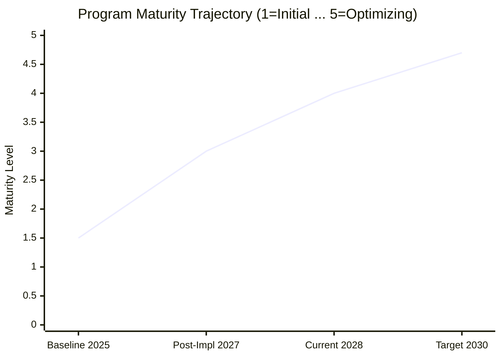
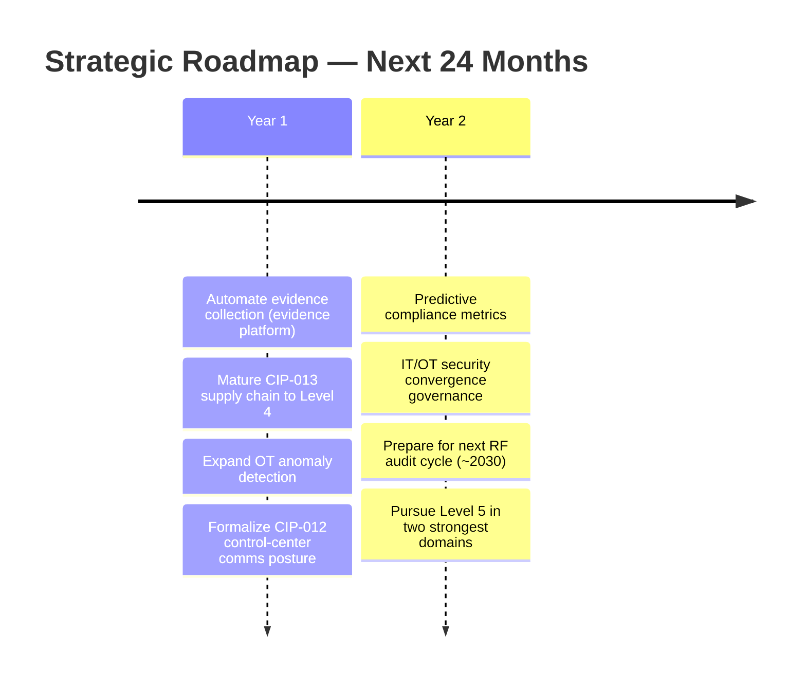

# 09.02 — Board Briefing: NERC CIP Compliance Program

| Field | Value |
|---|---|
| Document ID | CIP-BOARD-BRIEF-2026-902 |
| Version | 1.0 |
| Date | 2026-03-02 |
| Classification | BES Cyber System Information (BCSI) // Illustrative Portfolio Sample |
| Owner | Karen Whitfield, NERC Compliance Manager (ICP Owner) |
| Author | Advisory Team (OT GRC / NERC CIP Advisory) |
| Status | Approved |

## Purpose

This document is the **briefing to the GridPoint Energy Board of Directors — Audit & Risk Committee** on the state of the NERC CIP compliance program. It is structured to be read in ten minutes and delivered in twenty: **situation, compliance status, risk exposure, program maturity, the specific decisions requested, and the forward roadmap headline**. Speaker talking-points are embedded so the presenting executive — **Daniel Reyes, CIP Senior Manager** — can walk the Committee through each slide without a separate deck. Every figure reconciles to the underlying phase evidence.

## 1. Situation (Why We Are Here)

GridPoint completed a multi-year, nine-phase program to build and mature its complete NERC CIP compliance posture ahead of the **ReliabilityFirst (RF) Compliance Audit**. That audit is now behind us with a **favorable outcome**, and the program has transitioned to a standing internal-controls operating model. This briefing reports the result and seeks the Committee's endorsement of continued investment.

> **Talking point:** "We set out to pass a mandatory federal reliability audit with no violations and to leave behind a program that keeps us compliant every day, not just on audit day. We achieved both. This briefing is the proof and the ask."

## 2. Compliance Status (The Headline)

| Indicator | Status |
|---|---|
| RF Compliance Audit (report 2027-07-15) | **Favorable — 0 new Possible Violations** |
| Areas of Concern | 1 identified — **now closed** (Phase 08) |
| Open violations today | **0** |
| Compliance standing | **Good standing** |
| Continuous monitoring year | 12/12 patch cycles · 4/4 access reviews · 40 control tests · 0 reportable incidents |
| Self-logged Compliance Exceptions | 3 — minimal-risk, remediated < 30 days |

> **Talking point:** "Thirty-four gaps became nine formal issues, all remediated under our own plans before the auditors arrived. RF found zero new violations. The single Area of Concern is closed. We are in good standing."

## 3. Risk Exposure (What Was at Stake)

NERC CIP is enforced under the **Compliance Monitoring and Enforcement Program (CMEP)**. Non-compliance can carry statutory penalties of **up to $1,000,000 per violation, per day**. A single control lapse sustained across a monitoring period can therefore generate seven- or eight-figure exposure before any auditor involvement.

| Scenario (illustrative) | Exposure Framing |
|---|---|
| 1 violation, undetected 90 days | Up to **$90M** theoretical statutory maximum |
| GridPoint's prior lapsed CIP-007 R2 cycle | The catalyst — resolved via self-report, **$0 penalty** |
| Post-program state | **0 open Possible Violations**; residual compliance risk **Low** and stable |

> **Talking point:** "The penalty ceiling is a million dollars per violation per day. That is the number that justifies this program's budget many times over. We are now managing that exposure down to a low, stable residual — not eliminating a legal risk that can never be zero, but controlling it with evidence."

## 4. Program Maturity (How Durable Is This)

GridPoint moved from a **Level 1–2 (Initial/Repeatable)** posture — reactive and ad hoc, emblematized by the lapsed patch cycle — to **Level 4 (Managed)** on a five-level capability maturity scale.

> **Talking point:** "Maturity is what makes this durable. We are at Level 4 — controls are defined, measured, and continuously monitored. The roadmap takes our two strongest domains toward Level 5 over 24 months."

## 5. Decisions Requested of the Committee

The Committee is asked to take three actions.

| # | Decision Requested | Rationale |
|---|---|---|
| D1 | **Note and accept** the favorable RF audit outcome and current good standing | Governance record of the enterprise's regulatory position |
| D2 | **Affirm continued funding** of the ICP run-rate (~$1.4M annual OT security & compliance operating budget; lean team of Compliance Manager + 6 control owners) | Sustains the internal-controls program that prevents drift and recurrence |
| D3 | **Endorse the 24-month strategic roadmap** and the CIP Senior Manager's annual attestation | Authorizes the forward investment and affirms accountability |

> **Talking point:** "We are not asking for new capital. We are asking the Committee to keep funding the run-rate that protects a multi-million-dollar exposure at roughly 1.4 million a year, and to endorse the roadmap that keeps us ahead of the next audit cycle."

## 6. Forward Roadmap (Headline)

**Watch items** the Committee should be aware of: evolving NERC standards including **CIP-015 (INSM — Internal Network Security Monitoring)** and pending cloud/virtualization CIP revisions.

## 7. Bottom Line for the Board

GridPoint entered its first modern RF audit cycle with a stale asset baseline and a reactive posture and exits it in **good standing, with zero open violations, a Level 4 internal-controls program, and residual compliance risk that is Low and stable.** The exposure being managed — up to **$1M per violation per day** — dwarfs the **~$1.4M** annual cost of managing it. The program is working; the ask is to keep it funded and endorse its forward path.

## Cross-References

| Reference | Purpose |
|---|---|
| [09.01 — Executive Summary & Program Overview](09.01-executive-summary-and-program-overview.md) | The one-page narrative behind this briefing |
| [09.05 — Risk Posture & Heat Map](09.05-risk-posture-and-heat-map.md) | Detailed residual-risk basis for Section 3 |
| [09.06 — CIP Senior Manager Annual Attestation](09.06-cip-senior-manager-annual-attestation.md) | The attestation referenced in D3 |
| [07.10 — Audit Conduct & Outcome](../07-audit-readiness-compliance-package/07.10-audit-conduct-and-outcome.md) | Source of the favorable audit result |
| [08.12 — Compliance Metrics & KPIs](../08-continuous-monitoring-internal-controls/08.12-compliance-metrics-and-kpis.md) | ConMon performance figures |
| [01.06 — CIP Senior Manager Designation & Delegations](../01-program-foundation/01.06-cip-senior-manager-designation-and-delegations.md) | Accountable-authority basis |

---

[⬅ Previous](09.01-executive-summary-and-program-overview.md) · [🏠 Phase README](09.00-README.md) · [Next ➡](09.03-compliance-posture-dashboard.md)
