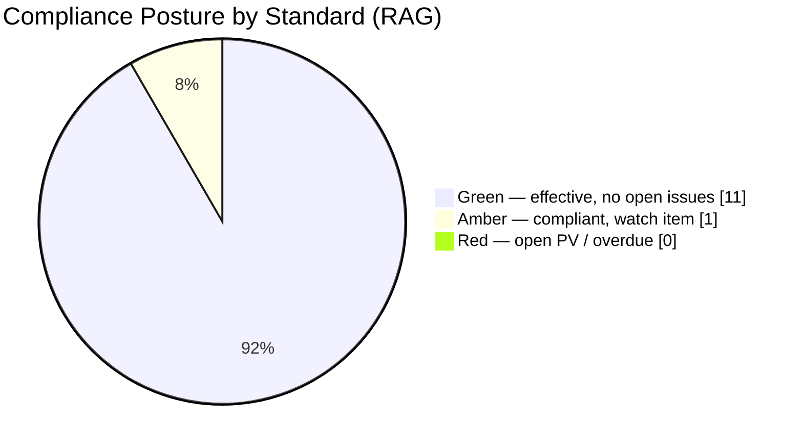
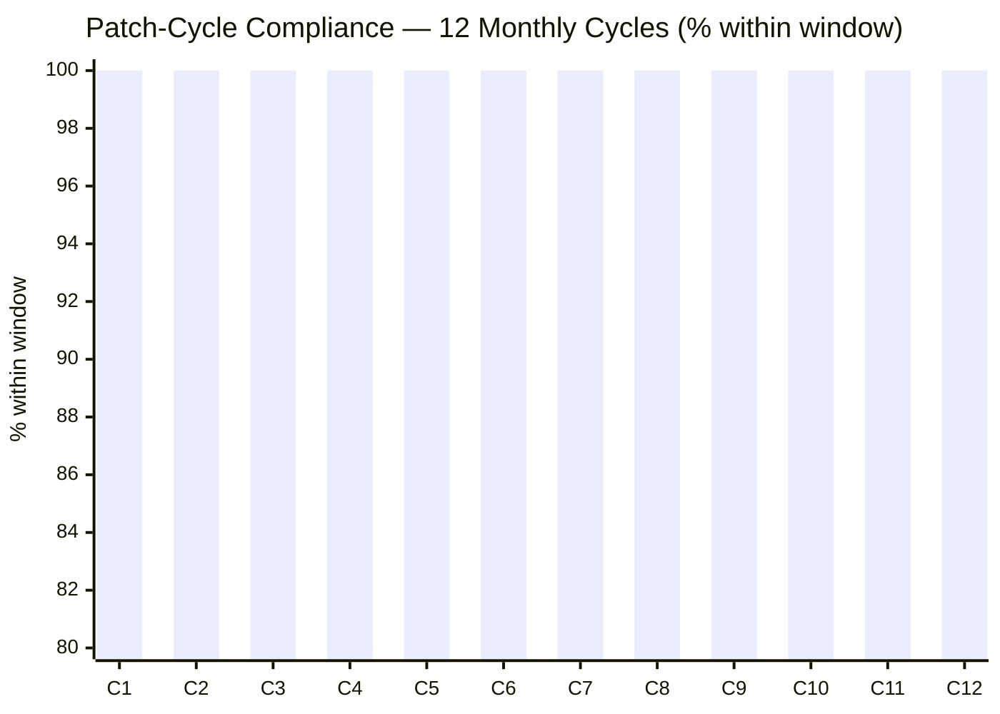

# 09.03 — Compliance Posture Dashboard

| Field | Value |
|---|---|
| Document ID | CIP-POSTURE-DASH-2026-903 |
| Version | 1.0 |
| Date | 2026-03-02 |
| Classification | BES Cyber System Information (BCSI) // Illustrative Portfolio Sample |
| Owner | Karen Whitfield, NERC Compliance Manager (ICP Owner) |
| Author | Advisory Team (OT GRC / NERC CIP Advisory) |
| Status | Approved |

## Purpose

This document is the **data view** of GridPoint Energy's NERC CIP compliance posture — a standing dashboard that renders current status across every applicable standard (**CIP-002 through CIP-014**) as a **RAG (Red / Amber / Green)** rating with supporting metrics. Where the executive summary (09.01) narrates and the board briefing (09.02) persuades, this document simply **reports the numbers** so that a reader can assess posture at a glance and drill into any standard. All figures are as of the close of the continuous-monitoring reporting window (**2027-Q3 → 2028-Q2**).

## 1. Portfolio Snapshot

| Metric | Value |
|---|---|
| Compliance standing | **Good standing** |
| BES Cyber Systems | 52 (14 Medium + 38 Low; 0 High) |
| Associated cyber assets | 26 EACMS · 18 PACS · 60 PCA |
| Applicable requirement parts under monitoring | 118 |
| Open Possible Violations | **0** |
| Open Areas of Concern | **0** (AOC-01 closed) |
| Overdue compliance obligations | **0** |
| Self-logged Compliance Exceptions (window) | 3 — remediated |
| Reportable cyber incidents (CIP-008) | 0 |

## 2. RAG Legend

| Status | Meaning |
|---|---|
| 🟢 Green | Controls operating effectively; evidence current; no open issues |
| 🟡 Amber | Compliant, but a monitored watch item or in-flight enhancement exists |
| 🔴 Red | Open Possible Violation or overdue obligation — none present |

## 3. Posture by CIP Standard

| Standard | Title | Scope Applicability | RAG | Key Metric / Note |
|---|---|---|---|---|
| CIP-002-5.1a | BES Cyber System Categorization | Medium + Low | 🟢 | Baselined; 15-month review current |
| CIP-003-8 | Security Management Controls (incl. Low Attachment 1) | Medium + Low | 🟢 | Policies approved; Low-impact plans in place |
| CIP-004-7 | Personnel & Training | Medium (+ Low awareness) | 🟢 | 100% training; 4/4 access reviews; 142 PRAs current |
| CIP-005-7 | Electronic Security Perimeter(s) & Remote Access | Medium | 🟢 | IRA controls tested; no exceptions |
| CIP-006-6 | Physical Security | Medium | 🟢 | PSP controls effective; monitoring operating |
| CIP-007-6 | System Security Management | Medium | 🟢 | 12/12 patch cycles at 100% within window |
| CIP-008-6 | Incident Reporting & Response Planning | Medium | 🟢 | Plan tested; 0 reportable incidents |
| CIP-009-6 | Recovery Plans | Medium | 🟢 | Recovery test completed; restoration validated |
| CIP-010-4 | Config Change Mgmt & Vulnerability Assessments | Medium | 🟢 | Baselines monitored; 2 minor exceptions self-corrected |
| CIP-011-3 | Information Protection (BCSI) | Medium + Low | 🟢 | BCSI repository controlled; access governed |
| CIP-013-2 | Supply Chain Risk Management | Medium | 🟡 | Program maturing to Level 4; vendor concentration watch item |
| CIP-014-3 | Physical Security (critical transmission) | Applicable stations | 🟢 | AOC-01 (Northgate) closed with third-party verification |

> **Reading note:** CIP-012 (communications between Control Centers) is a formalization item on the forward roadmap and is not yet a separately rated line here; CIP-015 (INSM) is a future-standard watch item. Both are tracked in 09.10.

## 4. RAG Distribution

## 5. Continuous-Monitoring Metrics (Reporting Window)

| KPI | Target | Actual | RAG |
|---|---|---|---|
| Patch compliance (within window) | 100% | **100%** (12/12) | 🟢 |
| Access-review completion | 100% | **100%** (4/4) | 🟢 |
| Control-test effectiveness (first test) | ≥ 90% | **95%** (38/40) | 🟢 |
| Mean time to remediate exceptions | < 30 days | **< 30 days** | 🟢 |
| CIP-004 training completion | 100% | **100%** (142) | 🟢 |
| New Possible Violations at audit | 0 | **0** | 🟢 |
| Overdue obligations | 0 | **0** | 🟢 |

## 6. Exception & Obligation Ledger

| Item | Standard | Type | Status |
|---|---|---|---|
| Self-logged exception 1 | CIP-010 R2 | Config baseline drift (minor) | Self-corrected; remediated < 30 days |
| Self-logged exception 2 | CIP-010 R1 | Change-record documentation | Self-corrected; remediated < 30 days |
| Self-logged exception 3 | CIP-007 R4 | Log-review timing (minor) | Remediated < 30 days |
| AOC-01 | CIP-014 / CIP-013 | Northgate assessment + MIT-05 vendor amendments | **Closed** |
| Recurring CMEP obligations | All | Self-cert, data submittals, spot-check readiness | **0 overdue** |

## 7. Dashboard Summary Statement

Across all twelve applicable CIP standards, GridPoint's posture is **eleven Green and one Amber, with zero Red**. The single Amber (CIP-013 supply chain) is a compliant-but-maturing program with a defined path to Level 4, not an open issue. There are **no open Possible Violations, no open Areas of Concern, and no overdue obligations.** The data view confirms the narrative: GridPoint is in **good standing** and audit-ready at all times.

## Cross-References

| Reference | Purpose |
|---|---|
| [09.04 — Program Maturity Assessment](09.04-program-maturity-assessment.md) | Maturity scoring behind the RAG ratings |
| [09.05 — Risk Posture & Heat Map](09.05-risk-posture-and-heat-map.md) | Risk context for the Amber standard |
| [08.12 — Compliance Metrics & KPIs](../08-continuous-monitoring-internal-controls/08.12-compliance-metrics-and-kpis.md) | Source of Section 5 metrics |
| [08.05 — Patch Cycle Operations (CIP-007)](../08-continuous-monitoring-internal-controls/08.05-patch-cycle-operations-cip-007.md) | Patch-compliance detail |
| [07.10 — Audit Conduct & Outcome](../07-audit-readiness-compliance-package/07.10-audit-conduct-and-outcome.md) | Basis for 0 Possible Violations |
| [01.04 — Applicable Reliability Standards Register](../01-program-foundation/01.04-applicable-reliability-standards-register.md) | Applicability basis per standard |

---

[⬅ Previous](09.02-board-briefing.md) · [🏠 Phase README](09.00-README.md) · [Next ➡](09.04-program-maturity-assessment.md)
