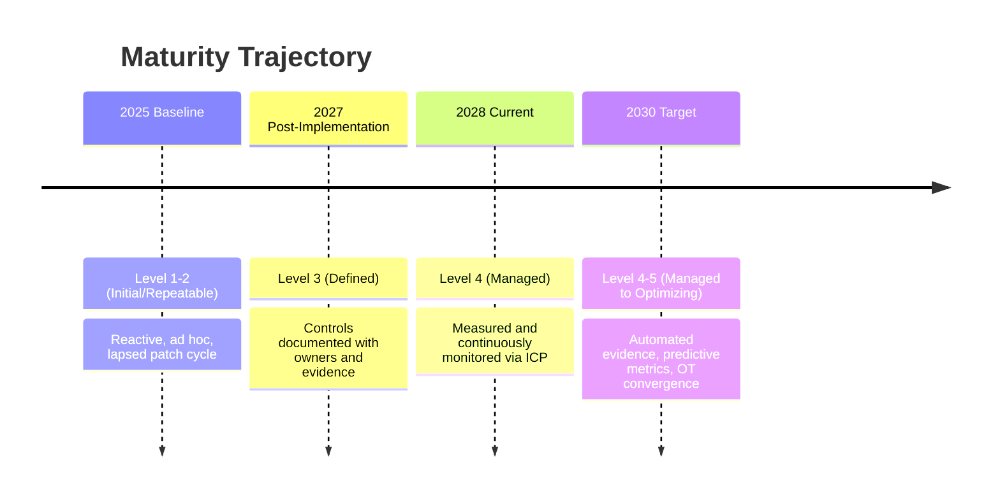
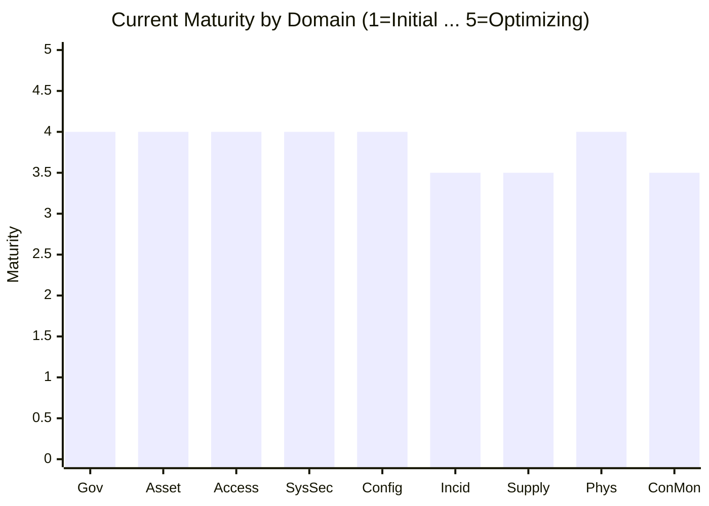
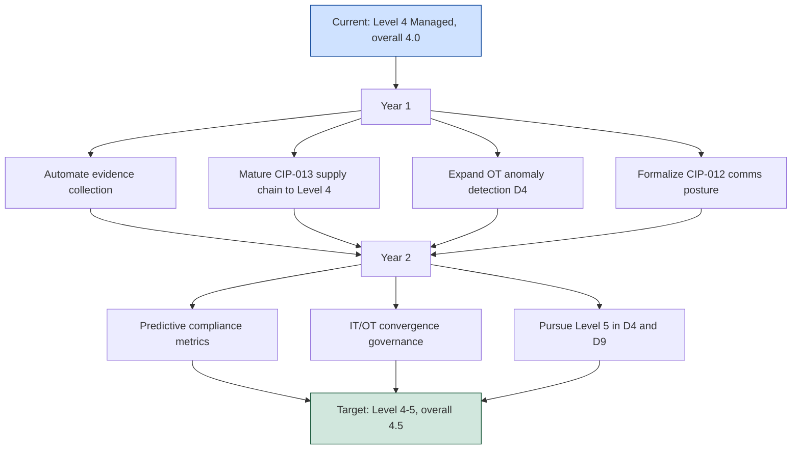

# 09.04 — Program Maturity Assessment

| Field | Value |
|---|---|
| Document ID | CIP-MATURITY-ASMT-2026-904 |
| Version | 1.0 |
| Date | 2026-03-02 |
| Classification | BES Cyber System Information (BCSI) // Illustrative Portfolio Sample |
| Owner | Karen Whitfield, NERC Compliance Manager (ICP Owner) |
| Author | Advisory Team (OT GRC / NERC CIP Advisory) |
| Status | Approved |

## Purpose

This document is the **formal capability-maturity assessment of GridPoint Energy's NERC CIP compliance program**. It applies a **five-level capability maturity model** across nine CIP control domains, establishes the **baseline** (Level 1–2, pre-program), scores the **current state** (Level 4, Managed), sets the **target state** (Level 4–5), and presents the **evidence** behind each domain score and the concrete **path to the next level**. It is the analytical foundation for the maturity claims made to the Board (09.02) and in the executive summary (09.01).

## 1. The Maturity Model

| Level | Name | Characteristics |
|---|---|---|
| 1 | Initial | Ad hoc, reactive; compliance depends on individuals; no repeatable process |
| 2 | Repeatable | Some documented processes; inconsistent execution; audit prep is a fire drill |
| 3 | Defined | Standardized, documented controls with owners; evidence produced routinely |
| 4 | Managed | Controls measured and continuously monitored; issues detected and self-corrected |
| 5 | Optimizing | Automated evidence, predictive metrics, continuous improvement embedded |

## 2. Overall Trajectory

GridPoint began the program at **Level 1–2** — reactive and ad hoc, with the lapsed **CIP-007 R2** patch-evaluation cycle emblematic of the starting posture. By the close of Phase 08 (2028-Q2) the program reached **Level 4 (Managed)** overall, with a **24-month target of Level 4–5**.

## 3. Domain-by-Domain Scores

Nine control domains were scored on the 1–5 scale. The program's **weakest links are Incident & Recovery and Supply Chain (both 3.5)**; every other domain is at **4.0**.

| # | Domain | CIP Standards | Baseline | Current | Target |
|---|---|---|---|---|---|
| D1 | Governance & Policy | CIP-003 | 2.0 | **4.0** | 4.5 |
| D2 | Asset & BCS Management | CIP-002 | 1.5 | **4.0** | 4.5 |
| D3 | Access Management | CIP-004 | 2.0 | **4.0** | 4.5 |
| D4 | Systems Security | CIP-005 / CIP-007 | 1.5 | **4.0** | 5.0 |
| D5 | Config & Vulnerability | CIP-010 | 1.5 | **4.0** | 4.5 |
| D6 | Incident & Recovery | CIP-008 / CIP-009 | 2.0 | **3.5** | 4.0 |
| D7 | Supply Chain | CIP-013 | 1.0 | **3.5** | 4.0 |
| D8 | Physical Security | CIP-006 / CIP-014 | 2.0 | **4.0** | 4.5 |
| D9 | Internal Controls / ConMon | ICP (cross-cutting) | 1.0 | **4.0** | 5.0 |
| — | **Overall** | — | **1.5** | **4.0** | **4.5** |

### 3.1 Radar / Spider Concept

A spider chart of the nine domains would show a near-regular nonagon at radius 4, with two slight inward notches at **D6 (Incident & Recovery)** and **D7 (Supply Chain)**. Rendered here as a horizontal bar proxy:

> Note: the ConMon bar reflects the cross-cutting domain's measured 4.0 with the same rendering scale; see the table in Section 3 for authoritative values.

## 4. Evidence Behind Each Score

| Domain | Evidence for Current Score |
|---|---|
| D1 Governance & Policy | Approved CIP policy set; CIP-003 R1 accountable authority (Daniel Reyes) with current delegations; annual review cadence |
| D2 Asset & BCS Management | CIP-002 baseline (52 BCS) on a 15-month review; recategorization completed post-solar/new-substations |
| D3 Access Management | 100% training (142 personnel); 4/4 quarterly access reviews; PRAs current for 142 personnel + 18 vendors |
| D4 Systems Security | 12/12 patch cycles at 100% within window; IRA and ESP controls tested with no exceptions |
| D5 Config & Vulnerability | Configuration monitoring operating; 2 minor baseline exceptions detected internally and self-corrected |
| D6 Incident & Recovery | CIP-008 plan tested (0 reportable incidents); CIP-009 recovery test completed — held at 3.5 pending automation & broader scenario coverage |
| D7 Supply Chain | CIP-013 program operating; MIT-05 vendor amendments executed — held at 3.5 pending vendor-risk scoring maturity and concentration mitigation |
| D8 Physical Security | CIP-006 PSP controls effective; CIP-014 Northgate assessment closed with independent third-party verification |
| D9 Internal Controls / ConMon | ICP executed 40 control tests at 95% effectiveness; 3 exceptions self-logged and remediated; 0 overdue obligations |

## 5. What Separates Level 4 from Level 5

The program is solidly **Managed**. Reaching **Optimizing** in the target domains requires the following transitions:

| From (Level 4 — Managed) | To (Level 5 — Optimizing) |
|---|---|
| Evidence collected continuously but partly manual | **Automated** evidence collection via evidence platform |
| Metrics reported (lagging) | **Predictive** compliance metrics / leading indicators |
| Controls monitored per requirement | **Continuous improvement** embedded; controls self-tune |
| IT and OT governed in parallel | **IT/OT security convergence** governance |

## 6. Path to the Next Level (24-Month Plan)

**Priority sequencing:** the two lagging domains (**D6, D7**) are lifted first to close the maturity floor, while the two strongest (**D4 Systems Security, D9 ConMon**) are pushed toward Level 5 to establish optimizing exemplars the rest of the program can pattern against.

## 7. Assessment Conclusion

GridPoint's NERC CIP program is assessed at **Level 4 (Managed), overall score 4.0**, up from a **1.5 baseline** — a two-and-a-half-level improvement driven by disciplined control implementation, a favorable audit, and a functioning internal-controls program. No domain scores below **3.5**. The program has a credible, funded, and sequenced path to **Level 4–5 (overall 4.5)** within 24 months.

## Cross-References

| Reference | Purpose |
|---|---|
| [09.03 — Compliance Posture Dashboard](09.03-compliance-posture-dashboard.md) | RAG posture aligned to domain scores |
| [09.10 — Strategic Roadmap & Continuous Improvement](09.10-strategic-roadmap-and-continuous-improvement.md) | The roadmap operationalizing Section 6 |
| [08.01 — Internal Controls Program Design](../08-continuous-monitoring-internal-controls/08.01-internal-controls-program-design.md) | The ICP underpinning the ConMon domain |
| [08.12 — Compliance Metrics & KPIs](../08-continuous-monitoring-internal-controls/08.12-compliance-metrics-and-kpis.md) | Evidence for D9 and D4 scores |
| [07.10 — Audit Conduct & Outcome](../07-audit-readiness-compliance-package/07.10-audit-conduct-and-outcome.md) | External validation of maturity |
| [01.05 — CIP Program Charter & Objectives](../01-program-foundation/01.05-cip-program-charter-and-objectives.md) | Baseline posture reference |

---

[⬅ Previous](09.03-compliance-posture-dashboard.md) · [🏠 Phase README](09.00-README.md) · [Next ➡](09.05-risk-posture-and-heat-map.md)
