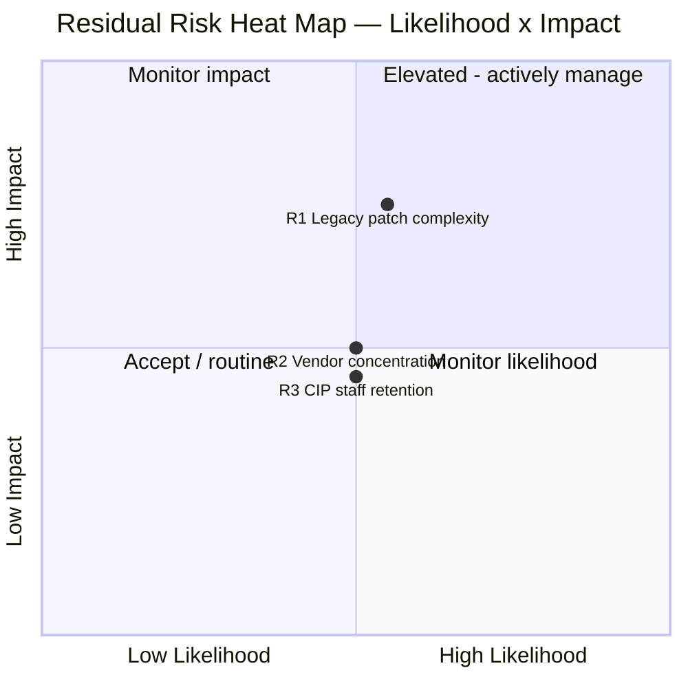
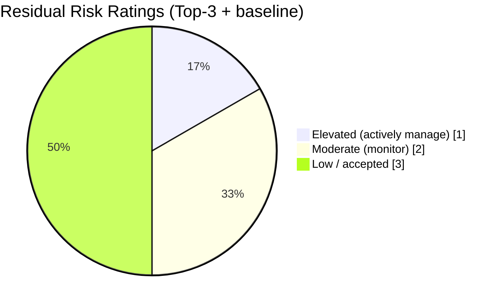

# 09.05 — Risk Posture & Heat Map

| Field | Value |
|---|---|
| Document ID | CIP-RISK-POSTURE-2026-905 |
| Version | 1.0 |
| Date | 2026-03-02 |
| Classification | BES Cyber System Information (BCSI) // Illustrative Portfolio Sample |
| Owner | Karen Whitfield, NERC Compliance Manager (ICP Owner) |
| Author | Advisory Team (OT GRC / NERC CIP Advisory) |
| Status | Approved |

## Purpose

This document presents GridPoint Energy's **residual compliance and enterprise risk posture** at the close of the program — the risk that remains **after** controls and the internal-controls program are operating. It identifies the **top residual risks** with named owners and mitigations, plots them on a **likelihood × impact heat map**, and frames the enterprise **penalty exposure**. It gives the Board and the CIP Senior Manager a defensible, evidence-backed view of what could still go wrong and how it is being managed.

## 1. Overall Residual Risk Statement

GridPoint's **residual compliance risk is Low and stable.** There are **no open Possible Violations and no overdue obligations.** The favorable RF audit (0 new Possible Violations) and a functioning internal-controls program (95% control-test effectiveness; 3 exceptions self-logged and remediated) provide strong assurance. Residual risk is not zero — regulatory risk never is — but it is controlled, monitored, and trending stable.

| Risk Dimension | Inherent (pre-program) | Residual (current) | Trend |
|---|---|---|---|
| Compliance / regulatory | High | **Low** | Stable |
| OT cyber (BES Cyber Systems) | High | **Moderate-Low** | Improving |
| Financial / penalty exposure | High | **Low** | Stable |
| Reputational | Moderate-High | **Low** | Stable |

## 2. Penalty Exposure Framing

NERC CIP violations are enforced under **CMEP** and can carry penalties of **up to $1,000,000 per violation, per day**. The program converts an uncontrolled, potentially multi-million-dollar exposure into a **Low residual** managed against a **~$1.4M** annual operating budget.

| Exposure Element | Framing |
|---|---|
| Statutory maximum | Up to **$1M per violation per day** |
| Illustrative 90-day undetected violation | Up to **$90M** theoretical maximum |
| GridPoint current open Possible Violations | **0** |
| Prior lapsed CIP-007 R2 cycle | Self-reported; **$0 penalty** — the catalyst for the program |
| Annual cost to manage the exposure | **~$1.4M** operating budget |

## 3. Top-3 Residual Risks

Three risks are carried forward. Each has a named owner, a rating, and an active mitigation.

| ID | Residual Risk | Likelihood | Impact | Rating | Owner | Mitigation |
|---|---|---|---|---|---|---|
| R1 | **OT patch-management complexity on legacy relay platforms** — some field devices have constrained patch paths | Medium | High | **Elevated** | Marcus Bell (OT / ICS Security Lead) | Compensating controls, vendor coordination, TFE where warranted, prioritized monitoring; 100% within-window sustained |
| R2 | **Supply-chain / vendor concentration** — reliance on a small set of OT vendors (CIP-013) | Medium | Medium | **Moderate** | Karen Whitfield (Compliance Mgr) / procurement | Vendor risk scoring, MIT-05 contract amendments executed, CIP-013 program maturing to Level 4, second-source strategy |
| R3 | **Skilled-staff retention for CIP roles** — a lean team creates key-person risk | Medium | Medium | **Moderate** | Daniel Reyes (CIP Senior Manager) | Cross-training, documented runbooks, succession planning, delegation currency |

## 4. Likelihood × Impact Heat Map

The three residual risks are plotted on a likelihood (x) × impact (y) quadrant. All sit within the **Moderate-to-Elevated** band — none in the critical top-right corner.

**Reading:** R1 sits highest on impact (legacy relay patching touches BES Cyber Systems directly) and just above the midline on likelihood — placing it in the "actively manage" quadrant. R2 and R3 sit near the center as steady-state "monitor" risks.

## 5. Risk Heat Distribution

## 6. Risk-to-Roadmap Linkage

Each top residual risk maps to a specific roadmap action, so risk treatment and strategic investment are the same program of work.

| Residual Risk | Roadmap Treatment (from 09.10) | Target Effect |
|---|---|---|
| R1 Legacy patch complexity | Expand OT anomaly detection; automate patch-evidence collection | Faster detection, reduced drift window |
| R2 Vendor concentration | Mature CIP-013 to Level 4; vendor scoring; second-sourcing | Lower concentration; Moderate → Low |
| R3 Staff retention | Cross-training, runbooks, succession; convergence governance | Reduced key-person risk |

## 7. Assurance & Escalation

- Residual risks are reviewed in the **quarterly ICP report** to the CIP Senior Manager and rolled up annually to the Board Audit & Risk Committee.
- Any new Possible Violation or overdue obligation triggers immediate escalation to Daniel Reyes under the established communications and escalation plan.
- The **three-lines-of-defense** model (control owners → compliance oversight → independent assurance / RF audit) provides layered detection.

## 8. Risk Posture Conclusion

GridPoint's residual NERC CIP risk posture is **Low and stable**, backed by zero open violations, a favorable audit, and a monitored control environment. The three carried-forward risks are known, owned, rated no higher than **Elevated**, and each is tied to a funded mitigation on the 24-month roadmap. The enterprise's penalty exposure — up to **$1M per violation per day** — is materially and demonstrably reduced.

## Cross-References

| Reference | Purpose |
|---|---|
| [09.02 — Board Briefing](09.02-board-briefing.md) | Executive framing of penalty exposure |
| [09.04 — Program Maturity Assessment](09.04-program-maturity-assessment.md) | Domain maturity behind residual ratings |
| [09.06 — CIP Senior Manager Annual Attestation](09.06-cip-senior-manager-annual-attestation.md) | Attestation reflecting this posture |
| [08.13 — Self-Report & Mitigation Lifecycle](../08-continuous-monitoring-internal-controls/08.13-self-report-and-mitigation-lifecycle.md) | Exception/self-report treatment |
| [07.10 — Audit Conduct & Outcome](../07-audit-readiness-compliance-package/07.10-audit-conduct-and-outcome.md) | Audit basis for Low residual risk |
| [01.11 — Communications & Escalation Plan](../01-program-foundation/01.11-communications-and-escalation-plan.md) | Escalation basis in Section 7 |

---

[⬅ Previous](09.04-program-maturity-assessment.md) · [🏠 Phase README](09.00-README.md) · [Next ➡](09.06-cip-senior-manager-annual-attestation.md)
