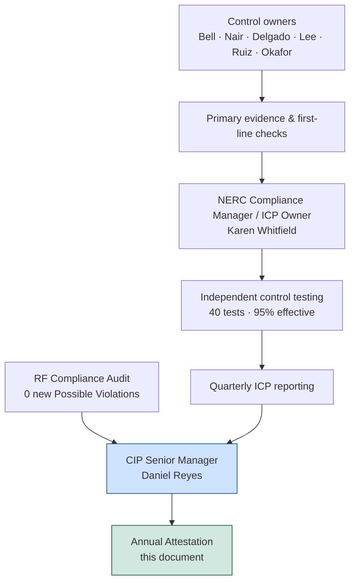

# 09.06 — CIP Senior Manager Annual Attestation

| Field | Value |
|---|---|
| Document ID | CIP-SM-ATTEST-2026-906 |
| Version | 1.0 |
| Date | 2026-03-02 |
| Classification | BES Cyber System Information (BCSI) // Illustrative Portfolio Sample |
| Owner | Daniel Reyes, CIP Senior Manager |
| Author | Advisory Team (OT GRC / NERC CIP Advisory) |
| Status | Approved |

## Purpose

This document is the **formal annual attestation of the CIP Senior Manager** of GridPoint Energy, Inc. for the reporting year, affirming that the entity's applicable NERC CIP compliance obligations were met, that CIP-003 R1 delegations are current, and that the program's controls operated as designed. It is the single accountable authority's on-the-record statement to executive leadership, the Board Audit & Risk Committee, and — in support of Self-Certification — to ReliabilityFirst. It is signed by **Daniel Reyes, CIP Senior Manager (VP Security & Compliance)**, the accountable authority required by **CIP-003 R1**.

## 1. Attesting Authority

| Field | Detail |
|---|---|
| Registered Entity | GridPoint Energy, Inc. |
| NERC Compliance Registry ID | NCR11027 |
| Regional Entity | ReliabilityFirst (RF) |
| Functional registrations | GO · GOP · TO · TOP · DP |
| Attesting authority | **Daniel Reyes, CIP Senior Manager (VP Security & Compliance)** |
| Basis of authority | CIP-003 R1 — single senior manager with overall responsibility |
| Reporting year covered | 2027-Q3 → 2028-Q2 (continuous-monitoring reporting window) |
| Date of attestation | 2026-03-02 (illustrative program-standard date) |

## 2. Scope of This Attestation

This attestation covers all NERC CIP Reliability Standards applicable to GridPoint's registered functions and its categorized BES Cyber Systems:

| Element | In Scope |
|---|---|
| BES Cyber Systems | **52** (14 Medium + 38 Low; 0 High) |
| Associated cyber assets | 26 EACMS · 18 PACS · 60 PCA |
| Standards | **CIP-002 through CIP-014** (incl. CIP-003 Low-impact Attachment 1) |
| Applicable requirement parts | 118 |
| Personnel & vendors | 142 personnel + 18 vendors (PRA + training) |
| Substations | 44 in BES footprint (8 Medium + 34 Low) |

## 3. Statement of Attestation

I, **Daniel Reyes**, serving as the **CIP Senior Manager** of GridPoint Energy, Inc., having made due inquiry of the NERC Compliance Manager, the control owners, and the CIP Internal Controls Program, and having reviewed the supporting evidence, **attest** as follows for the reporting year:

1. **Compliance obligations met.** GridPoint met its applicable NERC CIP compliance obligations across CIP-002 through CIP-014. As of the close of the reporting window there were **zero open Possible Violations** and **zero overdue compliance obligations**.

2. **Favorable audit standing.** The ReliabilityFirst Compliance Audit (fieldwork 2027-06; Compliance Audit Report issued **2027-07-15**) returned a **favorable result with zero new Possible Violations**. The single Area of Concern identified was **closed** through the internal-controls program.

3. **Controls operating effectively.** The program's controls operated as designed. Independent internal testing executed **40 control tests** at **95% first-test effectiveness (38/40)**, with the remaining two exceptions self-corrected. Patch compliance held at **100% within window (12/12 cycles)** and access reviews at **100% (4/4)**.

4. **Delegations current.** All delegations of CIP Senior Manager authority required under **CIP-003 R1** are documented, dated, and current. Delegated responsibilities are assigned to identified control owners, and no delegation has lapsed.

5. **Self-logging and self-correction functioning.** During the reporting year **three (3) minimal-risk Compliance Exceptions** were self-logged and remediated within **30 days** each, evidencing a functioning detect-and-correct control culture. There were **zero reportable Cyber Security Incidents** under CIP-008.

6. **Personnel controls current.** Personnel Risk Assessments and CIP-004 training are current for all **142 personnel and 18 vendors** with authorized access, at **100% training completion**.

7. **Evidence integrity.** Compliance evidence is maintained in the controlled **BCSI repository** under CIP-011 information-protection controls and is current and audit-ready.

8. **Residual risk acknowledged and managed.** Residual compliance risk is **Low and stable**. The three carried-forward residual risks (legacy OT patch complexity, vendor concentration, CIP staff retention) are owned and under active mitigation.

## 4. Basis for Attestation

My attestation rests on the three-lines-of-defense assurance chain: control owners generate primary evidence; the NERC Compliance Manager (Karen Whitfield) independently tests controls and reports quarterly to me; and the ReliabilityFirst Compliance Audit provides external validation.

## 5. Reporting-Year Evidence Summary

| Assertion | Evidence | Result |
|---|---|---|
| Obligations met | ConMon calendar; obligation ledger | 0 overdue |
| Audit standing | RF Compliance Audit Report (2027-07-15) | 0 new Possible Violations |
| Controls effective | ICP control-test worksheets | 95% (38/40) |
| Patch discipline | CIP-007 R2 patch records | 100% (12/12) |
| Access governance | CIP-004 access-review records | 100% (4/4) |
| Training / PRA | HR records (142 personnel + 18 vendors) | 100% |
| Incidents | CIP-008 records | 0 reportable |
| Exceptions | Self-report / remediation log | 3 logged, all remediated < 30 days |

## 6. Limitations

This attestation provides **reasonable — not absolute — assurance**. It reflects the state of the program over the reporting year based on evidence available at the time of signature and does not warrant that no undetected condition exists. It is prepared for internal governance and Self-Certification support and does not itself constitute a filing with any regulatory authority.

## 7. Signature Block

| | |
|---|---|
| **Attested by** | ________________________________ |
| Name | **Daniel Reyes** |
| Title | CIP Senior Manager (VP Security & Compliance) |
| Authority | CIP-003 R1 — single accountable authority |
| Date | 2026-03-02 |
| | |
| **Prepared / verified by** | ________________________________ |
| Name | **Karen Whitfield** |
| Title | NERC Compliance Manager (ICP Owner) |
| Date | 2026-03-02 |
| | |
| **Acknowledged for the Board** | ________________________________ |
| Body | Board Audit & Risk Committee |
| Date | 2026-03-02 |

## Cross-References

| Reference | Purpose |
|---|---|
| [09.02 — Board Briefing](09.02-board-briefing.md) | The briefing this attestation supports |
| [09.05 — Risk Posture & Heat Map](09.05-risk-posture-and-heat-map.md) | Residual-risk basis for assertion 8 |
| [08.01 — Internal Controls Program Design](../08-continuous-monitoring-internal-controls/08.01-internal-controls-program-design.md) | The ICP underpinning the assurance chain |
| [08.12 — Compliance Metrics & KPIs](../08-continuous-monitoring-internal-controls/08.12-compliance-metrics-and-kpis.md) | Evidence for the metrics attested |
| [07.10 — Audit Conduct & Outcome](../07-audit-readiness-compliance-package/07.10-audit-conduct-and-outcome.md) | The favorable RF audit result |
| [01.06 — CIP Senior Manager Designation & Delegations](../01-program-foundation/01.06-cip-senior-manager-designation-and-delegations.md) | Basis for CIP-003 R1 authority and delegations |

---

[⬅ Previous](09.05-risk-posture-and-heat-map.md) · [🏠 Phase README](09.00-README.md) · [Next ➡](09.07-kpi-and-metrics-rollup.md)
