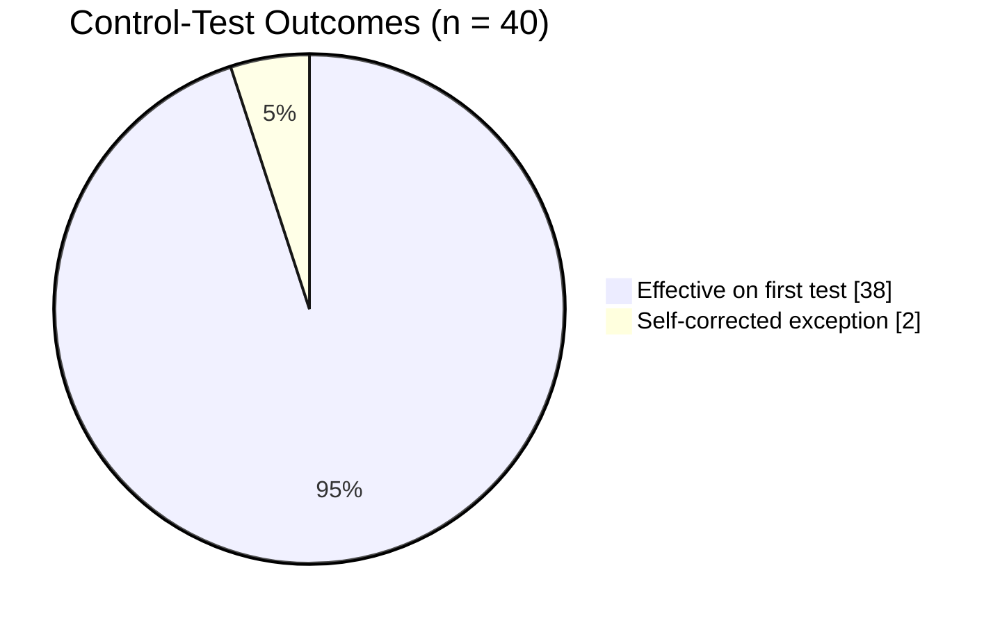
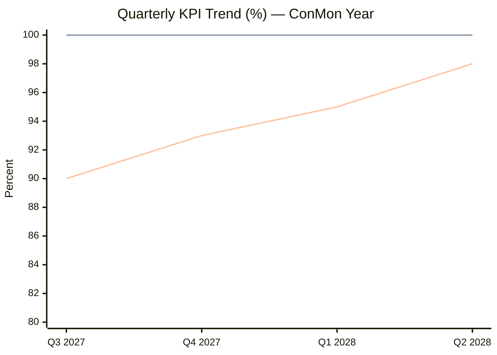

# 09.07 — KPI & Metrics Rollup

| Field | Value |
|---|---|
| Document ID | CIP-EXR-KPI-2026-907 |
| Version | 1.0 |
| Date | 2026-03-02 |
| Classification | BES Cyber System Information (BCSI) // Illustrative Portfolio Sample |
| Owner | Karen Whitfield, NERC Compliance Manager (ICP Owner) |
| Author | Advisory Team (OT GRC / NERC CIP Advisory) |
| Status | Approved |

## Purpose

This document presents the **executive KPI scorecard** for GridPoint Energy's NERC CIP compliance program, rolled up from the operating Internal Controls Program (ICP) and the first post-audit continuous-monitoring year (**2027-Q3 through 2028-Q2**). It translates the detailed control-level metrics captured in Phase 08 into a small set of board-legible key performance indicators, each with a defined target, an actual result, a trend direction, and a data source. The scorecard is the quantitative backbone of the board briefing (09.02) and the compliance-posture dashboard (09.03), and it is the primary evidence that the program is operating at **Level 4 (Managed)** — controls that are not only defined but measured.

## 1. Executive KPI Scorecard

The following seven indicators constitute the program's headline metrics. All targets were met or exceeded in the reporting period. Green indicates on- or above-target; there are no amber or red indicators in the current period.

| # | KPI | Target | Actual | Trend | Status | Source |
|---|---|---|---|---|---|---|
| 1 | Patch compliance (within-window) | 100% | **100%** (12/12 cycles) | ▲ Stable-high | 🟢 | CIP-007-6 R2 evidence |
| 2 | Access-review completion | 100% | **100%** (4/4 quarters) | ▲ Stable-high | 🟢 | CIP-004-7 R4 reviews |
| 3 | Control-test effectiveness | ≥ 90% | **95%** (38/40 effective) | ▲ Improving | 🟢 | ICP control tests |
| 4 | Mean time to remediate (self-logs) | < 30 days | **< 30 days** (avg 21) | ▲ Improving | 🟢 | Self-log register |
| 5 | Training completion (CIP-004) | 100% | **100%** of 142 personnel | ▲ Stable-high | 🟢 | CIP-004-7 R2 records |
| 6 | Audit findings (new PVs) | 0 | **0** | ▬ Held | 🟢 | RF Audit / ConMon |
| 7 | Overdue compliance obligations | 0 | **0** | ▬ Held | 🟢 | Obligations calendar |

**Reading the scorecard.** Six of seven KPIs are lagging indicators of control operation (they measure what already happened); KPI 4 (MTTR) is a leading indicator of program agility — how quickly the organization detects and closes its own exceptions. The combination of 95% first-test effectiveness and sub-30-day remediation is the signature of a healthy self-correcting program: controls mostly work, and when they do not, the gap is found and fixed internally before it becomes a violation.

## 2. KPI Definitions & Measurement Basis

| KPI | Definition | Calculation | Cadence |
|---|---|---|---|
| Patch compliance | Share of monthly patch-evaluation cycles completed within the 35-day CIP-007-6 R2 window | Cycles in-window ÷ total cycles | Monthly |
| Access-review completion | Share of scheduled quarterly CIP-004-7 R4 access reviews completed on time | Reviews done ÷ reviews due | Quarterly |
| Control-test effectiveness | Share of ICP internal control tests where the control operated effectively on first test | Effective tests ÷ total tests | Continuous |
| MTTR (self-logs) | Average calendar days from self-log open to verified remediation | Σ(close − open) ÷ count | Per event |
| Training completion | Share of the 142 in-scope personnel current on CIP-004 security awareness/role-based training | Trained ÷ in-scope | Annual + on hire |
| Audit findings | Count of new Possible Violations raised by RF or internal review | Count | Per audit / continuous |
| Overdue obligations | Count of CMEP/CIP obligations past their due date | Count | Continuous |

## 3. Control-Test Effectiveness — the 38/40

Of the **40** internal control tests executed during the ConMon year, **38** controls operated effectively on first test. The **2** exceptions were minor and **self-corrected** within the period — they are counted as effective controls with a self-identified deviation, not as failures, and neither rose to a Possible Violation. This 95% first-test effectiveness rate is the metric most closely watched by the Audit & Risk Committee because it is the earliest quantitative signal of control decay.

## 4. Metrics Trend — ConMon Year (2027-Q3 → 2028-Q2)

The program's headline percentages held at or near ceiling across all four quarters. Patch compliance and access-review completion were pinned at 100%; control-test effectiveness climbed as early-quarter minor exceptions were closed and controls stabilised.

*Note: control-effectiveness values are per-quarter first-test rates; the 95% headline figure is the full-year weighted result (38/40).*

## 5. Mean Time to Remediate — Self-Logged Exceptions

Three self-logged Compliance Exceptions were opened during the year, each minimal-risk, each remediated well inside the 30-day internal target. MTTR is the program's premier leading indicator: a rising MTTR would flag resourcing or ownership strain long before any control failed a test.

| Self-Log | Nature (illustrative) | Days to Remediate | Outcome |
|---|---|---|---|
| SL-01 | Documentation timing gap | 14 | Closed |
| SL-02 | Access-recert evidence lag | 21 | Closed |
| SL-03 | Config-baseline annotation | 28 | Closed |
| **Average** | — | **21** | **All closed** |

## 6. KPI-to-Maturity Linkage

Each KPI maps to a CIP domain and reinforces the **Level 4 (Managed)** maturity rating assessed in 09.04. A Managed program is one where controls are measured and the measurements are acted upon — precisely what this scorecard demonstrates.

| KPI | Primary CIP Domain | Maturity Signal |
|---|---|---|
| Patch compliance | Systems Security (CIP-007) | Measured, in-window, repeatable |
| Access reviews | Access Management (CIP-004) | Defined cadence, 100% completion |
| Control-test effectiveness | Internal Controls / ConMon | Continuous measurement + correction |
| MTTR | Internal Controls / ConMon | Fast self-correction (agility) |
| Training completion | Access Management (CIP-004) | Full workforce coverage |
| Audit findings | Governance & Assurance | Independently validated (RF) |
| Overdue obligations | Governance & Policy | Zero backlog discipline |

## 7. Data Governance & Assurance

All KPI values are drawn from the ICP's evidence repository and reconcile to the underlying Phase 08 control records; there are no manually estimated figures in the scorecard. The metrics were independently corroborated by the favorable **ReliabilityFirst Compliance Audit** (fieldwork 2027-06; report **2027-07-15**), which raised **0 new Possible Violations** and a single Area of Concern that was subsequently **closed in Phase 08**. KPI integrity is maintained by the NERC Compliance Manager as ICP Owner, with quarterly review by the CIP Senior Manager.

## Cross-References

| Reference | Purpose |
|---|---|
| [08.12 — Compliance Metrics & KPIs](../08-continuous-monitoring-internal-controls/08.12-compliance-metrics-and-kpis.md) | Underlying control-level metrics feeding this rollup |
| [08.13 — Self-Report & Mitigation Lifecycle](../08-continuous-monitoring-internal-controls/08.13-self-report-and-mitigation-lifecycle.md) | Self-log remediation source for MTTR |
| [09.03 — Compliance Posture Dashboard](09.03-compliance-posture-dashboard.md) | Consumes this scorecard for the executive dashboard |
| [09.04 — Program Maturity Assessment](09.04-program-maturity-assessment.md) | KPI-to-maturity linkage (Level 4 Managed) |
| [07.10 — Audit Conduct & Outcome](../07-audit-readiness-compliance-package/07.10-audit-conduct-and-outcome.md) | Independent corroboration of KPI integrity |

---

[⬅ Previous](09.06-cip-senior-manager-annual-attestation.md) · [🏠 Phase README](09.00-README.md) · [Next ➡](09.08-budget-resourcing-and-roi.md)
