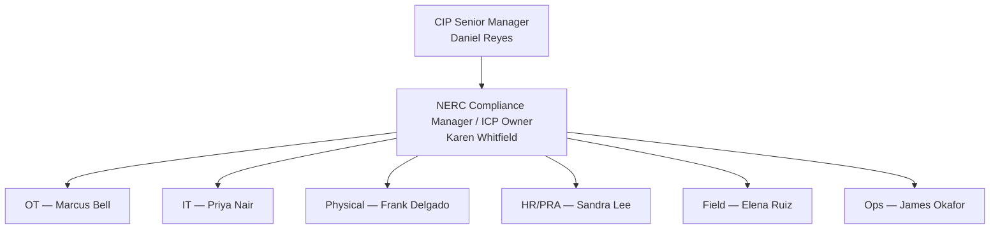
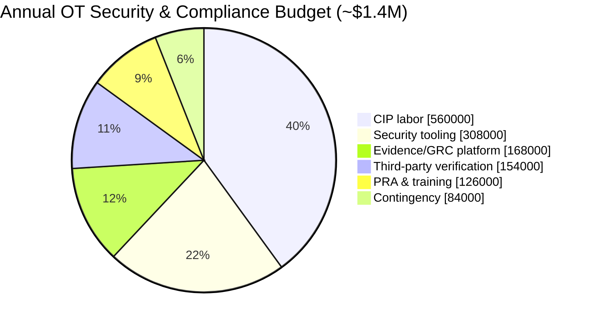
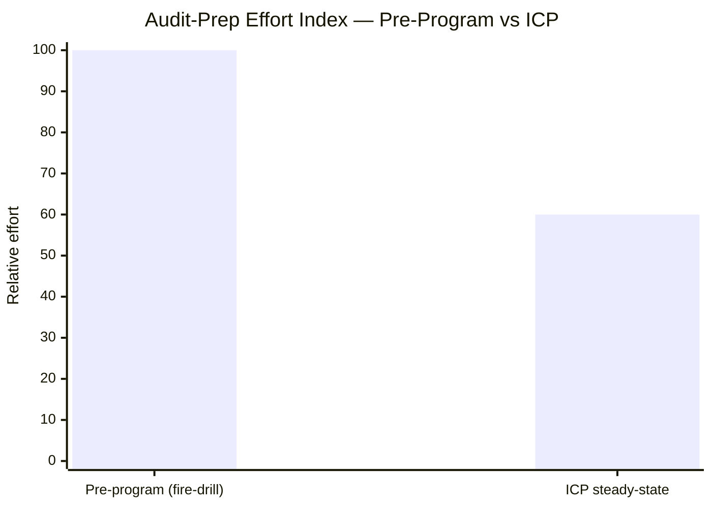

# 09.08 — Budget, Resourcing & ROI

| Field | Value |
|---|---|
| Document ID | CIP-EXR-BUD-2026-908 |
| Version | 1.0 |
| Date | 2026-03-02 |
| Classification | BES Cyber System Information (BCSI) // Illustrative Portfolio Sample |
| Owner | Karen Whitfield, NERC Compliance Manager (ICP Owner) |
| Author | Advisory Team (OT GRC / NERC CIP Advisory) |
| Status | Approved |

## Purpose

This document presents the **budget, resourcing model, and return-on-investment (ROI) framing** for GridPoint Energy's steady-state NERC CIP compliance program. It is written for the Audit & Risk Committee and executive leadership, and it answers three questions a board asks of any compliance program: *What does it cost? Who runs it? And what does it return?* The figures are illustrative but constructed to be realistic for a mid-size, Medium-impact registered entity. They demonstrate that GridPoint operates a **lean, well-governed program** whose run-rate is modest relative to the regulatory exposure it retires.

## 1. Resourcing Model — The CIP Team

GridPoint runs a deliberately lean compliance organization: a single accountable **NERC Compliance Manager** (ICP Owner) coordinating **six named control owners** who carry CIP responsibilities alongside their operational roles. This distributed-ownership model embeds compliance in the functions that actually operate the controls, rather than concentrating it in a standalone team divorced from the plant floor and the control room. Ultimate accountability rests with the **CIP Senior Manager (Daniel Reyes)** per CIP-003 R1.

| Role | Name | CIP Domain Ownership | Model |
|---|---|---|---|
| CIP Senior Manager | Daniel Reyes | Single accountable authority (CIP-003 R1) | Executive |
| NERC Compliance Manager / ICP Owner | Karen Whitfield | Program orchestration, evidence, calendar | Dedicated |
| OT / ICS Security Lead | Marcus Bell | CIP-005 / 007 / 010 (OT) | Control owner |
| IT Security Manager | Priya Nair | CIP-005 / 007 (IT/EACMS), CIP-011 | Control owner |
| Physical Security Manager | Frank Delgado | CIP-006 / 014 | Control owner |
| HR / PRA Coordinator | Sandra Lee | CIP-004 (PRA, training) | Control owner |
| Substation & Field Engineering Lead | Elena Ruiz | Field CIP-010 / CIP-006 execution | Control owner |
| Control Center Operations Manager | James Okafor | CIP-008 / 009, ops-floor controls | Control owner |

## 2. Annual Operating Budget — ~$1.4M

The program's steady-state operating budget is approximately **$1.4M per year**, covering tooling, personnel-security and training, third-party verification, and the evidence platform. Labor shown here is the incremental CIP-attributable portion of control-owner time plus the dedicated Compliance Manager; it excludes base operational salaries that would exist regardless of the CIP program.

| Category | Annual (illustrative) | Share | Notes |
|---|---|---|---|
| CIP-attributable labor (Compliance Mgr + control-owner allocation) | $560,000 | 40% | Dedicated + fractional |
| OT/IT security tooling & licensing | $308,000 | 22% | Monitoring, EACMS, config mgmt |
| Evidence & GRC platform | $168,000 | 12% | Automation of evidence collection |
| PRA, background & CIP-004 training | $126,000 | 9% | 142 personnel + 18 vendors |
| Third-party verification & advisory | $154,000 | 11% | CIP-014 reviewer, audits, advisory |
| Contingency / emergent remediation | $84,000 | 6% | Reserved |
| **Total** | **$1,400,000** | **100%** | Steady-state run-rate |

## 3. ROI Framing

Compliance ROI is not measured in revenue; it is measured in **exposure retired, insurability preserved, and effort avoided**. On all three dimensions the ~$1.4M run-rate is favorable.

### 3.1 Avoided Penalty Exposure

NERC CIP violations can carry statutory penalties historically up to **$1,000,000 per violation per day**. GridPoint's program journey converted **34 identified gaps** and **9 Possible Non-Compliances** into **9 Mitigation Plans** and ultimately **0 open violations at audit** — and the operating ICP has held new Possible Violations at **0** through the ConMon year. A single sustained multi-day violation could dwarf the entire annual program budget; the program's core economic function is to make that outcome improbable.

| Scenario | Illustrative Exposure | Program Effect |
|---|---|---|
| Single violation, 1 day | up to $1,000,000 | Prevented / self-logged as Exception |
| Single violation, 30 days undetected | up to $30,000,000 | ConMon detects in < 30 days (MTTR) |
| Systemic finding at audit | Multi-violation + reputational | 0 new PVs at RF audit |

### 3.2 Insurability & Financing

A demonstrably mature, evidenced CIP program supports favorable **cyber-insurance underwriting** and reduces the cost-of-capital risk premium that regulators and lenders associate with an entity carrying unresolved reliability findings. Good standing with ReliabilityFirst is itself a soft financial asset.

### 3.3 Audit-Preparation Efficiency

The ICP replaced the pre-program "fire-drill" model — in which audit preparation was a disruptive, all-hands scramble — with continuously audit-ready evidence. The estimated efficiency gain is **~40%** in audit-preparation effort, freeing control-owner time for operational security work rather than retrospective evidence assembly.

## 4. Cost-Benefit Summary

| Dimension | Position |
|---|---|
| Annual run-rate | ~$1.4M (lean, distributed ownership) |
| Peak single-day penalty exposure retired | up to $1M/violation/day |
| New Possible Violations (ConMon year) | 0 |
| Audit-prep efficiency gain vs pre-program | ~40% |
| Insurability | Strengthened by evidenced maturity |
| Net posture | Modest run-rate retiring outsized, catastrophic-tail regulatory exposure |

## 5. Resourcing Risks & Sustainability

The most significant resourcing risk is **skilled-staff retention** for specialized CIP/OT roles — a top residual risk carried forward in the risk posture (09.05). The distributed control-owner model mitigates single-point-of-failure dependency, and the evidence-platform investment reduces the manual burden that drives burnout. Cross-training and documented runbooks (built across Phases 03–08) preserve institutional knowledge if a control owner departs.

## Cross-References

| Reference | Purpose |
|---|---|
| [09.07 — KPI & Metrics Rollup](09.07-kpi-and-metrics-rollup.md) | KPIs quantifying the value this budget produces |
| [09.05 — Risk Posture & Heat Map](09.05-risk-posture-and-heat-map.md) | Staff-retention and residual-risk context |
| [01.07 — Governance Structure & RACI](../01-program-foundation/01.07-governance-structure-and-raci.md) | Origin of the control-owner accountability model |
| [08.12 — Compliance Metrics & KPIs](../08-continuous-monitoring-internal-controls/08.12-compliance-metrics-and-kpis.md) | ConMon evidence of zero-violation operation |

---

[⬅ Previous](09.07-kpi-and-metrics-rollup.md) · [🏠 Phase README](09.00-README.md) · [Next ➡](09.09-benchmarking-and-industry-comparison.md)
