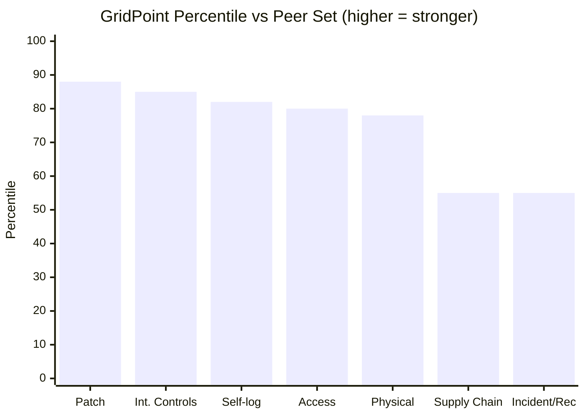
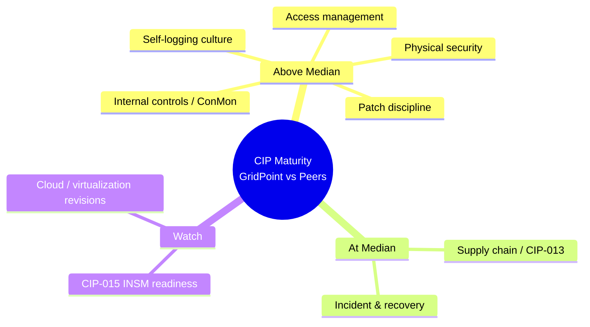

# 09.09 — Benchmarking & Industry Comparison

| Field | Value |
|---|---|
| Document ID | CIP-EXR-BMK-2026-909 |
| Version | 1.0 |
| Date | 2026-03-02 |
| Classification | BES Cyber System Information (BCSI) // Illustrative Portfolio Sample |
| Owner | Karen Whitfield, NERC Compliance Manager (ICP Owner) |
| Author | Advisory Team (OT GRC / NERC CIP Advisory) |
| Status | Approved |

## Purpose

This document positions GridPoint Energy's NERC CIP program against a **peer set of similarly-sized Medium-impact registered entities**. Benchmarking answers the question the board cannot answer from internal metrics alone: *not just "are we compliant?" but "how do we compare?"* It converts GridPoint's absolute results into relative standing, identifies where the program leads and where it merely matches the field, and thereby informs the forward roadmap (09.10). All comparative figures are **illustrative** and constructed from generalized industry patterns; they do not represent any identified entity and should be read as a directional, advisory-grade comparison rather than a certified survey.

## 1. Peer Set Definition

The comparison group is a synthetic cohort representative of GridPoint's regulatory class.

| Attribute | GridPoint | Representative Peer Set |
|---|---|---|
| Entity type | Investor-owned, vertically integrated | Investor-owned / cooperative mix |
| Impact rating | Medium (no High) | Medium (no High) |
| Registered functions | GO, GOP, TO, TOP, DP | Comparable multi-function |
| Approx. size | ~1,400 staff; ~750k customers | Similar mid-size |
| Regional Entity | ReliabilityFirst | Various NERC regions |
| BES footprint | 44 substations; 52 BCS | Comparable Medium footprint |

**Caveat.** Peer values below are modeled percentile bands, not audited data. They are intended to guide investment priorities, not to make compliance claims. Only GridPoint's own column reflects verified program results.

## 2. Benchmark Scorecard — Domain Positioning

| Domain | GridPoint Result | Peer Median (illustrative) | Position |
|---|---|---|---|
| Patch-cycle discipline (CIP-007 R2) | 100% within-window | ~90–94% | **Above median** |
| Internal-controls maturity (ICP/ConMon) | Level 4 (Managed) | Level 3 (Defined) | **Above median** |
| Self-logging / self-correction culture | 3 self-logs, 0 PVs, MTTR < 30d | Under-reporting common | **Above median** |
| Supply-chain program maturity (CIP-013) | Level 3.5 | Level 3.5 | **At median** |
| Access management (CIP-004) | 100% reviews & training | ~95% | **Above median** |
| Incident & recovery (CIP-008/009) | Level 3.5 | Level 3.5 | **At median** |
| Physical security (CIP-006/014) | Level 4 | Level 3.5 | **Above median** |

## 3. Percentile View

The chart below expresses GridPoint's standing as an approximate percentile against the peer distribution — higher is better. The program sits comfortably in the upper band on discipline and controls maturity, and at the field median on supply chain and incident/recovery, which are its designated growth areas.

## 4. Where GridPoint Leads

| Strength | Why It Leads | Evidence |
|---|---|---|
| Patch-cycle discipline | 100% within-window across 12/12 cycles; peers routinely miss on legacy OT | 09.07 KPI 1 |
| Internal-controls maturity | Operating ICP with continuous measurement; peers often at Defined, not Managed | 09.04 maturity |
| Self-logging culture | Converts issues into low-risk Compliance Exceptions rather than concealing them | 08.13 self-logs |

GridPoint's self-logging posture is its most differentiated strength. Across the industry, under-reporting is a known cultural risk; a program that surfaces and self-corrects three minimal-risk exceptions in a year — and takes no Possible Violations — signals to a regulator a genuinely functioning control environment rather than a compliance veneer.

## 5. Where GridPoint Matches the Field

| At-Median Area | Interpretation | Roadmap Response |
|---|---|---|
| Supply-chain maturity (CIP-013) | Program is solid but not yet differentiated; vendor concentration persists | Mature CIP-013 to Level 4 (Year 1, 09.10) |
| Incident & recovery (CIP-008/009) | Tested and effective, but not yet predictive/automated | Expand OT monitoring & drills (09.10) |

Being at median is not a deficiency — it reflects domains that are appropriately mature and tested. It is, however, where the marginal roadmap dollar buys the most relative improvement, which is why both are explicit Year-1 roadmap targets.

## 6. Maturity Radar — GridPoint vs Peer Median

## 7. Benchmarking Conclusions

| Question | Finding |
|---|---|
| Is GridPoint compliant relative to peers? | Yes — at or above median on every measured domain |
| Where does it lead? | Patch discipline, internal-controls maturity, self-logging culture |
| Where does it merely match? | Supply-chain and incident/recovery maturity |
| What does this imply for investment? | Concentrate roadmap spend on CIP-013 and predictive/automated monitoring |
| Overall standing | Upper-quartile program for its class (illustrative) |

The benchmark validates the internal maturity assessment: GridPoint runs an above-median program with two clearly identified, funded growth areas. There is no domain in which the program lags the field.

## Cross-References

| Reference | Purpose |
|---|---|
| [09.04 — Program Maturity Assessment](09.04-program-maturity-assessment.md) | Domain maturity scores underpinning the comparison |
| [09.07 — KPI & Metrics Rollup](09.07-kpi-and-metrics-rollup.md) | Absolute results converted to relative standing |
| [09.10 — Strategic Roadmap & Continuous Improvement](09.10-strategic-roadmap-and-continuous-improvement.md) | Roadmap response to at-median domains |
| [08.13 — Self-Report & Mitigation Lifecycle](../08-continuous-monitoring-internal-controls/08.13-self-report-and-mitigation-lifecycle.md) | Evidence of self-logging culture |

---

[⬅ Previous](09.08-budget-resourcing-and-roi.md) · [🏠 Phase README](09.00-README.md) · [Next ➡](09.10-strategic-roadmap-and-continuous-improvement.md)
