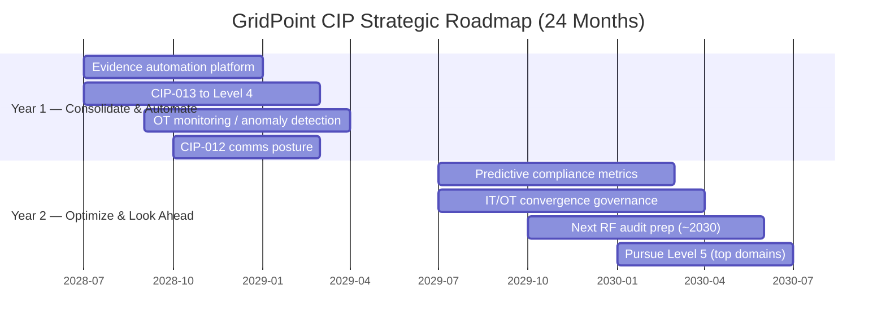
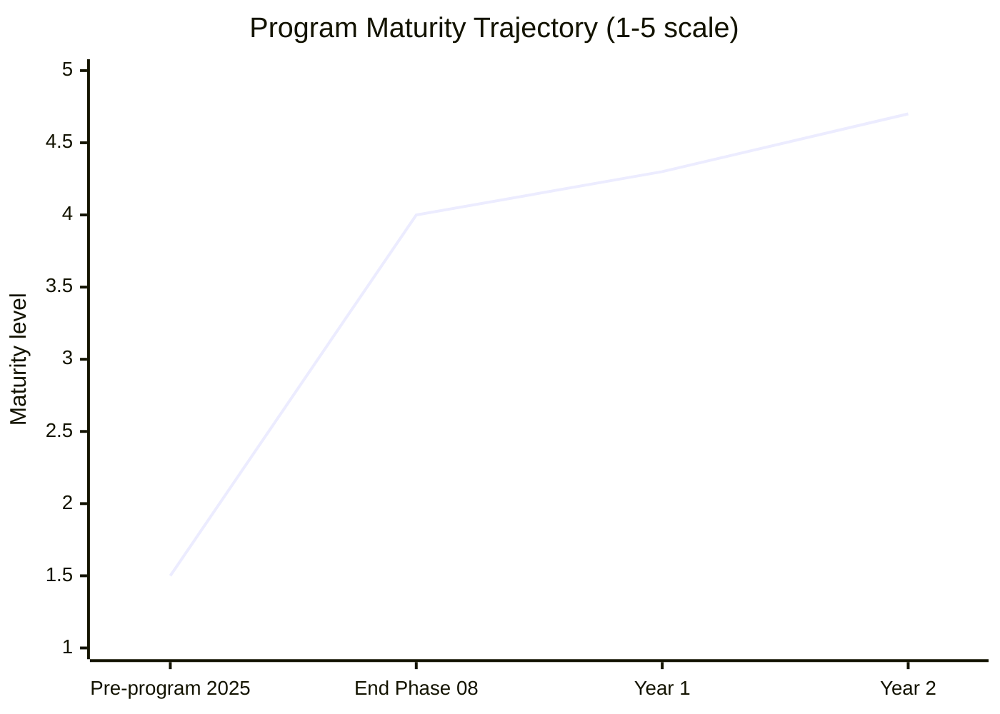
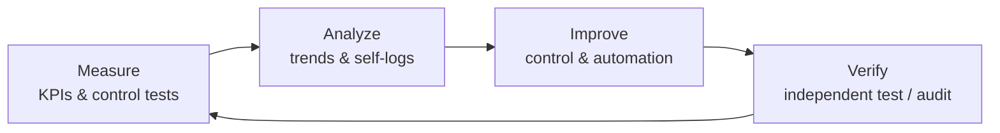

# 09.10 — Strategic Roadmap & Continuous Improvement

| Field | Value |
|---|---|
| Document ID | CIP-EXR-RMP-2026-910 |
| Version | 1.0 |
| Date | 2026-03-02 |
| Classification | BES Cyber System Information (BCSI) // Illustrative Portfolio Sample |
| Owner | Karen Whitfield, NERC Compliance Manager (ICP Owner) |
| Author | Advisory Team (OT GRC / NERC CIP Advisory) |
| Status | Approved |

## Purpose

This document sets GridPoint Energy's **24-month forward strategic roadmap** for its NERC CIP program and defines the continuous-improvement mechanism that keeps the program advancing after the portfolio closes. Having reached **Level 4 (Managed)** maturity, the program's forward objective is to consolidate at Managed and selectively reach **Level 5 (Optimizing)** in its strongest domains — while positioning for the next **ReliabilityFirst audit cycle (~2030)** and for emerging standards. The roadmap is deliberately paced and funded within the existing ~$1.4M run-rate plus targeted enhancement investment.

## 1. Strategic Objectives (24 Months)

| Objective | Target State | Domain |
|---|---|---|
| Automate evidence collection | Continuous, low-touch audit evidence | Internal Controls |
| Mature CIP-013 to Level 4 | Managed supply-chain program | Supply Chain |
| Expand OT network monitoring | Anomaly detection across ESPs | Systems Security |
| Formalize CIP-012 posture | Documented Control-Center comms protection | Systems Security |
| Predictive compliance metrics | Leading-indicator forecasting | ConMon |
| IT/OT convergence governance | Unified security-governance model | Governance |
| Prepare for ~2030 RF audit | Continuously audit-ready | Assurance |
| Pursue Level 5 in top domains | Optimizing in 2 strongest domains | Maturity |

## 2. Year 1 — Consolidate & Automate

Year 1 concentrates on retiring manual effort and closing the two at-median benchmark gaps (supply chain, monitoring depth). It is the "harvest" year: convert the operating ICP into an increasingly automated, self-evidencing machine.

| Initiative | Outcome | Owner |
|---|---|---|
| Evidence-collection automation | ~40% → higher audit-prep efficiency; continuous evidence | Whitfield / Nair |
| CIP-013 supply-chain to Level 4 | Managed vendor-risk program; concentration mitigated | Bell / Nair |
| OT monitoring & anomaly detection | Expanded ESP visibility; INSM-ready foundation | Bell |
| CIP-012 comms posture | Documented protection of Control-Center-to-Control-Center data | Bell / Okafor |

## 3. Year 2 — Optimize & Look Ahead

Year 2 shifts from measuring the past to **predicting the future** and from parallel IT and OT governance to a converged model, while beginning formal preparation for the next audit cycle.

| Initiative | Outcome | Owner |
|---|---|---|
| Predictive compliance metrics | Leading indicators forecast control decay before it occurs | Whitfield |
| IT/OT convergence governance | Single security-governance operating model | Reyes / Nair / Bell |
| ~2030 RF audit preparation | Evidence, RSAWs, and scope pre-staged | Whitfield |
| Pursue Level 5 (Optimizing) | Optimizing rating in 2 strongest domains (patch, internal controls) | Reyes |

## 4. Roadmap Timeline (Gantt)

## 5. Maturity Trajectory

The roadmap moves the overall program from Level 4 toward a **4→5 blend**: consolidating Managed across all domains and reaching Optimizing in the two strongest.

## 6. Watch Items — Regulatory Horizon Scanning

The roadmap explicitly tracks evolving NERC standards so that GridPoint invests ahead of, not behind, new obligations.

| Watch Item | What It Is | GridPoint Posture |
|---|---|---|
| **CIP-015 (INSM)** | Internal Network Security Monitoring inside the ESP | Year-1 OT-monitoring work builds the foundation; track FERC/NERC effective dates |
| **Cloud / virtualization CIP revisions** | Standards revisions addressing cloud & virtualized BCS | Monitor drafting; assess impact on solar/modernization assets |
| **Supply-chain expansion** | Continued CIP-013 scope evolution | Year-1 Level-4 uplift positions ahead of change |

## 7. Continuous-Improvement Mechanism

Improvement does not end with the roadmap; it is institutionalized through a recurring cycle that feeds retrospective learning back into control design.

| Cadence | Activity | Owner |
|---|---|---|
| Continuous | KPI & control-test monitoring | Whitfield |
| Quarterly | Trend review + roadmap check-in | Whitfield / Reyes |
| Annual | Maturity re-scoring + attestation | Reyes |
| ~3-year | RF audit cycle preparation | Whitfield |

## 8. Roadmap Governance & Funding

The roadmap is owned by the NERC Compliance Manager, sponsored by the CIP Senior Manager, and reviewed quarterly by the Audit & Risk Committee. Year-1 initiatives are funded within the existing ~$1.4M run-rate plus a targeted evidence-platform and monitoring enhancement; Year-2 predictive-metrics and convergence work is scoped for the following budget cycle. No initiative depends on unbudgeted headcount; each maps to an existing control owner.

## Cross-References

| Reference | Purpose |
|---|---|
| [09.04 — Program Maturity Assessment](09.04-program-maturity-assessment.md) | Baseline maturity the roadmap advances |
| [09.09 — Benchmarking & Industry Comparison](09.09-benchmarking-and-industry-comparison.md) | At-median domains targeted by Year-1 |
| [09.08 — Budget, Resourcing & ROI](09.08-budget-resourcing-and-roi.md) | Funding envelope for roadmap initiatives |
| [01.12 — Compliance Obligations Calendar](../01-program-foundation/01.12-compliance-obligations-calendar.md) | Recurring obligations feeding continuous improvement |

---

[⬅ Previous](09.09-benchmarking-and-industry-comparison.md) · [🏠 Phase README](09.00-README.md) · [Next ➡](09.11-lessons-learned-and-program-retrospective.md)
