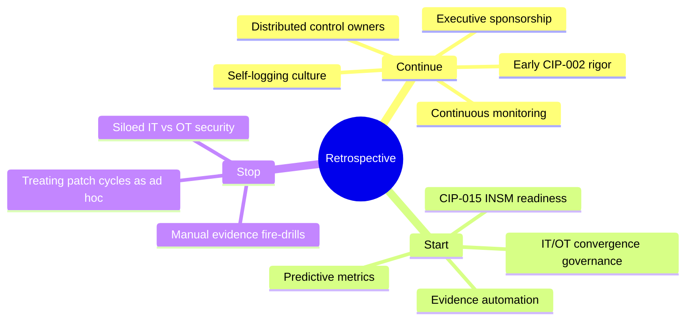
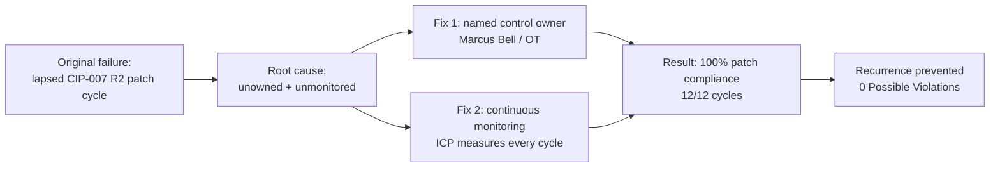

# 09.11 — Lessons Learned & Program Retrospective

| Field | Value |
|---|---|
| Document ID | CIP-EXR-LLR-2026-911 |
| Version | 1.0 |
| Date | 2026-03-02 |
| Classification | BES Cyber System Information (BCSI) // Illustrative Portfolio Sample |
| Owner | Karen Whitfield, NERC Compliance Manager (ICP Owner) |
| Author | Advisory Team (OT GRC / NERC CIP Advisory) |
| Status | Approved |

## Purpose

This document is the **honest program retrospective** across the full nine-phase build-out of GridPoint Energy's NERC CIP compliance program. Its value depends on candor: a retrospective that records only successes teaches nothing. It captures what worked, what was genuinely hard, the specific catalyst that triggered the program, and the structural changes that prevent recurrence. It is written for both the executive audience — who fund the program — and for the practitioners who will operate it, so that the institutional learning survives staff turnover. The retrospective feeds directly into the continuous-improvement mechanism defined in 09.10.

## 1. The Catalyst — Why This Program Existed

The program's origin was a **single lapsed CIP-007 R2 patch-evaluation cycle** — a reactive, ad-hoc control environment (Level 1–2) in which a routine obligation slipped because no one owned it end-to-end and no monitoring surfaced the miss. Combined with an asset baseline changed by the new Sunfield Solar site, two new substations, and control-center modernization, and an approaching **ReliabilityFirst audit (2027-Q2)**, the lapsed cycle made the risk concrete. It was, in retrospect, the most valuable failure in the program's history: it converted an abstract compliance mandate into an executive-sponsored, funded, structured program.

## 2. What Went Well

| Theme | What Worked | Downstream Effect |
|---|---|---|
| Early CIP-002 rigor | Disciplined categorization at the very start (52 BCS; 118 applicable parts) | Every later phase inherited a correct, defensible scope — no rework |
| Executive sponsorship | CIP Senior Manager (Daniel Reyes) visibly accountable; named ICP owner (Karen Whitfield) | Decisions unblocked; resourcing sustained |
| Self-logging culture | Issues surfaced and self-corrected rather than concealed | 9 PNCs → 9 Mitigation Plans → 0 open violations; 3 self-logs in ConMon year |
| Distributed control ownership | Six control owners embedded in operating functions | Compliance lived where controls actually run |
| Continuous monitoring | ICP converted a one-time build into a sustained lifecycle | 0 new PVs; audit-prep effort down ~40% |

**The single most important lesson:** front-loaded categorization rigor (CIP-002) paid compounding dividends. Getting scope right once removed ambiguity from all 118 applicable requirement parts and prevented the scope-churn that derails many programs mid-flight.

## 3. What Was Hard

| Challenge | Nature | How It Was Handled |
|---|---|---|
| Legacy OT patch complexity | Relay platforms with vendor-gated patch paths | Structured evaluation cycles; carried as top residual risk |
| Supply-chain / vendor concentration | CIP-013 exposure concentrated in few vendors | Mitigation Plans; roadmap Year-1 uplift to Level 4 |
| Evidence discipline at scale | Manual evidence assembly was labor-intensive | ICP + planned evidence automation (09.10) |
| Skilled-staff retention | Specialized CIP/OT roles hard to backfill | Cross-training; documented runbooks; distributed ownership |
| IT/OT cultural divide | Different tooling, cadence, and language | Convergence governance on the Year-2 roadmap |

None of these were fully "solved" — they were **converted from unmanaged risks into owned, mitigated, monitored risks**. Honest retrospection distinguishes closed problems from managed ones; the hard items above are managed, not closed, and remain on the residual-risk register (09.05).

## 4. Start / Stop / Continue

| Action | Item | Rationale |
|---|---|---|
| **Continue** | Early categorization rigor; self-logging; exec sponsorship; ConMon | Proven sources of program strength |
| **Start** | Evidence automation; predictive metrics; convergence governance | Reach Level 5 in strongest domains |
| **Stop** | Manual audit-prep fire-drills; ad-hoc patch handling; IT/OT silos | Retire the practices that caused the original lapse |

## 5. The Recurrence-Prevention Story

The retrospective's central claim to the board is that **the original failure mode cannot recur silently**. The lapsed patch cycle was possible because the obligation was unowned and unmonitored. Both conditions have been structurally removed.

| Prevention Layer | Mechanism | Evidence |
|---|---|---|
| Ownership | Every obligation has a named control owner | 09.08 resourcing model |
| Detection | ConMon measures each patch cycle in-window | 100% (12/12) |
| Correction | Self-log lifecycle with < 30-day MTTR | 3 self-logs closed, avg 21 days |
| Assurance | Independent RF audit validation | 0 new Possible Violations |

## 6. Lessons by Phase

| Phase | Key Lesson |
|---|---|
| 01 Foundation | Name the accountable CIP Senior Manager early; governance first |
| 02 Categorization | Front-loaded CIP-002 rigor prevents downstream scope churn |
| 03–04 Controls | Embed control ownership in operating functions, not a silo |
| 05–06 Assessment/Remediation | Self-identify gaps before the regulator does |
| 07 Audit | Continuously audit-ready evidence beats the fire-drill |
| 08 ConMon | Monitoring turns a project into a sustained lifecycle |
| 09 Executive Reporting | Translate control data into board-legible maturity and ROI |

## 7. Retrospective Conclusions

The program succeeded not because nothing went wrong, but because the organization built the machinery to **find and fix what goes wrong before it becomes a violation**. The lapsed patch cycle that started it all is now the clearest proof of maturity: the same failure today would be detected within one monitoring cycle, self-logged, and remediated inside 30 days. That is the difference between a Level 1–2 program and the Level 4 program GridPoint operates today.

## Cross-References

| Reference | Purpose |
|---|---|
| [09.04 — Program Maturity Assessment](09.04-program-maturity-assessment.md) | Maturity movement (Level 1–2 → 4) referenced throughout |
| [09.05 — Risk Posture & Heat Map](09.05-risk-posture-and-heat-map.md) | Residual risks that remain managed, not closed |
| [08.13 — Self-Report & Mitigation Lifecycle](../08-continuous-monitoring-internal-controls/08.13-self-report-and-mitigation-lifecycle.md) | Self-logging evidence |
| [02.00 — Phase 02 README (Categorization)](../02-bes-cyber-system-categorization/02.00-README.md) | Origin of the CIP-002 rigor lesson |

---

[⬅ Previous](09.10-strategic-roadmap-and-continuous-improvement.md) · [🏠 Phase README](09.00-README.md) · [Next ➡](09.12-portfolio-closeout-and-transition.md)
