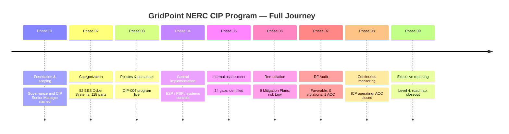
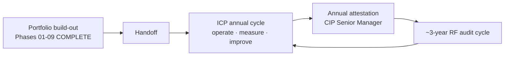

# 09.12 — Portfolio Closeout & Transition

| Field | Value |
|---|---|
| Document ID | CIP-EXR-CLS-2026-912 |
| Version | 1.0 |
| Date | 2026-03-02 |
| Classification | BES Cyber System Information (BCSI) // Illustrative Portfolio Sample |
| Owner | Karen Whitfield, NERC Compliance Manager (ICP Owner) |
| Author | Advisory Team (OT GRC / NERC CIP Advisory) |
| Status | Approved |

## Purpose

This document **formally closes the entire nine-phase NERC CIP Compliance Program Portfolio** for GridPoint Energy. It is the capstone of the capstone phase. It summarizes the full program arc phase by phase, confirms GridPoint's **good standing** with ReliabilityFirst, records that the program has transitioned from build-out to **steady-state continuous operation**, and hands the program off to the ongoing Internal Controls Program (ICP) annual cycle owned by the NERC Compliance Manager under the accountability of the CIP Senior Manager. With this document, the advisory engagement concludes and stewardship rests wholly with GridPoint.

## 1. The Program Arc — Nine Phases

The portfolio built GridPoint's CIP program end to end, from an empty registration scope to a measured, benchmarked, board-reported, continuously operating compliance program.

| Phase | Title | One-Line Outcome |
|---|---|---|
| 01 | Program Foundation & Registration Scoping | Governance, CIP Senior Manager, RACI, and scope established |
| 02 | BES Cyber System Categorization | 52 BCS categorized (14 Medium + 38 Low); 118 applicable parts |
| 03 | Policies, Governance & Personnel | CIP policies, CIP-004 personnel-risk and training program stood up |
| 04 | Technical & Physical Control Implementation | Medium + Low control sets implemented across ESP, PSP, systems |
| 05 | Internal Compliance Assessment | 34 gaps identified; posture measured before the regulator |
| 06 | Gap Remediation & Mitigation Plans | 9 PNCs → 9 Mitigation Plans; gaps closed; residual risk Low |
| 07 | Audit Readiness & Compliance Package | RF audit favorable: 0 new Possible Violations, 1 Area of Concern |
| 08 | Continuous Monitoring & Internal Controls | ICP operating; 0 PVs; AOC closed; good standing |
| 09 | Executive Reporting & Program Maturity | Level 4 maturity; board reporting; roadmap; portfolio closed |

## 2. The Full Journey (Timeline)

## 3. Terminal Program State

| Dimension | Position at Portfolio Close |
|---|---|
| BES Cyber Systems | 52 (14 Medium + 38 Low; 0 High) |
| Open Possible Violations | 0 |
| Open Mitigation Plans | 0 |
| Open Areas of Concern | 0 (AOC-01 closed in Phase 08) |
| Overdue obligations | 0 |
| RF audit outcome | Favorable (report 2027-07-15) |
| ConMon year results | 12/12 patch · 4/4 reviews · 40 tests · 3 self-logs · 0 PVs |
| Program maturity | Level 4 (Managed); roadmap to 4→5 |
| Residual compliance risk | Low and stable |
| **Compliance standing** | **Good standing with ReliabilityFirst** |

## 4. Confirmation of Good Standing

GridPoint Energy is in **good standing** with **ReliabilityFirst**. The 2027 Compliance Audit closed favorably with **0 new Possible Violations**; the single Area of Concern was **closed in Phase 08** with independent third-party verification; and the operating ICP has sustained zero Possible Violations and zero overdue obligations through the first post-audit year. There are no open enforcement actions, no open Mitigation Plans, and no unresolved findings. The CIP Senior Manager's annual attestation (09.06) affirms compliance across CIP-002 through CIP-014 for the reporting period.

## 5. Transition to Steady-State Operation

The program is no longer a project; it is a **continuously operating capability**. Build-out deliverables are complete and baselined; forward activity is the recurring operate-measure-improve cycle institutionalized by the ICP and governed by the strategic roadmap (09.10).

## 6. Handoff to the ICP Annual Cycle

| Handoff Element | Recipient / Owner | Cadence |
|---|---|---|
| Control operation & evidence | Six control owners | Continuous |
| KPI & control-test monitoring | Karen Whitfield (ICP Owner) | Continuous / quarterly |
| Maturity re-scoring | Advisory-informed, ICP-run | Annual |
| Annual CIP attestation | Daniel Reyes (CIP Senior Manager) | Annual |
| Board / Audit & Risk reporting | Whitfield → Reyes → Committee | Annual |
| Strategic roadmap execution | Whitfield (sponsored by Reyes) | 24-month plan |
| Next RF audit preparation | Whitfield | ~2030 cycle |

The advisory engagement concludes here. All artifacts are transferred, the evidence repository is continuously audit-ready, and no advisory dependency remains for steady-state operation.

## 7. Acknowledgements

The program's success reflects sustained executive sponsorship by CIP Senior Manager **Daniel Reyes**, day-to-day stewardship by NERC Compliance Manager **Karen Whitfield**, and disciplined control operation by the six control owners — **Marcus Bell (OT), Priya Nair (IT), Frank Delgado (Physical), Sandra Lee (HR/PRA), Elena Ruiz (Field), and James Okafor (Operations)** — under the leadership of CEO **Margaret Chen** and VP Grid Operations **Robert Tan**.

## 8. Portfolio Sign-Off

| Role | Name | Acceptance |
|---|---|---|
| CIP Senior Manager | Daniel Reyes | Portfolio accepted; program in good standing |
| NERC Compliance Manager / ICP Owner | Karen Whitfield | All nine phases validated and baselined |
| OT / ICS Security Lead | Marcus Bell | Control operations confirmed |
| Advisory Team | Advisory Team | Engagement complete; portfolio delivered |

## 9. Closing Statement

GridPoint Energy began this program with a single lapsed patch cycle and an approaching audit. It closes it with a **Level 4 (Managed)** compliance program, a favorable regulatory audit, a closed Area of Concern, zero open violations, and a funded 24-month roadmap toward Optimizing maturity. The program that began as a response to risk is now a durable, self-correcting capability. **The portfolio is complete; the program continues.**

## Cross-References

| Reference | Purpose |
|---|---|
| [09.06 — CIP Senior Manager Annual Attestation](09.06-cip-senior-manager-annual-attestation.md) | Formal attestation of compliance standing |
| [09.11 — Lessons Learned & Program Retrospective](09.11-lessons-learned-and-program-retrospective.md) | Retrospective across the nine phases |
| [08.14 — Phase 08 Summary & Transition](../08-continuous-monitoring-internal-controls/08.14-phase-summary-and-transition.md) | Good-standing and AOC-closure basis |
| [07.10 — Audit Conduct & Outcome](../07-audit-readiness-compliance-package/07.10-audit-conduct-and-outcome.md) | Favorable audit outcome |
| [01.05 — CIP Program Charter & Objectives](../01-program-foundation/01.05-cip-program-charter-and-objectives.md) | Original program objectives now fulfilled |

---

[⬅ Previous](09.11-lessons-learned-and-program-retrospective.md) · [🏠 Phase README](09.00-README.md) · [🏠 Portfolio Home](../README.md)
