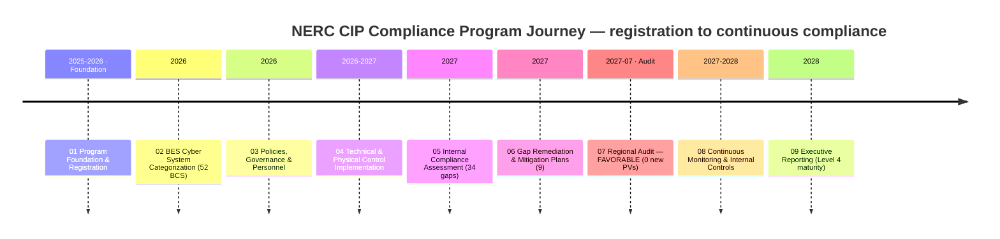
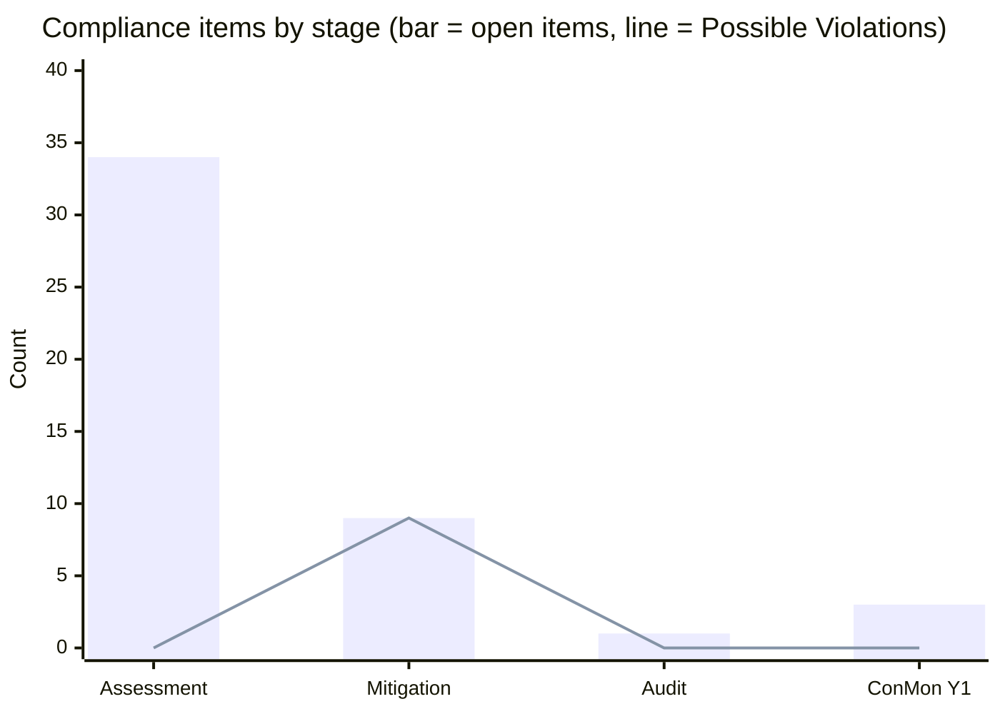
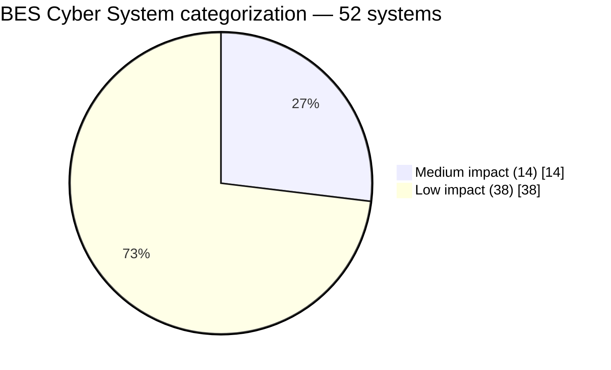
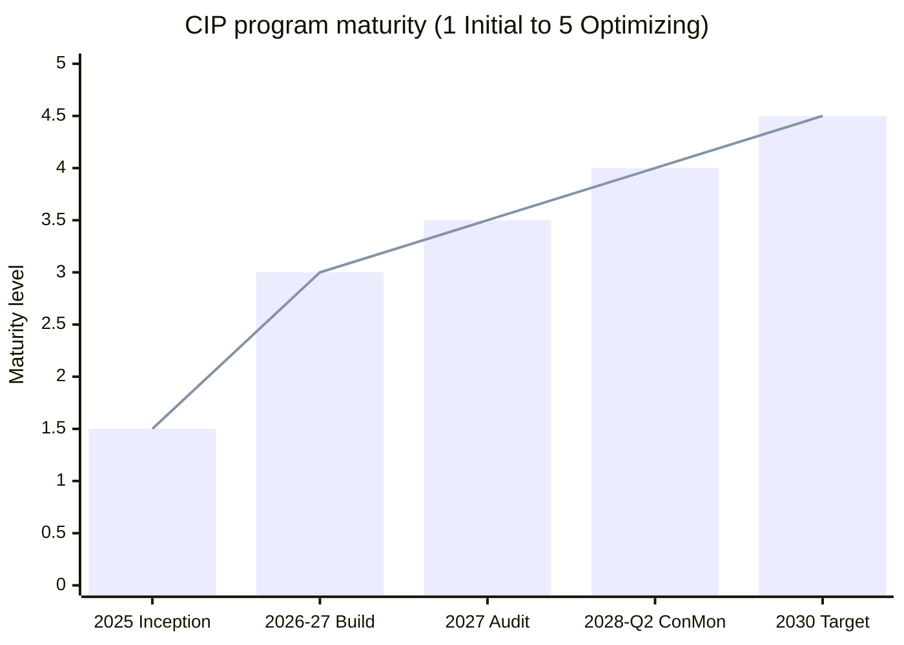
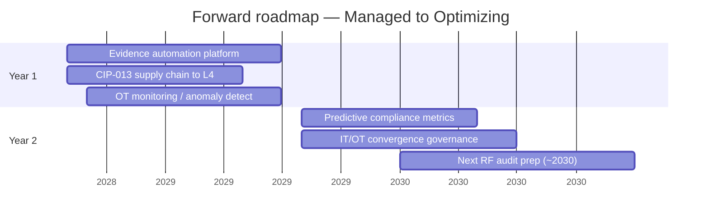

# 📊 Executive Dashboard — GridPoint Energy NERC CIP Compliance Program

> **This page renders directly on GitHub** — the charts below are [Mermaid](https://github.blog/2022-02-14-include-diagrams-markdown-files-mermaid/) diagrams that GitHub draws inline, so the dashboard is visible with no setup.
> For the fully interactive version (light/dark toggle, hover tooltips), open [`index.html`](index.html) locally or enable **GitHub Pages** (see the repo [README](../README.md)).
>
> *Illustrative portfolio sample · BES Cyber System Information (BCSI) formatting for realism only · all names & figures fictional.*

---

## Program scorecard

| Dimension | Result | Status |
|---|---|:--:|
| **Registered Entity** | GridPoint Energy · `NCR11027` · ReliabilityFirst (RF) | 🟢 |
| **Standards** | NERC **CIP-002 – CIP-014** (+ CIP-003 Low) | 🟢 |
| **BES footprint** | 44 substations · **52 BES Cyber Systems** (14 Medium + 38 Low; 0 High) | 🟢 |
| **Associated assets** | 26 EACMS · 18 PACS · 60 PCA | 🟢 |
| **Regional audit** | **Favorable · 0 new Possible Violations** (report 2027-07-15) | 🟢 |
| **Compliance journey** | 34 gaps → 9 PNCs → 9 Mitigation Plans → **0 open violations** | 🟢 |
| **Program maturity** | **Level 4 (Managed)** — up from Level 1–2 | 🟢 |
| **Continuous monitoring** | Internal Controls Program active · **good standing** (2028-Q2) | 🟢 |

---

## The nine-phase journey

---

## Compliance burndown across the program

Identified gaps were driven through Mitigation Plans to **zero open violations at audit**, and held there through continuous monitoring.

| Stage | Gaps / items | Possible Non-Compliances | Open violations | Overall posture |
|---|:--:|:--:|:--:|:--:|
| Internal Assessment | 34 | 9 | 0 | Elevated |
| Mitigation Plans | 9 in progress | 9 (managed) | 0 | Improving |
| Regional Audit | 1 Area of Concern | 0 new PVs | 0 | **Favorable** |
| Continuous Monitoring (Y1) | 3 self-logged exceptions | 0 | 0 | **Good standing** |

---

## BES Cyber System categorization (CIP-002)

Protected estate: **52 BCS** · **26 EACMS** · **18 PACS** · **60 PCA**, across **44 substations** each with an Electronic Security Perimeter (ESP) and Physical Security Perimeter (PSP).

---

## Program maturity — Level 1–2 to Level 4 (Managed)

| Domain | Current level | Domain | Current level |
|---|:--:|---|:--:|
| Governance & Policy | 4 | Config & Vulnerability (CIP-010) | 4 |
| Asset & BCS Management | 4 | Incident & Recovery (CIP-008/009) | 3.5 |
| Access Management (CIP-004) | 4 | Supply Chain (CIP-013) | 3.5 |
| Systems Security (CIP-005/007) | 4 | Physical Security (CIP-006/014) | 4 |
| Internal Controls / ConMon | 4 | **Overall** | **4 (Managed)** |

---

## Continuous monitoring — year 1 (2027-Q3 → 2028-Q2)

| KPI | Result | Status |
|---|---|:--:|
| CIP-007 R2 patch cycles (35-day) | 12 / 12 · 100% within window | 🟢 |
| CIP-004 quarterly access reviews | 4 / 4 complete | 🟢 |
| Internal control tests | 40 (effective; 2 self-corrected) | 🟢 |
| Self-logged Compliance Exceptions | 3 · minimal-risk · remediated | 🟢 |
| Possible Violations | 0 | 🟢 |
| Reportable Cyber Security Incidents | 0 | 🟢 |
| Overdue compliance obligations | 0 | 🟢 |

---

## Cross-phase traceability

Every material item is traceable from internal discovery through Mitigation Plan, audit, and ongoing monitoring.

| Compliance thread | Assessment | Mitigation | Audit | Continuous Monitoring |
|---|---|---|---|---|
| **CIP-007 R2 patch cycle** | Gap found | Mitigation Plan | ✅ Accepted | 🔵 12/12 at 100% |
| **CIP-014 Northgate physical** | Risk noted | Assessment scheduled | 🟡 Area of Concern | ✅ Completed + verified |
| **CIP-013 supply chain** | Vendor-risk gap | MIT-05 amendments | ✅ Closed | 🔵 Ongoing vendor reviews |
| **CIP-004 access reviews** | Process gap | Standardized | ✅ Satisfied | 🔵 4/4 quarterly |

---

## Forward roadmap (24 months)

Watch items: **CIP-015 (INSM — Internal Network Security Monitoring)** and cloud/virtualization CIP revisions.

---

## The nine phases

| Phase | Focus | Signature outcome |
|---|---|---|
| [01 Program Foundation](../01-program-foundation/01.00-README.md) | Registration & charter | Foundation baselined (`NCR11027`) |
| [02 BES Cyber System Categorization](../02-bes-cyber-system-categorization/02.00-README.md) | CIP-002 impact rating | 52 BCS (14 Medium + 38 Low) |
| [03 Policies, Governance & Personnel](../03-policies-governance-personnel/03.00-README.md) | CIP-003/004 | Policies + 142 personnel |
| [04 Technical & Physical Controls](../04-technical-physical-control-implementation/04.00-README.md) | CIP-005/006/007/010 | Controls across all perimeters |
| [05 Internal Compliance Assessment](../05-internal-compliance-assessment/05.00-README.md) | RSAW assessment | 34 gaps identified |
| [06 Gap Remediation & Mitigation Plans](../06-gap-remediation-mitigation-plans/06.00-README.md) | Mitigation to closure | 9 Mitigation Plans |
| [07 Audit Readiness & Compliance Package](../07-audit-readiness-compliance-package/07.00-README.md) | RF audit | **Favorable · 0 new PVs** |
| [08 Continuous Monitoring & Internal Controls](../08-continuous-monitoring-internal-controls/08.00-README.md) | Sustainment (ICP) | Good standing |
| [09 Executive Reporting & Program Maturity](../09-executive-reporting-program-maturity/09.00-README.md) | Synthesis | This dashboard · Level 4 |

---

*Prepared by the Advisory Team. Fictional illustrative portfolio sample — not a real registered entity or a real NERC CIP audit. Standards referenced: NERC CIP-002 through CIP-014, the CMEP, and RSAW methodology.*

[⬅ Back to portfolio README](../README.md)
