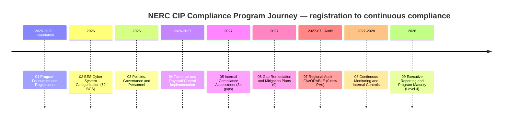
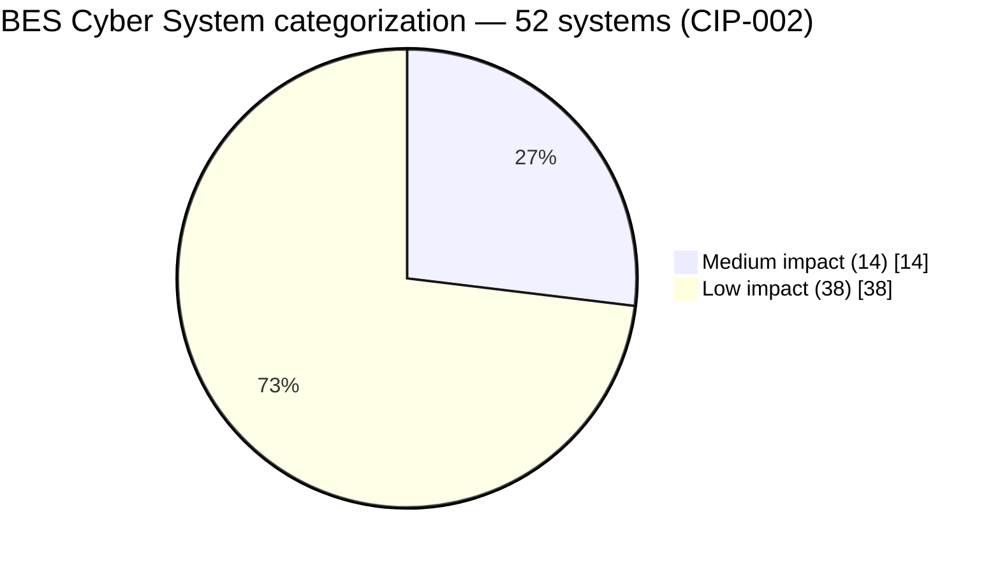

# Electric Utility NERC CIP Compliance Program

### 📊 [**View the Executive Dashboard →**](docs/DASHBOARD.md) &nbsp;·&nbsp; 🗂️ [Jump to full repository map](#-repository-map--links-to-every-folder)

> An end-to-end, illustrative **NERC CIP compliance program** — from functional registration and BES Cyber System categorization through a favorable Regional Entity audit and ongoing continuous monitoring — for a fictitious electric utility, **GridPoint Energy, Inc.** (Registered Entity `NCR11027`), overseen by **ReliabilityFirst (RF)**.
>
> **All names, data, figures, and findings are fictional**, produced as a professional portfolio demonstration of OT / NERC CIP GRC and compliance capability. Nothing here represents a real utility, a real BES Cyber System, or a real audit.

---

## Program at a glance

| Attribute | Value |
|---|---|
| Registered Entity | **GridPoint Energy, Inc.** (`NCR11027`) |
| Regional Entity | **ReliabilityFirst (RF)** — under NERC / FERC oversight (CMEP) |
| Standards | **NERC CIP-002 through CIP-014** (plus CIP-003 for Low-impact) |
| BES footprint | **44 substations** · **52 BES Cyber Systems** (14 Medium + 38 Low; 0 High) |
| Associated cyber assets | **26 EACMS** · **18 PACS** · **60 PCA** |
| Compliance journey | **34 gaps → 9 Possible Non-Compliances → 9 Mitigation Plans → 0 open violations** |
| Regional audit | **Favorable — 0 new Possible Violations** (Compliance Audit Report 2027-07-15) |
| Program maturity | **Level 4 (Managed)** — up from Level 1–2 at inception |
| Continuous monitoring | **Internal Controls Program active — good standing (2028-Q2)** |
| Scale | **9 phases · 130+ documents · 40+ Excel trackers, diagrams, logs, ADRs & templates** |

---

## 🗂️ Repository map — links to every folder

Each phase is a top-level folder containing a numbered document set (`NN.00`–`NN.NN`) in execution order, plus six artifact sub-folders. Click any cell to open that folder on GitHub.

| Phase | Overview | 🖼️ Diagrams | 📈 Trackers (Excel) | 📝 Logs | 🏛️ Governance | 🧭 ADRs | 📋 Templates |
|---|---|---|---|---|---|---|---|
| **01 — Program Foundation** | [README](01-program-foundation/01.00-README.md) | [diagrams](01-program-foundation/diagrams) | [trackers](01-program-foundation/trackers) | [logs](01-program-foundation/logs) | [governance](01-program-foundation/governance) | [adr](01-program-foundation/adr) | [templates](01-program-foundation/templates) |
| **02 — BES Cyber System Categorization** | [README](02-bes-cyber-system-categorization/02.00-README.md) | [diagrams](02-bes-cyber-system-categorization/diagrams) | [trackers](02-bes-cyber-system-categorization/trackers) | [logs](02-bes-cyber-system-categorization/logs) | [governance](02-bes-cyber-system-categorization/governance) | [adr](02-bes-cyber-system-categorization/adr) | [templates](02-bes-cyber-system-categorization/templates) |
| **03 — Policies, Governance & Personnel** | [README](03-policies-governance-personnel/03.00-README.md) | [diagrams](03-policies-governance-personnel/diagrams) | [trackers](03-policies-governance-personnel/trackers) | [logs](03-policies-governance-personnel/logs) | [governance](03-policies-governance-personnel/governance) | [adr](03-policies-governance-personnel/adr) | [templates](03-policies-governance-personnel/templates) |
| **04 — Technical & Physical Control Implementation** | [README](04-technical-physical-control-implementation/04.00-README.md) | [diagrams](04-technical-physical-control-implementation/diagrams) | [trackers](04-technical-physical-control-implementation/trackers) | [logs](04-technical-physical-control-implementation/logs) | [governance](04-technical-physical-control-implementation/governance) | [adr](04-technical-physical-control-implementation/adr) | [templates](04-technical-physical-control-implementation/templates) |
| **05 — Internal Compliance Assessment** | [README](05-internal-compliance-assessment/05.00-README.md) | [diagrams](05-internal-compliance-assessment/diagrams) | [trackers](05-internal-compliance-assessment/trackers) | [logs](05-internal-compliance-assessment/logs) | [governance](05-internal-compliance-assessment/governance) | [adr](05-internal-compliance-assessment/adr) | [templates](05-internal-compliance-assessment/templates) |
| **06 — Gap Remediation & Mitigation Plans** | [README](06-gap-remediation-mitigation-plans/06.00-README.md) | [diagrams](06-gap-remediation-mitigation-plans/diagrams) | [trackers](06-gap-remediation-mitigation-plans/trackers) | [logs](06-gap-remediation-mitigation-plans/logs) | [governance](06-gap-remediation-mitigation-plans/governance) | [adr](06-gap-remediation-mitigation-plans/adr) | [templates](06-gap-remediation-mitigation-plans/templates) |
| **07 — Audit Readiness & Compliance Package** | [README](07-audit-readiness-compliance-package/07.00-README.md) | [diagrams](07-audit-readiness-compliance-package/diagrams) | [trackers](07-audit-readiness-compliance-package/trackers) | [logs](07-audit-readiness-compliance-package/logs) | [governance](07-audit-readiness-compliance-package/governance) | [adr](07-audit-readiness-compliance-package/adr) | [templates](07-audit-readiness-compliance-package/templates) |
| **08 — Continuous Monitoring & Internal Controls** | [README](08-continuous-monitoring-internal-controls/08.00-README.md) | [diagrams](08-continuous-monitoring-internal-controls/diagrams) | [trackers](08-continuous-monitoring-internal-controls/trackers) | [logs](08-continuous-monitoring-internal-controls/logs) | [governance](08-continuous-monitoring-internal-controls/governance) | [adr](08-continuous-monitoring-internal-controls/adr) | [templates](08-continuous-monitoring-internal-controls/templates) |
| **09 — Executive Reporting & Program Maturity** | [README](09-executive-reporting-program-maturity/09.00-README.md) | [diagrams](09-executive-reporting-program-maturity/diagrams) | [trackers](09-executive-reporting-program-maturity/trackers) | [logs](09-executive-reporting-program-maturity/logs) | [governance](09-executive-reporting-program-maturity/governance) | [adr](09-executive-reporting-program-maturity/adr) | [templates](09-executive-reporting-program-maturity/templates) |

**Top-level:** [`docs/`](docs) (dashboard) · [`docs/DASHBOARD.md`](docs/DASHBOARD.md) (renders on GitHub) · [`docs/index.html`](docs/index.html) (interactive)

Every phase folder also contains: `CHANGELOG.md`, `STRUCTURE.md`, `MANIFEST.md` (SHA-256 checksums), and `install.sh`.

---

## ⭐ Marquee documents (jump straight to the highlights)

| Document | Phase | What it is |
|---|---|---|
| [Executive Summary & Program Overview](09-executive-reporting-program-maturity/09.01-executive-summary-and-program-overview.md) | 09 | The whole story in one document |
| [Audit Conduct & Outcome](07-audit-readiness-compliance-package/07.10-audit-conduct-and-outcome.md) | 07 | The favorable RF audit — 0 new Possible Violations |
| [CIP Senior Manager Annual Attestation](09-executive-reporting-program-maturity/09.06-cip-senior-manager-annual-attestation.md) | 09 | The formal annual CMEP attestation |
| [Program Maturity Assessment](09-executive-reporting-program-maturity/09.04-program-maturity-assessment.md) | 09 | 5-level model — baseline → Level 4 (Managed) → target |
| [Mock Audit Report & Readiness Rating](05-internal-compliance-assessment/05.16-mock-audit-report-and-readiness-rating.md) | 05 | Internal RSAW-based assessment result |
| [Findings Register & Risk Exposure](05-internal-compliance-assessment/05.15-findings-register-and-risk-exposure.md) | 05 | The 34 gaps and their risk exposure |
| [Mitigation Plan Register](06-gap-remediation-mitigation-plans/06.02-mitigation-plan-register.md) | 06 | The 9 Mitigation Plans to closure |
| [Internal Controls Program Design](08-continuous-monitoring-internal-controls/08.01-internal-controls-program-design.md) | 08 | The engine that sustains compliance between audits |
| [Compliance Package Sign-Off](07-audit-readiness-compliance-package/07.12-compliance-package-sign-off.md) | 07 | The assembled evidence package, signed |

---

## The nine phases

| Phase | Focus | Signature outcome |
|---|---|---|
| [01 Program Foundation](01-program-foundation/01.00-README.md) | Registration, charter, scope, roles, obligations calendar | Program foundation baselined (`NCR11027`, RF) |
| [02 BES Cyber System Categorization](02-bes-cyber-system-categorization/02.00-README.md) | CIP-002 impact rating across the footprint | **52 BCS categorized** (14 Medium + 38 Low) |
| [03 Policies, Governance & Personnel](03-policies-governance-personnel/03.00-README.md) | CIP-003/004 — policies, CIP Senior Manager, PRA, training | Policies + 142 personnel authorized & trained |
| [04 Technical & Physical Control Implementation](04-technical-physical-control-implementation/04.00-README.md) | CIP-005/006/007/010/011 — ESP, PSP, patching, baselines | Controls implemented across all perimeters |
| [05 Internal Compliance Assessment](05-internal-compliance-assessment/05.00-README.md) | RSAW-based internal assessment vs the standards | **34 gaps identified**; readiness rated |
| [06 Gap Remediation & Mitigation Plans](06-gap-remediation-mitigation-plans/06.00-README.md) | Mitigation Plans, Self-Reports, residual risk | **9 Mitigation Plans** to closure |
| [07 Audit Readiness & Compliance Package](07-audit-readiness-compliance-package/07.00-README.md) | Evidence package, dry-run, the RF audit | **Favorable audit — 0 new Possible Violations** |
| [08 Continuous Monitoring & Internal Controls](08-continuous-monitoring-internal-controls/08.00-README.md) | ICP, monitoring calendar, control testing, self-logging | Active — **good standing** (2028-Q2) |
| [09 Executive Reporting & Program Maturity](09-executive-reporting-program-maturity/09.00-README.md) | Board briefing, maturity scoring, roadmap | **Level 4 (Managed)**; program closeout |

---

## How each phase is organized

Every phase contains a numbered document set (`NN.00`–`NN.NN`) in the logical order a real program produces them, plus consulting artifacts:

- **`diagrams/`** — Mermaid architecture, process, and status diagrams
- **`trackers/`** — formatted, filterable Excel workbooks (asset/BCS lists, gap register, mitigation plans, metrics)
- **`logs/`** — decision, risk, RAID, and action-item logs
- **`governance/`** — meeting minutes and status reports
- **`adr/`** — Architecture / program Decision Records (numbered continuously across the portfolio)
- **`templates/`** — reusable program templates

---

## Continuity threads (traceable across phases)

A single storyline traces cleanly across all nine phases — a gap discovered at internal assessment, remediated under a Mitigation Plan, presented at audit, and sustained under continuous monitoring:

- **Lapsed CIP-007 R2 patch cycle:** identified in the internal assessment (Phase 05) → **Mitigation Plan** (Phase 06) → presented and accepted at audit (Phase 07) → **12/12 monthly cycles at 100%** under the ICP (Phase 08).
- **CIP-014 physical-security (Northgate):** noted as the audit's single **Area of Concern** (Phase 07) → completed with independent verification (Phase 08) → reported closed to the Board (Phase 09).
- **Supply-chain (CIP-013):** vendor-risk gap (Phase 05) → contract amendments MIT-05 (Phase 06) → closed and confirmed at audit (Phase 07) → ongoing vendor reviews (Phase 08).

---

## Key parties (all fictitious)

- **Registered Entity:** GridPoint Energy, Inc. (`NCR11027`) — CIP Senior Manager **Daniel Reyes**, NERC Compliance Manager / ICP Owner **Karen Whitfield**, control owners **Bell** (OT), **Nair** (IT), **Delgado** (Physical), **Lee** (HR), **Ruiz** (Field), **Okafor** (Ops).
- **Regional Entity:** **ReliabilityFirst (RF)** — conducting the CMEP Compliance Audit under NERC / FERC oversight.

## Standards referenced

NERC **CIP-002 through CIP-014** · CIP-003 (Low-impact) · the CMEP (Compliance Monitoring & Enforcement Program) · RSAW (Reliability Standard Audit Worksheet) methodology · NERC Rules of Procedure. Emerging/watch: **CIP-015 (INSM)**.

---

*Illustrative portfolio sample — BES Cyber System Information (BCSI) formatting used for realism only. Not a real registered entity or a real audit.*
